<div class="rw-ui-container"></div>

## Overview

As you may be aware, a release pipeline specifies the end-to-end release process for an application to be deployed across a range of environments. Deployments to each environment are fully automated by using jobs and tasks. 
Ideally, you do not want new updates to the applications to be exposed to all the users at the same time. It is a best practice to expose updates in a phased manner i.e. expose to a subset of users, monitor their usage and expose to other users based on the experience the initial set of users had.

Approvals and gates enable you to take control over the start and completion of the deployments in a release. 
With approvals, you can wait for users to manually approve or reject deployments.
Using release gates, you can specify application health criteria that must be met before release is promoted to the next environment. Prior to or after any environment deployment, all the specified gates are automatically evaluated until they all pass or until they reach your defined timeout period and fail.

Gates can be added to an environment in the release definition from the pre-deployment conditions or the post-deployment conditions panel. Multiple gates can be added to the environment conditions to ensure all the inputs are successful for the release.

As an example:

**Pre-deployment gates** ensures there are no active issues in the work item or problem management system before deploying a build to an environment.

**Post-deployment gates** ensures there are no incidents from the monitoring or incident management system for the app after it's been deployed, before promoting the release to the next environment.

4 types of gates are included by default for every account.

1. **Invoke Azure function:** Trigger execution of an Azure function and ensures a successful completion. For more details, see [Azure function task](https://docs.microsoft.com/en-us/vsts/build-release/tasks/utility/azure-function)

1. **Query Azure monitor alerts:** Observe the configured Azure monitor alert rules for active alerts. For more details, see [Azure monitor task](https://docs.microsoft.com/en-us/vsts/build-release/tasks/utility/azure-monitor)

1. **Invoke REST API:** Make a call to a REST API and continue if it returns a successful response. For more details, see [HTTP REST API task](https://docs.microsoft.com/en-us/vsts/build-release/tasks/utility/http-rest-api)

1. **Query Workitems:** Ensures the number of matching work items returned from a query is within a threshold. For more details, see [Query Workitems task](https://docs.microsoft.com/en-us/vsts/build-release/tasks/utility/work-item-query)

## What's covered in this lab?

This lab covers the configuration of the deployment gates and details how to add the control to Azure pipelines.
You will configure a release definition with two environments for an Azure Web App. You will deploy to the **Canary** environment only when there are no blocking bugs for the app and mark the Canary environment complete only when there are no active alerts in Azure Monitor (Application Insights). 

## Before you begin

1. Refer the [Getting Started](../Setup/) page to know the prerequisites for this lab.

1. Click the [Azure DevOps Demo Generator](https://azuredevopsdemogenerator.azurewebsites.net/?TemplateId=77375&Name=ReleaseGates) link and follow the instructions in [Getting Started](../Setup/) page to provision the project to your **Azure DevOps**.

## Setting up the Target Environment

You will create two **Web Apps** in Azure to depict two environments **Canary** and **Production** to deploy the application.
1. Launch the [Azure Cloud Shell](https://docs.microsoft.com/en-in/azure/cloud-shell/overview) from the Azure portal and choose **Bash**.

1. Create a Resource Group. Replace `<region>` with the region of your choosing, for example eastus.
   
   ```bash
   az group create -n MyResourceGroup -l <region>
   ```

1. To create an App service plan
   
   ```bash
   az appservice plan create -g MyResourceGroup -n MyPlan --sku S1
   ```
1. Create two web apps with a unique app names.
 
    ```bash
    az webapp create -g MyResourceGroup -p MyPlan -n PartsUnlimited-Canary
    ```

    ```bash
    az webapp create -g MyResourceGroup -p MyPlan -n PartsUnlimited-Prod
    ```

1. Navigate to the resource group you created, you will see the resources as shown.

   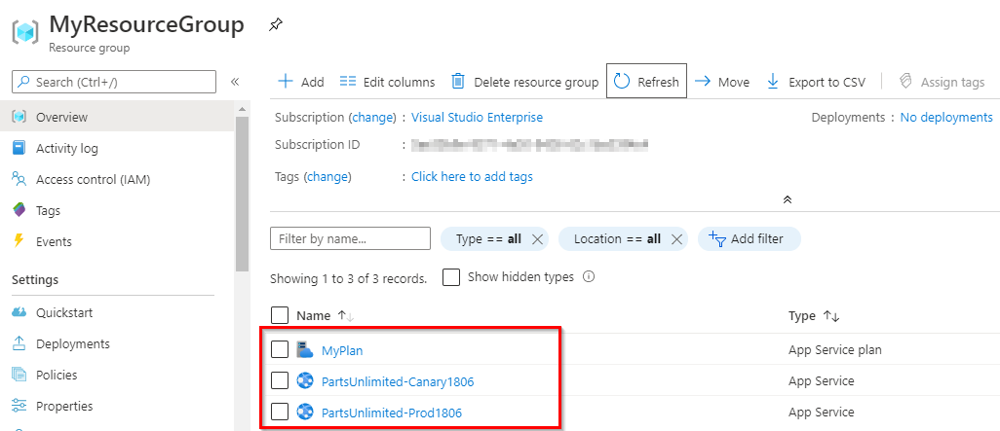

1. Now select the **Canary** web app and click on **Application insights** setting. Select **Turn on Application Insights**.

    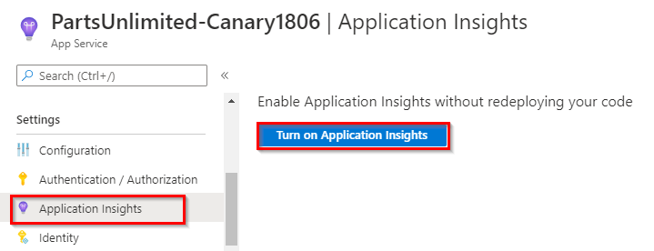

1. With the default settings click **Apply** to create and connect Application insights resource to your Canary web app.
     
      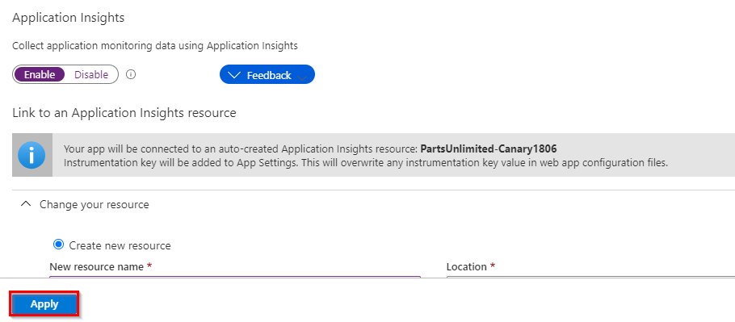

1. Now navigate back to your resource group and select application insights resource created.
     
     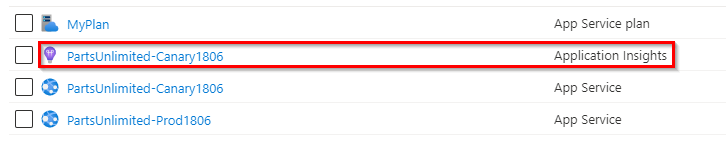

1. You will create monitor alerts here, which you will use in later part of this lab. Choose **Alerts** and click **New alert rule**.

     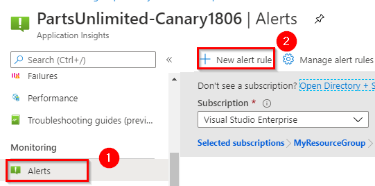

1. The **Create alert rule** pane appears. Choose **Select condition**. Search for **Failed Requests** rule and select.
    
    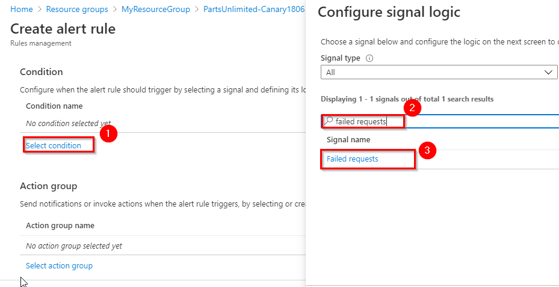

   In the resulting pane configure **Alert logic** as shown below and click on **Done**.

    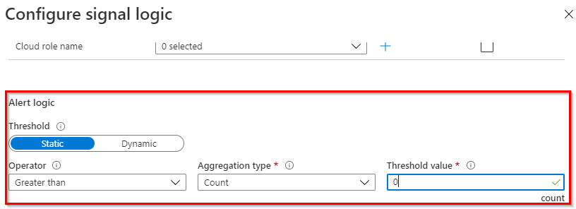

1. Now in Create alert rule pane enter Alert rule details as below
    
    

1. Once the rule is created you will be able to see that rule under **Alerts**
       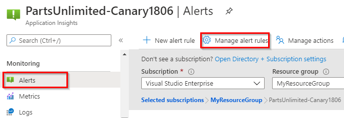
        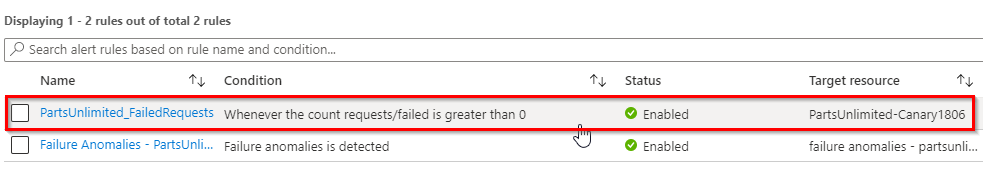

   You can create multiple alert rules on different metrics like 

       
       Availability < 99 Percent

       Server response time > 5 Seconds

       Server exceptions > 0 Count
       
    For this lab we just created one monitor alert to trigger on condition `Whenever the count requests/failed is greater than 0`


## Exercise 1: Configure Release pipeline


Navigate to the project created by Azure DevOps Demo Generator above.
### Update Release Tasks

1. Navigate to **Releases** under **Pipelines** and **Edit** the pipeline **PartsUnlimited-CD**. 
   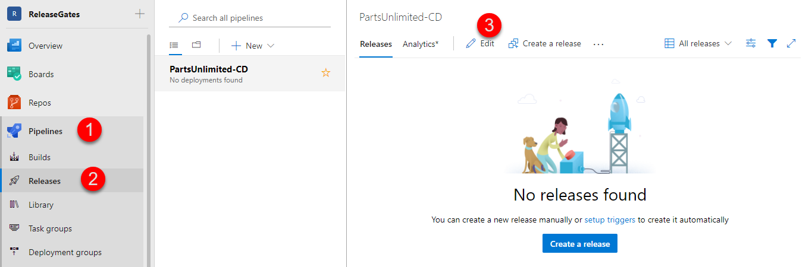

   In this pipeline, you have two environments viz. *Canary Environment* & *Production*. Click on **“1 job, 2 tasks”** link for Canary Environment to view and update the tasks.

   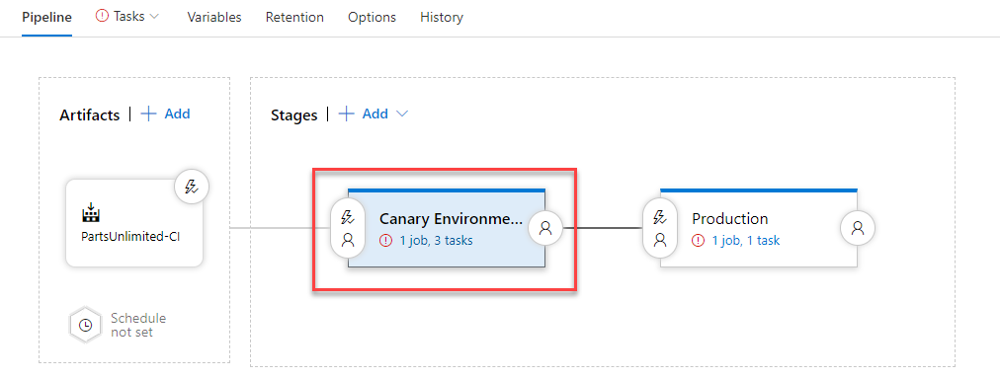

1. The canary environment has 2 tasks which will publish the package to Azure Web App, enables continuous monitoring of the application after deployment. 

   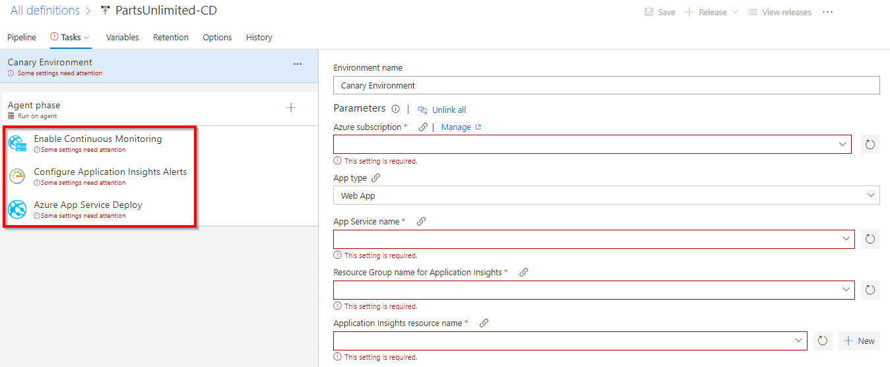

1. Select **Canarys Environment** stage. In Azure Subscription field, select your Azure subscription from the dropdown and click on **Authorize**. Provide your credentials, if required, to complete the authorization to your Azure account.

   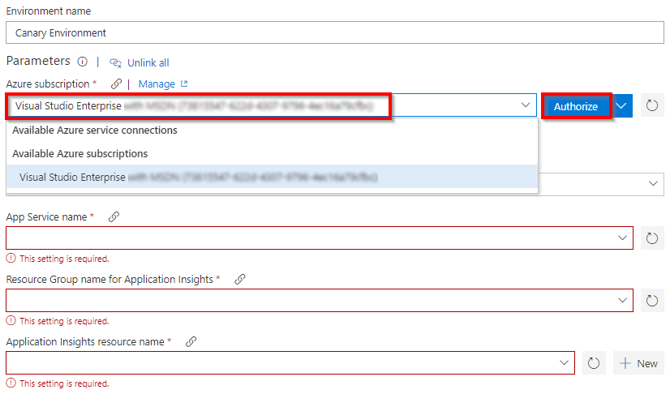

   

1. Select the App Service, Resource Group and Application Insights that you created for Canary environment from the drop-down.

   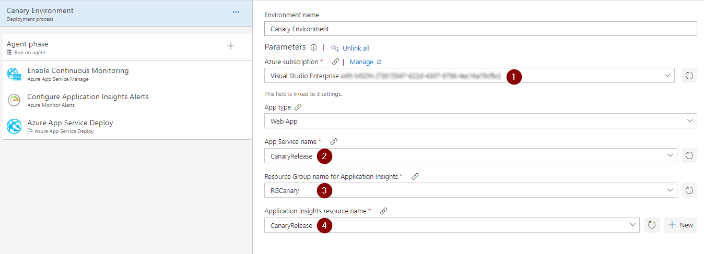

1. For Production, select the **Azure subscription** from the drop-down. Pick the App service you created for Production and click on **Save** button.

   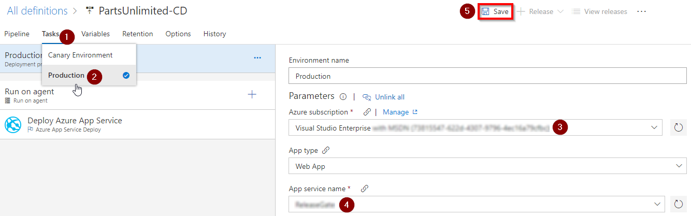

1. Navigate to **Pipelines \| Pipelines** and select **PartsUnlimited-CI** build pipeline.

   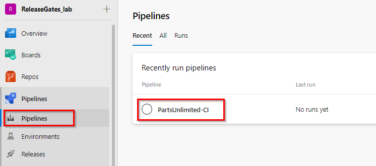 

   Click on **Run Pipeline** then select **Run** to trigger the pipeline.

   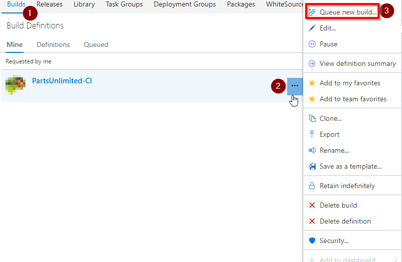


1. After the build succeeds, the release will be triggered automatically and the application will be deployed to both the environments. Browse the websites after the application is deployed.

   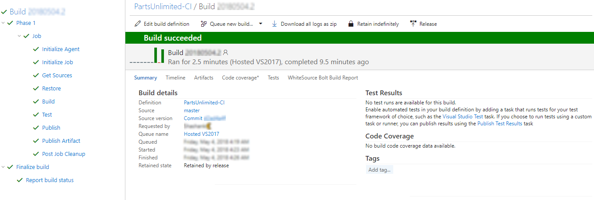

   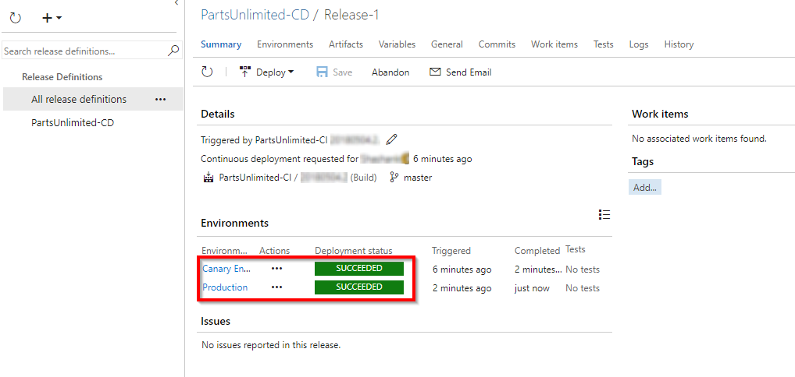

Now we have our application with CI/CD configured. In the following exercise we will see how to setup Gates in release pipeline.

## Exercise 2: Configure Deployment Gates.

### Enabling Pre-deployment Gate

1. Edit the release pipeline **PartsUnlimited-CD**.

   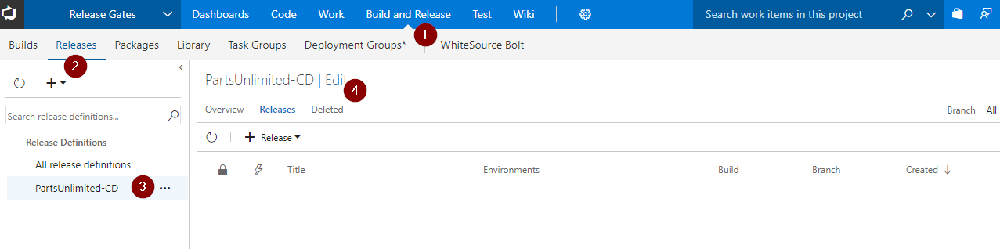

1. Click on **Pre-deployment conditions**. 

   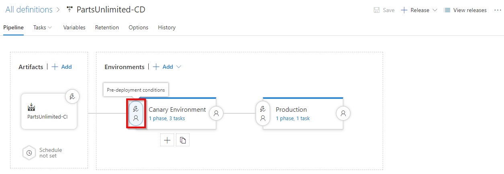

1. In Pre-deployment conditions pane, enable **Pre-deployment approvals**. Add yourself as an **Approver** for the lab purpose.

   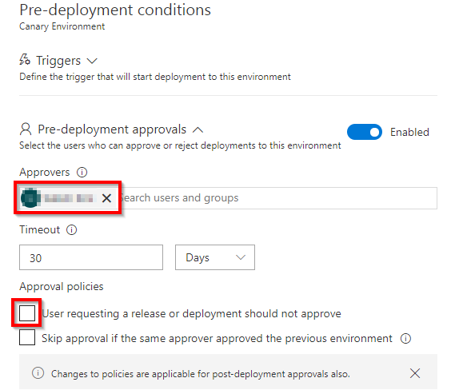 

1. In the same pane enable **Gates** and click on **+Add**
   
    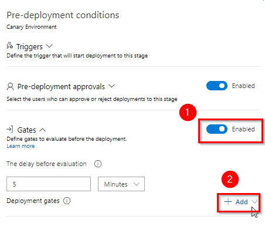

1. Add **Query Work Items** to the Gates.

   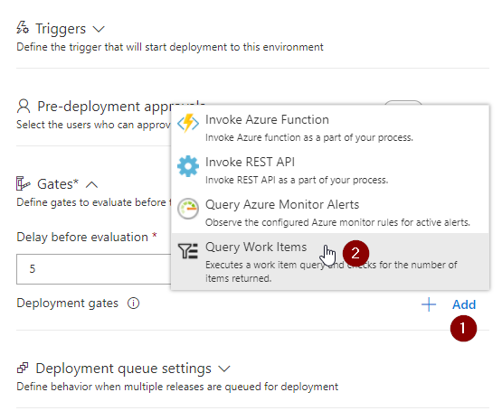

1. Select **Bugs** under **Shared Queries** in the Query field. As the maximum threshold is set to "**0**", if this query returns any active bug work Item, the release gate will fail.

   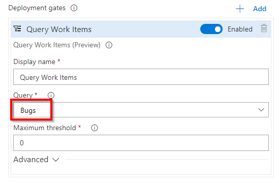

1. Set the evaluation options.

   >*Delay before evaluation:* Time before the added gates are evaluated for the first time. If no gates are added, then the deployments wait for the duration before proceeding. To allow gate functions to initialize and stabilize (it may take some time for it to begin returning accurate results), we configure a delay before the results are evaluated and used to determine if the deployment should be approved or rejected.
   
   >*Time between re-evaluation of gates:* The time interval between each evaluation of all the gates. At each sampling interval, new requests are sent concurrently to each gate for fresh results. The sampling interval must be greater than the longest typical response time of any configured gate to allow time for all responses to be received.

   >*Timeout after which gates fail:* The maximum evaluation period for all gates. The deployment will be rejected if the timeout is reached before all gates succeed during the same sampling interval. The minimum value we can specify for timeout is 6 minutes and 5 minutes for the sampling interval.

   For this demo purpose, set **Delay before evaluation** as *5 minutes* (so that you can see the results reasonably quick), **Time between re-evaluation of gates** as *5 minutes* (sampling interval) and **Timeout after which gates fail** as *8 minutes* but in reality these durations might be in hours. When the release is triggered, gate will validate the samples at *0<sup>th</sup> and 5<sup>th</sup> minutes*. If the result is "**Pass**", notification will be sent for approval. If the result is "**Fail**", the release will time-out after *8<sup>th</sup> minute*.

   Select **On successful gates, ask for approvals** radio button.

   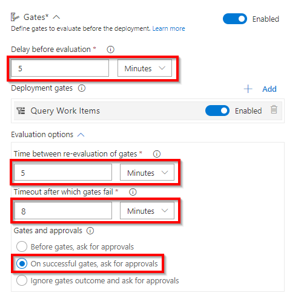

### Enabling Post-deployment Gate.

1. Click on **Post-deployment conditions**

   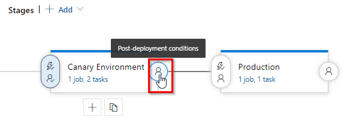

1. Enable **Gates** and Add **Query Azure Monitor Alerts** to the gate.
   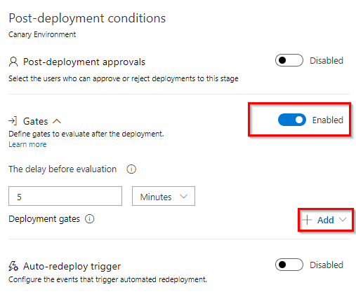

   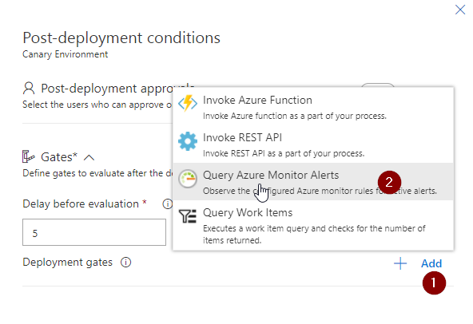

1. Update the details from the dropdown. 

   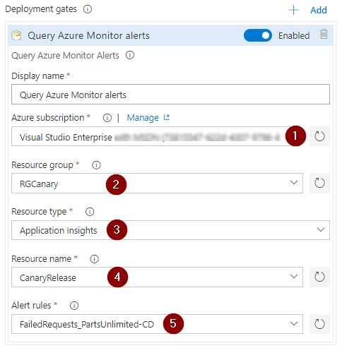

1.  Expand the **Evaluation options** and specify the details as below.

    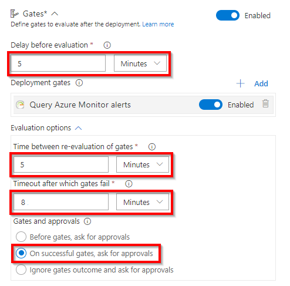

    >The sampling interval and timeout work together so that the gates will call their functions at suitable intervals and reject the deployment if they don't succeed during the same sampling interval within the timeout period. 

1. Click **Save** to save the changes.

## Exercise 3: Update and deploy application after adding release gates 
In this exercise, you will make a small code change in the application and commit to the repository which in-turn triggers build and release.

1. Go to **Repos** and click *Files*. Navigate to the path *"src/PartsUnlimitedWebsite/Views/Home/Index.cshtml"* and modify the content to ***"30%"*** from ***"20%"*** in **line 30**.
After the modification, **Commit** the changes.
   
   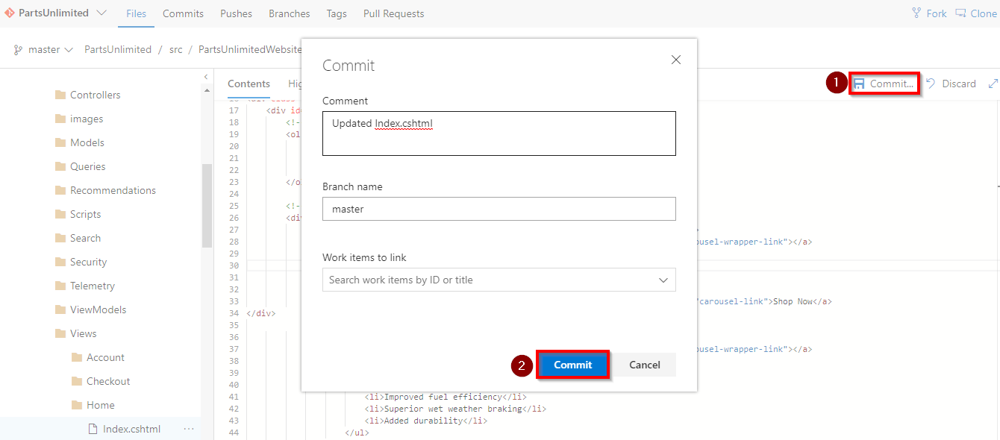

1. Run **PartsUnlimited-CI** build pipeline. Once the build succeeds, navigate to the **Releases** tab. You will notice the release have been triggered after the successful build.

1. Go to release **Logs** to see the progress. You will see **Query Work Items** gate have failed in a delay before evaluation, which indicates there are active bugs. These bugs should be closed in order to proceed further. Next sampling time will be after 5 minutes.

   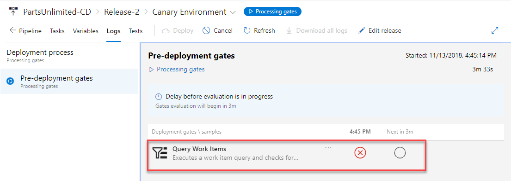 
  
 
1. Navigate to **Queries** under **Boards** tab.

   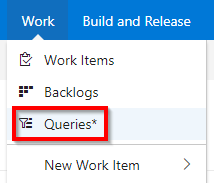

1. Select **Bugs** under **Shared Queries**.

   

1. You will see a bug with title "**Disk out of space in Canary Environment**" in **New** State.
Assuming that Infrastructure team has fixed the disk space issue, change the state to **Closed** and **Save** it.

   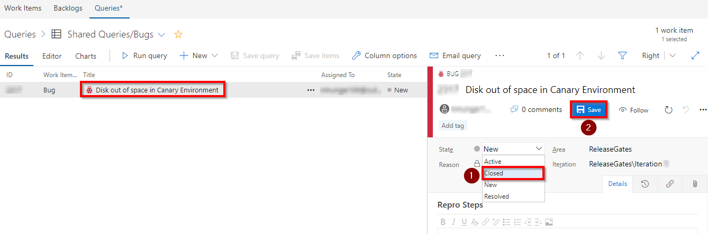 

1. Go back to release logs. You will see the evaluation has passed.

     

1. When the evaluation is successful, you will see the request for pre-deployment approval. Click on **Approve** to deploy in Canary environment

    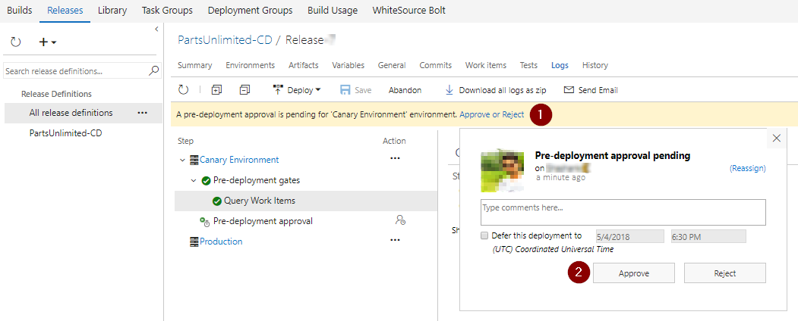

1. Once the deployment to Canary environment is successful, we will see the post-deployment gates in action which will start monitoring the application for any exceptions. 

    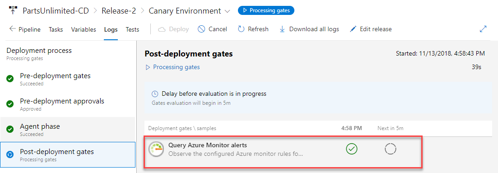

1. Now, quickly verify the application. Go to *CanaryRelease* Azure Web App in 
Azure Portal and click on **Browse**.

   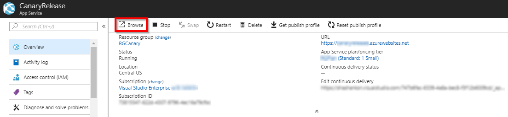

1. After the application is launched, click on **More**. You will encounter with an error page. Do this couple of times to trigger alerts.

   >This error scenario is just for the purpose of the lab and in the real world, analysis of the alert and a resolution like “disabling a feature flag” or “upgrading the infra” would be realistic.

   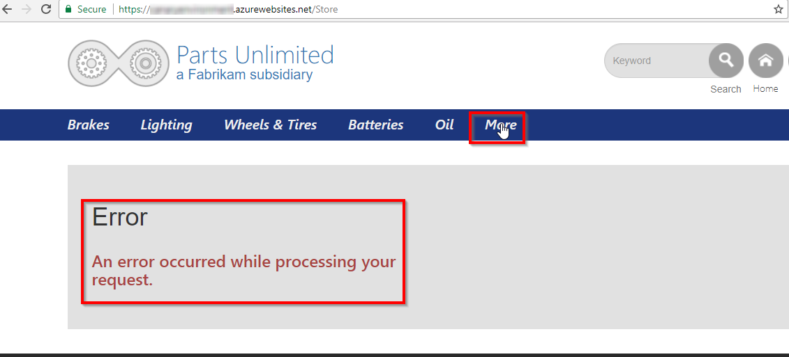 
   
1. This exception is monitored by **Application Insights** which will trigger an alert. In Azure Portal, we will be able to see the alert triggered.

   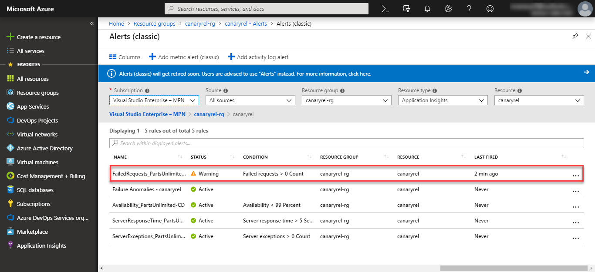
   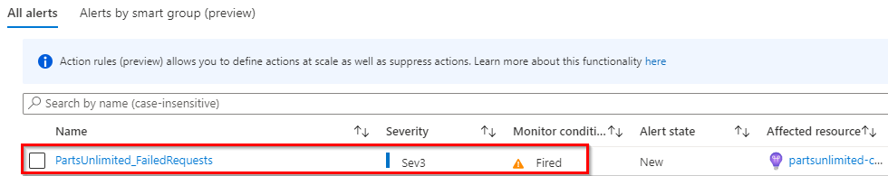

1. As there was an alert triggered by the exception, **Query Azure Monitor** gate failed. However, the gate is still under a delay period, you should wait for the next evaluation to proceed.

   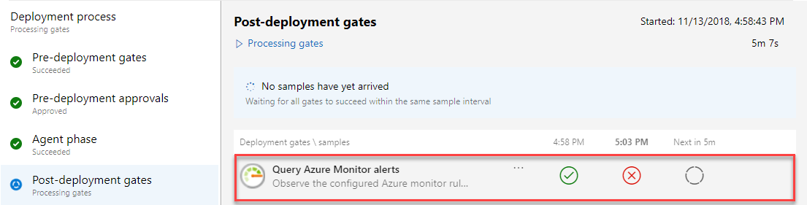
   
1. As the next step, **Query Azure Monitor** gate will block the pipeline and prevents the deployment to **Production** Environment.

   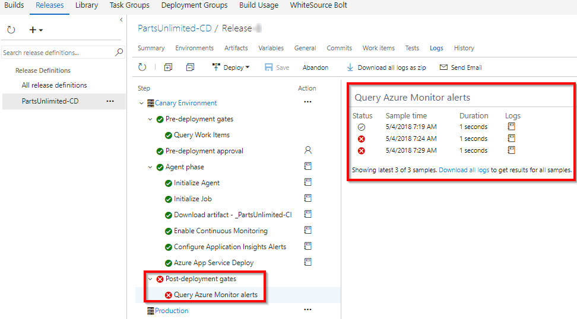
  
   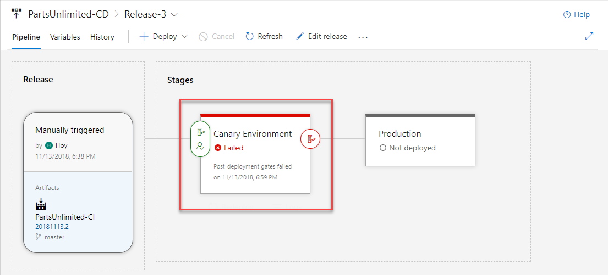

## Summary

Gates ensures that the release waits for you to react to the feedback and fix any issues within a timeout period. The gate samples continue to fail and the deployment waits until the issues are fixed. Once the issues are fixed, the next sample from the gates becomes successful and the deployment automatically proceeds.

If a new release is required to fix the issues, then you can cancel the deployment and manually abandon the current release.

So here are release gates, enabling teams to release applications with higher confidence with fewer manual steps. There is now a built-in audit of all the necessary criteria for a deployment being met.


## Reference

Thanks to **Nagaraj Bhairaji** for making a video on this lab. You can watch the following video that walks you through all the steps explained in this lab

<figure class="video_container">
  <iframe width="560" height="315" src="https://www.youtube.com/embed/8jbMnFiEow0" frameborder="0" allowfullscreen="true"> </iframe>
</figure>