Last updated : {{ "now" | date: "%b %d,%Y" }}

## Overview

[Selenium](http://www.seleniumhq.org/){:target="_blank"} is a portable open source software-testing framework for web applications. It has the capability to operate on almost every operating system. It supports all modern browsers and multiple languages including .NET (C#), Java.

In this lab, you will learn how to execute selenium testcases on a C# web application as part of the VSTS Continuous Delivery pipeline.

If you are not familiar with creating Selenium UI tests in Visual Studio, you may refer to this lab  [click here](https://almvm.azurewebsites.net/labs/vsts/selenium/){:target="_blank"}

### Prerequisites for the lab

1. **Microsoft Azure Account**: You will need a valid and active Azure account for the Azure labs. If you do not have one, you can sign up for a [free trial](https://azure.microsoft.com/en-us/free/){:target="_blank"}

    - If you are an active Visual Studio Subscriber, you are entitled for a $50-$150 credit per month. You can refer to this [link](https://azure.microsoft.com/en-us/pricing/member-offers/msdn-benefits-details/){:target="_blank"} to find out more information about this including how to activate and start using your monthly Azure credit.

    - If you are not a Visual Studio Subscriber, you can sign up for the FREE [Visual Studio Dev Essentials](https://www.visualstudio.com/dev-essentials/){:target="_blank"} program to create a **Azure free account** (includes 1 year of free services, $200 for 1st month).

1. You will need a **Visual Studio Team Services Account**. If you do not have one, you can sign up for free [here](https://www.visualstudio.com/products/visual-studio-team-services-vs){:target="_blank"}

1. You will need a **Personal Access Token** to set up your project using the **VSTS Demo Generator**. Please see this [article](https://docs.microsoft.com/en-us/vsts/accounts/use-personal-access-tokens-to-authenticate){:target="_blank"} for instructions to create your token.

    

## Setting up the Environment

1. Click **Deploy To Azure** to provision a Windows Server 2016 virtual machine along with SQL Express 2017 and browsers - Chrome and FireFox.

   {:target="_blank"}

1. It should take approximately 20-25 minutes to provision the resources. Once the deployment is successful, you will see the resources as shown.

   

## Setting up the VSTS team project

1. Use the [VSTS Demo Generator](https://vstsdemogenerator.azurewebsites.net/?Name=Selenium&TemplateId=77367){:target="_blank"} to provision the project on your VSTS account.

   > **VSTS Demo Generator** helps you create team projects on your VSTS account with sample content that include source code, work items,iterations, service endpoints, build and release definitions based on the template you choose during the configuration.

   

    

1. Once the project is provisioned, click the URL to navigate to the project.

   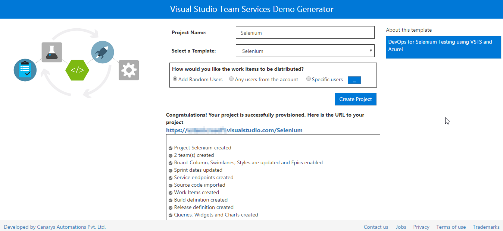

## Exercise 1: Creating Deployment Group

We will use Deployment Groups feature in VSTS  to deploy the application to the VM which was provisioned earlier to execute the Selenium test cases. [Deployment Groups](https://docs.microsoft.com/en-us/vsts/build-release/concepts/definitions/release/deployment-groups/){:target="_blank"} in VSTS makes it easier to organize the servers that you want to use to host your app. A deployment group is a collection of machines with a VSTS agent on each of them. Each machine interacts with VSTS to coordinate deployment of your app.

We will also deploy the SQL database in the VM using Deployment Groups.

1. Go to **Deployment Groups** under **Build & Release** tab. Click **Add deployment group** .

   

1. Provide deployment group name and click **Create**.

   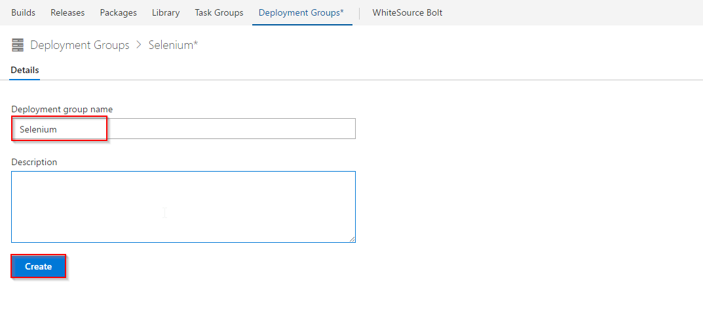

   This will generate a PowerShell script to associate the VM to this deployment group.

1. Select the **Use a personal access token in the script for authentication** check box so that we will not have to provide password every time the script is executed. Click on **Copy script to clipboard** to copy the script which will be used in the next exercise to associate the VM to  deployment group.

   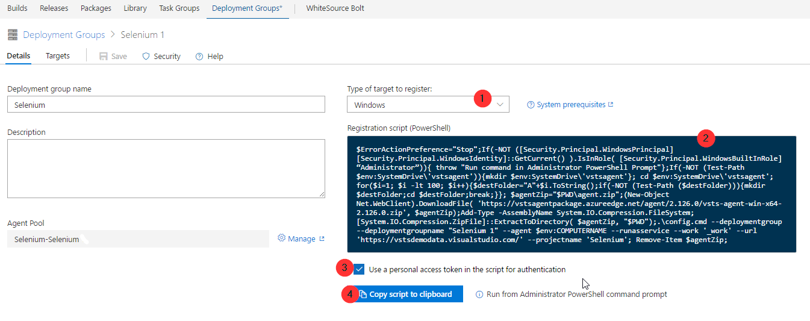

## Exercise 2: Associate the VM to Deployment Group

In this exercise, we will execute the **registration script** on the VM to associate with the deployment group.

1. Login to the VM using [RDP](https://docs.microsoft.com/en-us/azure/virtual-machines/windows/connect-logon){:target="_blank"} with the following credentials

   - **Username**: vmadmin
   - **Password**: P2ssw0rd@123

1. Open **Windows PowerShell** in **administrator** mode, paste the copied **Registration script** and hit **Enter**.

   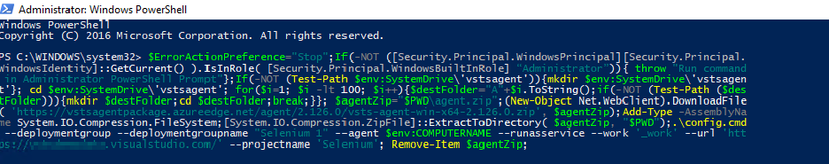

1. When the **Enter deployment group tags for agent? (Y/N) (press enter for N) >** message is prompted in the PowerShell window, type **Y** and hit enter.

   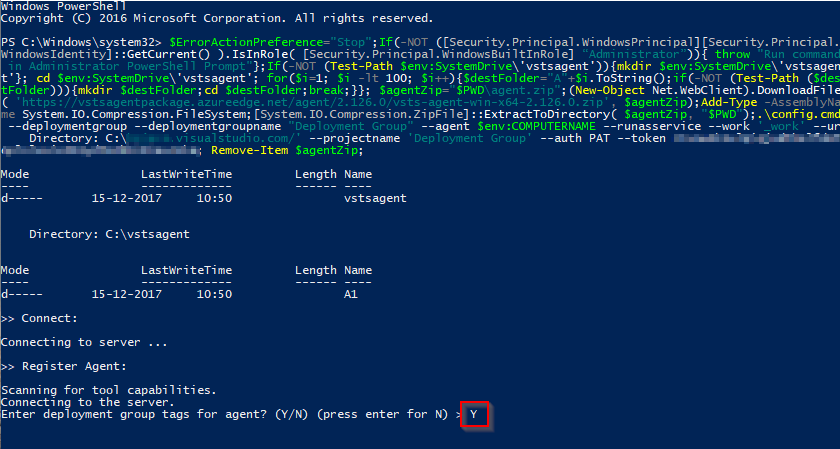

1. Enter **web, db** for the tags

   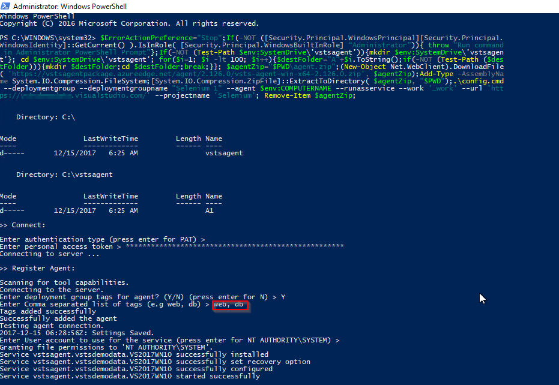

1. When prompt -**Enter User account to use for the service (press enter for NT AUTHORITY\SYSTEM) >** is displayed, hit **Enter** to configure the service to run under **NT AUTHORITY\SYSTEM** account.

   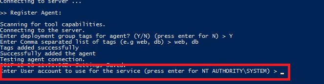

1. Refresh your VSTS Deployment Groups page, click the created Deployment Group and you will notice the online status, health status and the associated tags of the VM.

   

## Exercise 3: Configure agent on the VM

Let us configure a ***private*** agent on this VM, since Selenium requires the agent to be run in **interactive** mode to execute the UI tests.

1. Go to the VM and open the folder **C:\VSTSwinAgent**.

1. Open a command prompt in **administrator mode**. Change the path to **C:\VSTSWinAgent** and type **Config.cmd** and hit **Enter**.

1. Provide the following details:

    - Enter server URL: Your VSTS URL
    - Authentication type: Press **enter key** for PAT as the authentication type and paste the PAT in the next prompt.
    - Let us use the default options for rest of the configuration. Press **Enter** for all prompts until the command execution completes.
    - Once the agent is registered, type **run.cmd** and hit **Enter** to start the agent.

    Click [here](https://docs.microsoft.com/en-us/vsts/build-release/actions/agents/v2-windows){:target="_blank"} for more information on how to configure the agent.

   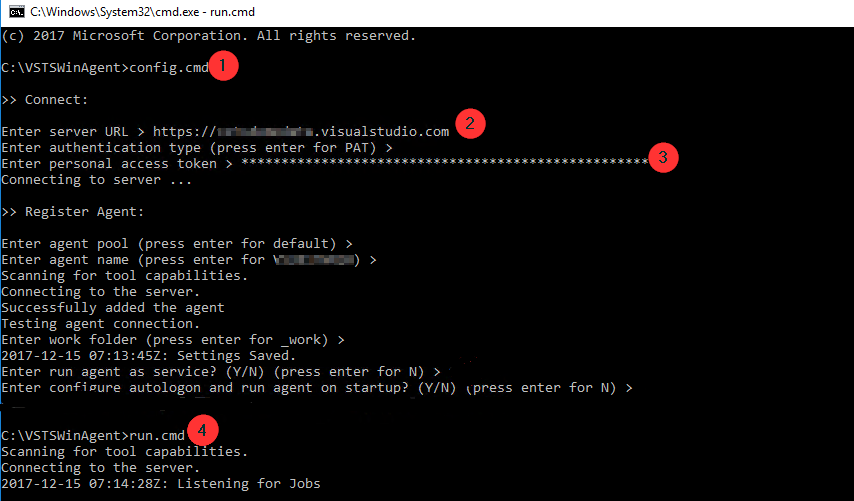

## Exercise 4: Configure Release

The target machine is available in the deployment group to deploy the application and run selenium testcases. The release definition uses **[Phases](https://docs.microsoft.com/en-us/vsts/build-release/concepts/process/phases){:target="_blank"}** to deploy to target servers.

1. Go to **Releases** under **Build and Release** tab. Select **Selenium** release definition and **Edit**.

   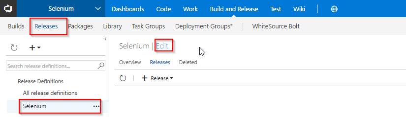

1. Open **Dev** environment to see the three deployment phases.

   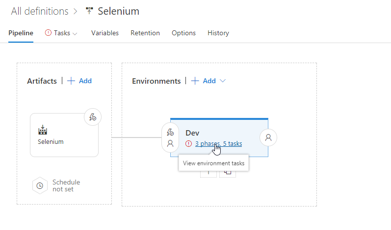

   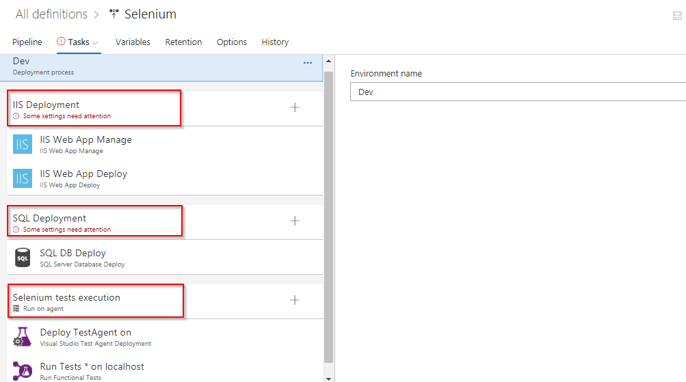

   - **IIS Deployment phase**: In this phase, we deploy application to the VM using following tasks-

      - **IIS Web App Manage**: This task runs on the target machine registered with the Deployment Group. It creates a *website* and an *Application Pool* locally with the name **PartsUnlimited** running under the port **82** [**http://localhost:82**](http://localhost:82)

      - **IIS Web App Deploy**: This task deploys the application to the IIS server using **Web Deploy**.

   - **Database deploy phase**: In this phase, we use [**SQL Server Database Deploy**](https://github.com/Microsoft/vsts-tasks/blob/master/Tasks/SqlDacpacDeploymentOnMachineGroup/README.md){:target="_blank"} task to deploy [**dacpac**](https://docs.microsoft.com/en-us/sql/relational-databases/data-tier-applications/data-tier-applications){:target="_blank"} file to the DB server.

   - **Selenium tests execution**: Executing **UI testing** as part of the release process is a great way of detecting unexpected changes, and need not be difficult. In this phase, we will execute Selenium tests on the deployed web application. The below tasks describes using Selenium to test the website in the release pipeline.

     - **Deploy Test Agent**: The [Deploy Test agent](https://github.com/Microsoft/vsts-tasks/blob/master/Tasks/DeployVisualStudioTestAgent/README.md){:target="_blank"} task will deploy the test agent to the VM. The test agent is used to run distributed tests like Coded UI and Selenium.
     - **Run Functional tests**: This [task](https://github.com/Microsoft/vsts-tasks/blob/master/Tasks/RunDistributedTests/README.md){:target="_blank"} uses **vstest.console.exe** to execute the selenium testcases.

1. Click on **IIS Deployment** phase and select the Deployment Group which we have created in **Exercise 2**.

   

1. Repeat the above step for **SQL Deployment** phase

   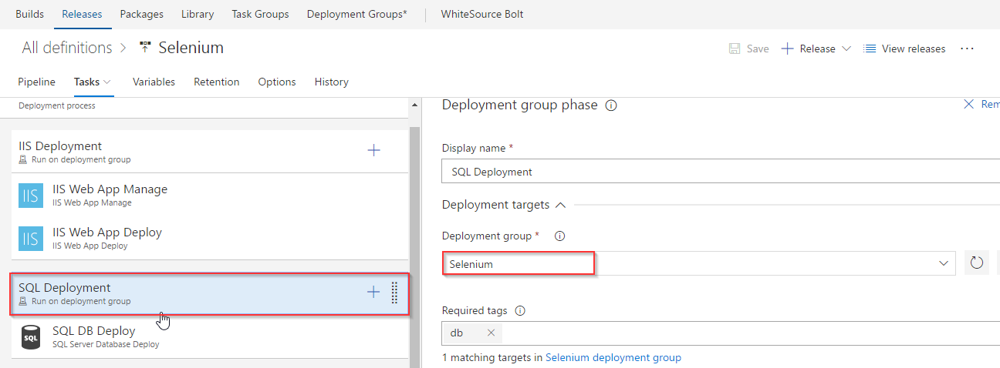

1. Click on **Selenium tests execution** phase and set Agent queue to **Default** then save the changes.

   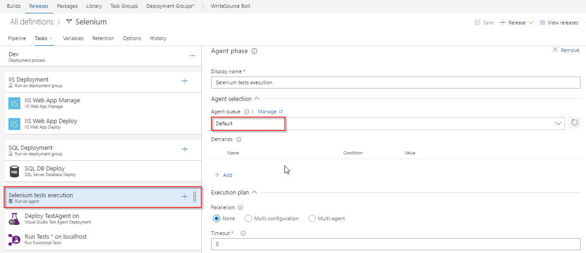

## Exercise 5: Trigger Build and Release

In this exercise, we will trigger the **VSTS build** to compile the Selenium C# scripts along with the Web application. The resulting binaries are copied to the Azure VM and finally, the Selenium scripts are executed as part of the automated **VSTS release**.

1. Navigate to **Builds** under **Build and Release** tab and queue the build.

   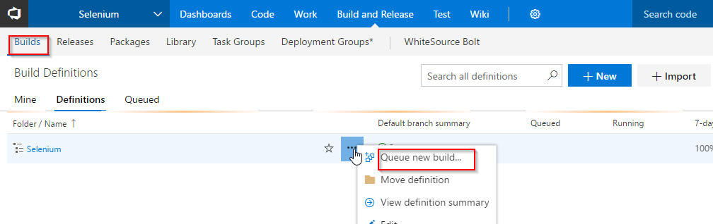

1. This build will publish the test artifacts to VSTS, which will be used in release.

   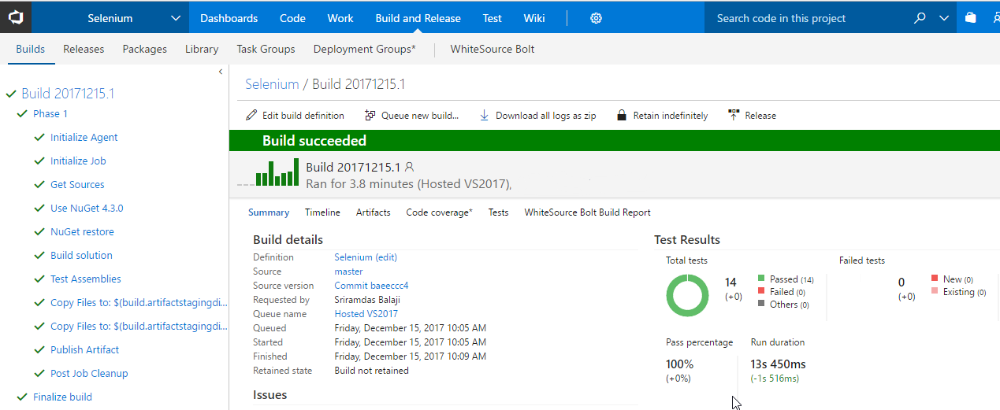

1. Once the build completes, the release will be triggered. Navigate to **Releases** tab to see the deployment in-progress.

   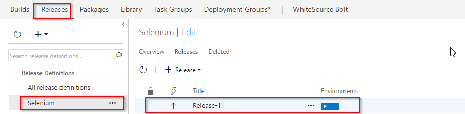

1. When **Selenium test execution** phase starts, connect back to the VM provisioned earlier to see UI tests execution.

   

   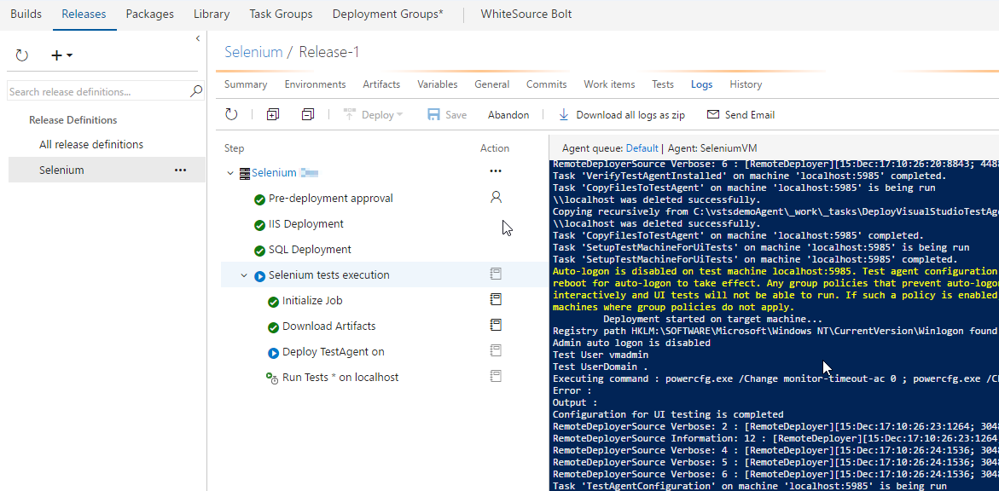

1. In this lab, we are executing **4** UI test scenarios configured to run on **Chrome** and **Firefox** browsers.

### Tests running in Chrome

   

### Tests running in Firefox

   

Once the release succeeds, click the **Tests** tab to analyze the test results. Select **All** in the **Outcome** section to view all the tests and their status.

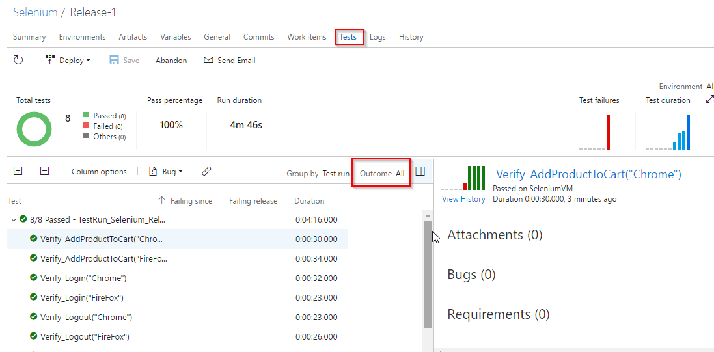
