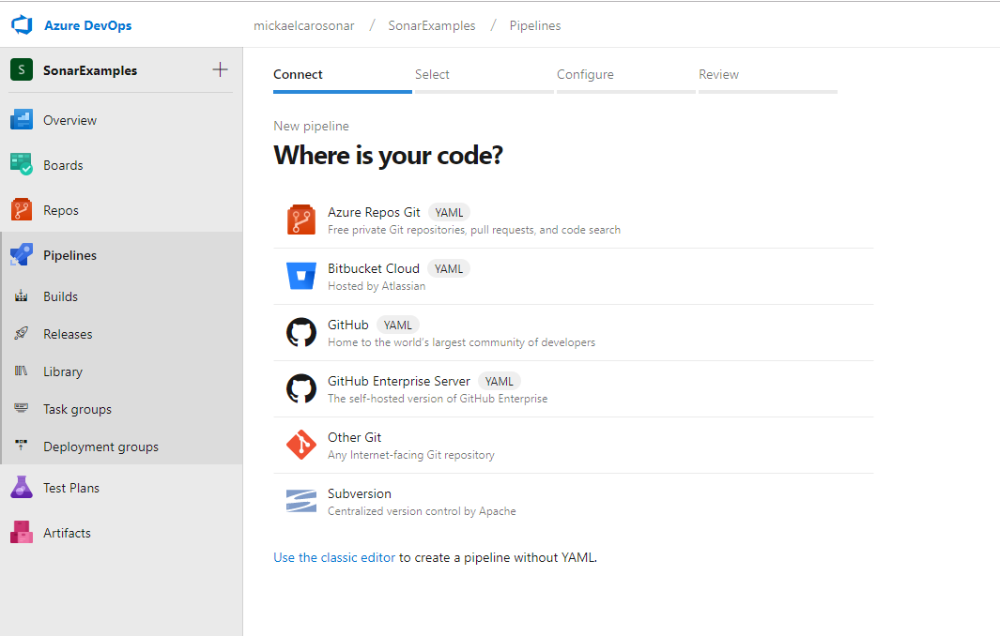
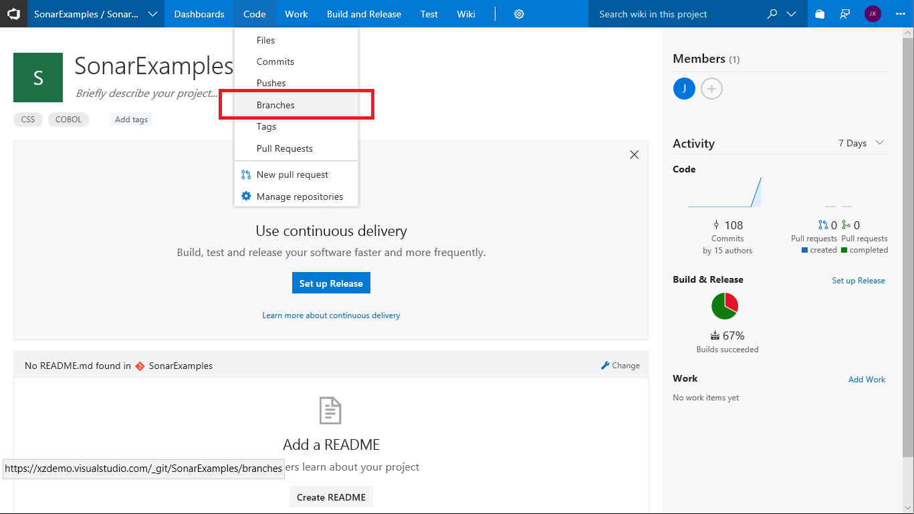
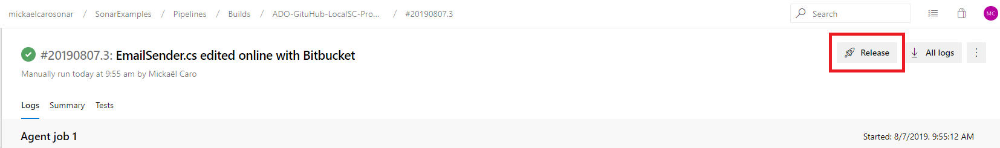

## Overview

Technical debt is the set of problems in a development effort that make forward progress on customer value inefficient. Technical debt saps productivity by making code hard to understand, fragile, time-consuming to change, difficult to validate, and creates unplanned work that blocks progress. Unless they are managed, technical debt can accumulate and hurt the overall quality of the software and the productivity of the development team in the long term.

[SonarCloud](https://about.sonarcloud.io/){:target="\_blank"} is the code quality and security service provided by SonarSource.
The main features of SonarCloud are:

- 23 languages: Java, JS, C#, C/C++, Objective-C, TypeScript, Python, ABAP, PLSQL, T-SQL and more.
- Thousands of rules to track down hard-to-find bugs and quality issues thanks to powerful static code analyzers.
- Cloud CI Integrations, with Travis, Azure DevOps, BitBucket, AppVeyor and more.
- Deep code analysis, to explore all source files, whether in branches or pull requests, to reach a green Quality Gate and promote the build.
- Fast and Scalable

### What's covered in this lab

In this lab, you will learn how to integrate Azure DevOps Services with SonarCloud

- Setup an Azure DevOps project and CI build to integrate with SonarCloud
- Analyze SonarCloud reports
- Integrate static analysis into the Azure DevOps pull request process

### Prerequisites for the lab

1. You will need a **Azure DevOps Services Account**. If you do not have one, you can sign up for free [here](https://dev.azure.com){:target="\_blank"}

1. A **Microsoft Work or School account, or a GitHub/BitBucket account**. SonarCloud supports logins using any of those identity providers.

1. Install the SonarCloud Azure DevOps extension to your Azure DevOps account

   - Navigate to the [SonarCloud extension](https://marketplace.visualstudio.com/items?itemName=SonarSource.sonarcloud) in the Visual Studio Marketplace and click **Get it free** to install it.

   

   > If you do not have the appropriate permissions to install an extension from the marketplace, a request will be sent to the account administrator to ask them to approve the installation.

   The SonarCloud extension contains build tasks, build templates and a custom dashboard widget.

1. Create a new Azure DevOps project for the lab

   - Create a new project in your Azure DevOps account called **SonarExamples**

   - Import the **Sonar Scanning Examples repository** from GitHub at https://github.com/SonarSource/sonar-scanning-examples.git

   

   See [here](https://docs.microsoft.com/en-us/azure/devops/repos/git/import-git-repository?view=azure-devops) for detailed instructions on importing a repository.

   The scanning examples repository contains sample projects for a number of build systems and languages including C# with MSBuild, and Maven and Gradle with Java.

## Exercise 1: Set up a pipeline that integrates with SonarCloud

We will set up a new build pipeline that integrates with SonarCloud to analyze the **SonarExamples** code. As part of setting up the pipeline, we will create a SonarCloud account and organization.

1. In your new Azure DevOps project, go to **Pipelines** under **Pipelines** tab, then click on **New Pipeline** to create a new build pipeline.

1. You have 2 possibilities: Configure the pipeline with the YAML editor, or with the classic assistant.

### **YAML Editor**

1. Select your code location. SonarCloud currently supports Azure Repos, Bitbucket Cloud and GitHub for PR decoration.

   

1. Select the repository where you want to build from
1. Select a default template. Currently, there are no SonarCloud template available for YAML edition
1. Click next, you enter into the YAML file you have to fill.

### **Classic Editor**

1. Click **Continue** to accept the default values for **source**, **Team project**, **Repository** and **Default branch**

   

   > The SonarCloud extension contains custom build templates for Maven, Gradle, .NET Core and .NET Desktop applications. The templates are based on the standard Azure DevOps templates but with additional analysis-specific tasks and some pre-configured settings.

1. Select the .NET Desktop with SonarCloud template.

   

   The template contains all of the necessary tasks and most of the required settings. We will now provide the values for the remaining settings.

1. Select the _Azure Pipelines_ in Agent pool, then choose _vs2017-win2016_ in Agent specification

   

1. Configure the _Prepare analysis on SonarCloud_ task

   

   There are three settings that need to be configured:

   | Setting                         | Value                                                                 | Notes                                                             |
   | ------------------------------- | --------------------------------------------------------------------- | ----------------------------------------------------------------- |
   | **SonarCloud Service Endpoint** | SonarCloudSamples                                                     | The name of the Azure DevOps endpoint that connects to SonarCloud |
   | **Organization**                | {your SonarCloud org id}                                              | The unique key of your organization in SonarCloud                 |
   | **Project Key**                 | {your Azure DevOps account name}.visualstudio.com.sonarexamples.netfx | The unique key of the project in SonarCloud                       |

   > Currently the project key must be globally unique across all projects in SonarCloud. In the future, the project key will only need to be unique within your SonarCloud organization.

   We will now create the endpoint and an account on SonarCloud.

1. Create a service endpoint for SonarCloud

   - Click on the _New_ button to start creating a new endpoint

     

1. Create a SonarCloud account

   A service endpoint provides the information Azure DevOps requires to connect to an external service, in this case, SonarCloud. There is a custom SonarCloud endpoint that requires two pieces of information: the identity of the organization in SonarCloud, and a token that the Azure DevOps build can use to connect to SonarCloud. We will create both while setting up the endpoint.

   - Click on the **your SonarCloud account security page** link

     

1. Select the identity provider to use to log in to SonarCloud

   As we are not currently logged in to SonarCloud we will be taken to the SonarCloud login page.

   - Select the identity provider you want to use and complete the login process

     

1. Authorize SonarCloud to use the identity provider

   > The first time you access SonarCloud, you will be asked to grant SonarCloud.io access to your account. The only permission that SonarCloud requires is to read your email address.

     

   After authorizing and logging in, we will be redirected to the **Generate token** page.

1. Generate a token to allow Azure DevOps to access your account on SonarCloud:

   - Enter a descriptive name for the token e.g. "vsts_build" and click **Generate**

   - Click **Generate**

     

1. Copy the generated token

    - Click **Copy** to copy the new token to the clipboard

      

      > You should treat Personal Access Tokens like passwords. It is recommended that you save them somewhere safe so that you can re-use them for future requests.

    We have now created an organization on SonarCloud, and have the token needed configure the Azure DevOps endpoint.

1. Finish creating the endpoint in Azure DevOps

    - Return to Azure DevOps **Add new SonarCloud Connection** page, set the **Connection name** to **SonarCloud**, and enter the **SonarCloud Token** you have just created.
    - Click **Verify connection** to check the endpoint is working, then click **OK** to save the endpoint.

      

1. Finish configuring the **Prepare analysis on SonarCloud** task.

    - Click on the **Organization** drop-down and select your organization.
    - Enter a unique key for your project e.g. **[your account].visualstudio.com.sonarexamples.netfx**
    - Enter a friendly name for the project e.g. **Sonar Examples - NetFx**

      

1. [Optional] Enable the _Publish Quality Gate Result_ step

    This step is not required unless you want to use the pre-deployment gate along with Release Pipelines.
    If this step is enabled, a summary of the analysis results will appear on the _Extensions_ tab of the _Build Summary_ page. However, this will delay the completion of the build until the processing on SonarCloud has finished.

1. Save and queue the build.

    

1. If you enabled the _Publish Quality Gate Result_ step above the Build Summary will contain a summary of the analysis report.

    

1. Either click on the **Detailed SonarCloud Report** link in the build summary to open the project in SonarCloud, or browse to SonarCloud and view the project.

    

    We have now created a new organization on SonarCloud and configured an Azure DevOps build to perform analysis and push the results of the build to SonarCloud.

## Exercise 2: Analyze SonarCloud Reports

Open the **Sonar Examples - NetFx** project in the SonarCloud Dashboard. Under **_Bugs and Vulnerabilities_**, we can see a bug has been caught.

The page has other metrics such as **_Code Smells_**, **_Coverage_**, **_Duplications_** and **_Size_**. The following table briefly explains each of these terms.

| Terms               | Description                                                                                                                                                                                                                                                                               |
| ------------------- | ----------------------------------------------------------------------------------------------------------------------------------------------------------------------------------------------------------------------------------------------------------------------------------------- |
| **Bugs**            | An issue that represents something wrong in the code. If this has not broken yet, it will, and probably at the worst possible moment. This needs to be fixed                                                                                                                              |
| **Vulnerabilities** | A security-related issue which represents a potential backdoor for attackers                                                                                                                                                                                                              |
| **Code Smells**     | A maintainability-related issue in the code. Leaving it as-is means that at best maintainers will have a harder time than they should make changes to the code. At worst, they'll be so confused by the state of the code that they'll introduce additional errors as they make changes |
| **Coverage**        | To determine what proportion of your project's code is actually being tested by tests such as unit tests, code coverage is used. To guard effectively against bugs, these tests should exercise or 'cover' a large proportion of your code                                                |
| **Duplications**    | The duplications decoration shows which parts of the source code are duplicated                                                                                                                                                                                                           |
| **Size**            | Provides the count of lines of code within the project including the number of statements, Functions, Classes, Files and Directories                                                                                                                                                      |

{% include important.html content= "In this example, along with the bug count, a character **C** is displayed which is known as **Reliability Rating**. **C** indicates that there is **at least 1 major bug** in this code. For more information on Reliability Rating, click [here](https://docs.sonarqube.org/display/SONAR/Metric+Definitions#MetricDefinitions-Reliability). For more information on rule types see [here](https://docs.sonarqube.org/latest/user-guide/rules/) and for more information on severities, see [here](https://docs.sonarqube.org/latest/user-guide/issues/)." %}

1. Click on the **Bugs** count to see the details of the bug.

   

1. Click on the bug to navigate to the code

   

1. You will see the error in line number 9 of **Program.cs** file as **Change this condition so that it does not always evaluate to 'true'; some subsequent code is never executed.**.

   

   We can also see which lines of code are not covered by tests.

   

   Our sample project is very small and has no historical data. However, there are thousands of [public projects on SonarCloud](https://sonarcloud.io/explore/projects){:target="\_blank"} that have more interesting and realistic results.

## Exercise 3: Set up pull request integration

Configuring SonarCloud analysis to run when a pull request is created has two parts:

- A SonarCloud project needs to be provided with an access token so it can add PR comments to Azure DevOps, and
- Branch Policy needs to be configured in Azure DevOps to trigger the PR build

1. Create a **Personal Access Token** in Azure DevOps.

   - Follow the instructions in this [article](https://docs.microsoft.com/en-us/azure/devops/organizations/accounts/use-personal-access-tokens-to-authenticate?view=azure-devops) to create a token with **Code (read and write)** scope.

     > SonarCloud will post comments to the pull request as if it is a user who owns the personal access token. The recommended practice is to create a separate "bot" Azure DevOps user for this so that it is clear which comments are from real developers and which are from SonarCloud.

     

   > You should treat Personal Access Tokens like passwords. It is recommended that you save them somewhere safe so that you can re-use them for future requests.

1. Configure SonarCloud to analyze pull requests

   - Browse to the **Sonar Examples - NetFx** dashboard in SonarCloud
   - Click on **Administration**, **General Settings**

     

   - Select the **Pull Requests** tab
   - Set the **Provider** drop-down to **Azure DevOps Services**
   - Set the **Personal access token**
   - Click **Save**

     

1. Configure the branch policy for the project in Azure DevOps

   - navigate to the **SonarExamples** project in Azure DevOps
   - Click on **Repos**, **Branches** to view the list of branches

     

   - Click on the settings link ("**...**") for **master** and select **Branch policies**

     

   - Click **Add Build Policy**

     

   - Select the build definition we created earlier from the **Build definition** drop-down
   - Set the **Display name** to **SonarCloud analysis**
   - Click **Save**

     

   Azure DevOps is now configured to trigger a SonarCloud analysis when any pull request targeting the **master** branch is created.

1. Create a new pull request

   Now we need to make a change to a file and create a new request so we check that the pull request triggers the analysis.

   - Navigate to the code file **Program.cs** at **sonarqube-scanner-msbuild/CSharpProject/SomeConsoleApplication/Program.cs** and click **Edit**
   - Add an empty method to the code as shown in the following screen shot, then click **Commit...**

     

   In the dialogue that appears:

   - Change the branch name from **master** to **branch1**
   - Check the **Create a pull request** checkbox
   - Click **Commit**, then click **Create** on the next screen to submit the pull request

     

     If the pull request integration is correctly configured the UI will show that an analysis build is in progress.

     

1. Review the results of the Pull Request analysis

   The results show that the analysis builds completed successfully, but that the new code in the PR failed the Code Quality check.
   Comment has been posted to the PR for the new issue that was discovered.

   

   Note that the only issues in code that was changed or added in the pull request are reported - pre-existing issues in **Program.cs** and other files are ignored.

1. Block pull requests if the Code Quality check failed

   At this point, it is still possible to complete the pull request and commit the changes even though the Code Quality check has failed.
   However, it is simple to configure Azure DevOps to block the commit unless the Code Quality check passes:

   - Return to the **Branch Policy** page
   - Click **Add status policy**
   - Select **SonarCloud/quality gate** from the **Status to check** drop-down
   - Set the **Policy requirement** to **Required**
   - Click **Save**

     

   Users will now be unable to merge the pull request until the Code Quality check is successful, either because all of the issues have been fixed or the issues have been marked as **confirmed** or **resolved** in SonarCloud.

## Exercise 4: Check the SonarCloud Quality Gate status in a Continuous Deployment scenario (In Preview)

** Disclaimer: This feature is in preview, and may not reflect its final version. Please look at the notes at the end of this exercise for more information.**

Starting from version 1.8.0 of the SonarCloud extension for Azure DevOps, a pre-deployment gate is available for your release pipeline. It allows you to check the status of the SonarCloud Quality Gate for the artifact you want to deploy and block the deployment if the Quality Gate failed.

Prerequisites :

- Enable the **Publish Quality Gate Result** in your build pipeline
- Have an artifact built and published in this pipeline to feed the release pipeline

Setup :

1. Click on **Pipelines** on the left pane, then click on **Releases**
1. Click on **New Pipeline**

   

1. On the template selection, choose the template you want. We will choose **Empty job** for this exercise.

   

1. Close for now the Stage properties
1. Click on the pre-deployment conditions on Stage 1

   

1. Click on **Enabled** beside **Gates**
1. Click on **+ Add**, then select **SonarCloud Quality Gate status check**

   

1. In order to have the fastest result possible for this exercise, we recommend you to set the evaluations options as per this screenshot (See [how Gate evaluation flow works](https://docs.microsoft.com/en-us/azure/devops/pipelines/release/approvals/gates?view=azure-devops), as per Microsoft Documentation)

   

1.  That's it. You can close this panel.
1. Click now on **Add an artifact** on the left.
1. Currently, only build artifacts are supported. Choose the project and the source (build pipeline) of your artifact, its alias should match the name of the artifact published in the build pipeline.
1. Click on **Add**

    

1. You can now save your pipeline.
1. Go back to the build pipeline section, trigger a build of the pipeline that creates the artifact.
1. Once the build is completed and succeeded, you can create a new release by either clicking on the **Release** button on the build page or set up an automatic release trigger based on a branch filter.

    

1. Go to the release by either clicking on the link if a manual release has been triggered from the build (on the top of the Build page), or going to the **Releases** page.
1. After few minutes (as set up on the point 8 of this exercise), your Quality Gate check should have been performed (at least twice to get a 'go/nogo' for the stage), and if it's green, it should look like this:

   

Otherwise, if it's failed, then read important notes below to find out how it happened and how to get a green Quality Gate.

**Important notes about this feature**

- The **Publish Quality Gate Result** task in your build pipeline has to be enabled in order for the release gate to work.
- If the Quality Gate is in the failed state, it will not be possible to get the pre-deployment gate passing as this status will remain in its initial state. You will have to execute another build with either the current issues corrected in SonarCloud or with another commit for fixing them.
- Please note also that current behaviour of the pre-deployment gates in Release Pipelines is to check the status every 5 minutes, for a duration of 1 day by default. However, if a Quality Gate for a build has failed it will remain failed so there is no point in re-checking the status. Knowing this, you can set the timeout after which gates fail to a maximum of 6 minutes so the gate will be evaluated only twice as described above, or just cancel the release itself.
- Only the primary build artifact related Quality Gate of the release will be checked.
- During a build, if multiple analyses are performed, all of the related Quality Gates are checked. If one of them has the status either WARN, ERROR or NONE, then the Quality Gate status on the Release Pipeline will be failed.

## Summary

With the **SonarCloud** extension for **Azure DevOps Services**, you can embed automated testing in your CI/CD pipeline to automate the measurement of your technical debt including code semantics, testing coverage, vulnerabilities. etc. You can also integrate the analysis into the Azure DevOps pull request process so that issues are discovered before they are merged.
