Last updated : {{ "now" | date: "%b %d,%Y" }}

## Overview

Technical debt is the set of problems in a development effort that make forward progress on customer value inefficient. Technical debt saps productivity by making code hard to understand, fragile, time-consuming to change, difficult to validate, and creates unplanned work that blocks progress. Unless they are managed, technical debt can accumulate and hurt the overall quality of the software and the productivity of the development team in the long term.

[SonarCloud](https://about.sonarcloud.io/){:target="_blank"} is the code quality cloud service provided by SonarSource.
The main features of SonarCloud are:

- 16 languages: Java, JS, C#, C/C++, Objective-C, TypeScript, Python, ABAP, PLSQL, T-SQL and more.
- Thousands of rules to track down hard-to-find bugs and quality issues thanks to powerful static code analyzers.
- Cloud CI Integrations, with Travis, Azure DevOps, AppVeyor and more.
- Deep code analysis, to explore all source files, whether in branches or pull requests, to reach a green quality gate and promote the build.
- Fast and Scalable

### What's covered in this lab

In this lab, you will learn how to integrate Azure DevOps with SonarCloud

- Setup a Azure DevOps project and CI build to integrate with SonarCloud
- Analyze SonarCloud reports
- Integrate static analysis into the Azure DevOps pull request process

### Prerequisites for the lab

1. You will need a **Azure DevOps Account**. If you do not have one, you can sign up for free [here](https://www.visualstudio.com/products/visual-studio-team-services-vs){:target="_blank"}

1. A **Microsoft Work or School account, or a GitHub/BitBucket account**. SonarCloud supports logins using any of those identity providers.

## Setting up the Environment

1. Install the SonarCloud Azure DevOps extension to your Azure DevOps account

    - Navigate to the  [SonarCloud extension](https://marketplace.visualstudio.com/items?itemName=SonarSource.sonarcloud){:target="_blank"} in the Visual Studio Marketplace and click on **Get it free** to install it.

    

   

   The SonarCloud extension contains build tasks, build templates and a custom dashboard widget.

1. Create a new Azure DevOps project for the lab
    
    - Create a new project in your Azure DevOps account called **SonarExamples**

    - Import the **Sonar Scanning Examples repository** from GitHub at https://github.com/SonarSource/sonar-scanning-examples.git

    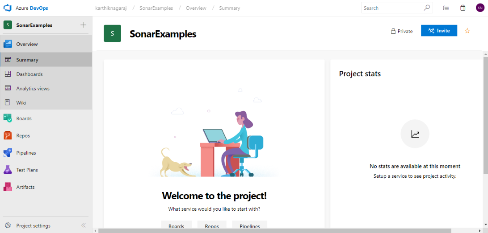

    See [here](https://docs.microsoft.com/en-us/vsts/git/import-git-repository?view=vsts){:target="_blank"} for detailed instructions on importing a repository.

    The scanning examples repository contains sample projects for a number of build systems and languages including C# with MSBuild, and Maven and Gradle with Java.

## Exercise 1: Set up a build definition that integrates with SonarCloud

You will set up a new build definition that integrates with SonarCloud to analyze the **SonarExamples** code. As part of setting up the build definition you will create a SonarCloud account and organization.

1. In your new Azure DevOps project, go to **Builds** under **Pipelines** tab, then click on **New pipeline** to create a new build definition.

1. Click on **Continue** to accept the default values for **Source**, **Team project**, **Repository** and **Default branch**

    

   > The SonarCloud extension contains custom build templates for Maven, Gradle, .NET Core and .NET Desktop applications. The templates are based on the standard Azure DevOps templates but with additional analysis-specific tasks and some pre-configured settings.

1. Select the .NET Desktop with SonarCloud template.

    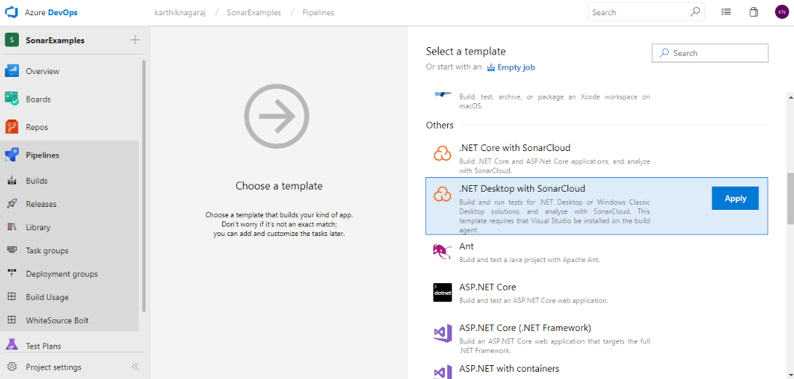

    The template contains all of the necessary tasks and most of the required settings. We will now provide the values for the remaining settings.

1. Select the _Hosted VS2017_ agent queue 

    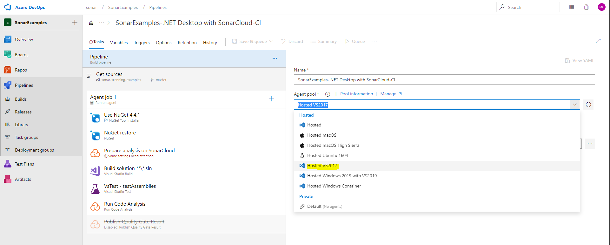

1. Configure the _Prepare analysis on SonarCloud_ task

    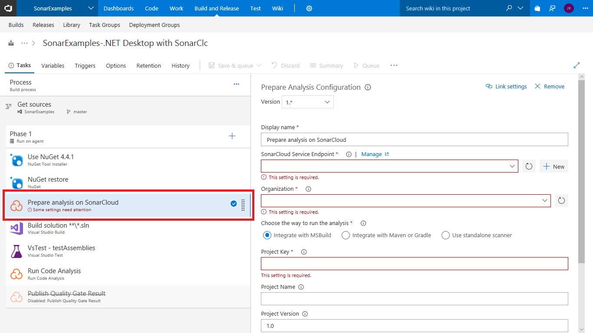

   There are three settings that need to be configured:

   |Setting|Value|Notes|
   |---------|-----|-----|
   |**SonarCloud Service Endpoint**|SonarCloudSamples|The name of the Azure DevOps endpoint that connects to SonarCloud|
   |**Organization**|{your SonarCloud org id}|The unique key of your organization in SonarCloud|
   |**Project Key**|{your Azure DevOps account name}.visualstudio.com.sonarexamples.netfx |The unique key of the project in SonarCloud|

   

   You will now create the endpoint and an account on SonarCloud.

1. Create a service endpoint for SonarCloud

   - Click on the **+New** button to start creating a new endpoint

    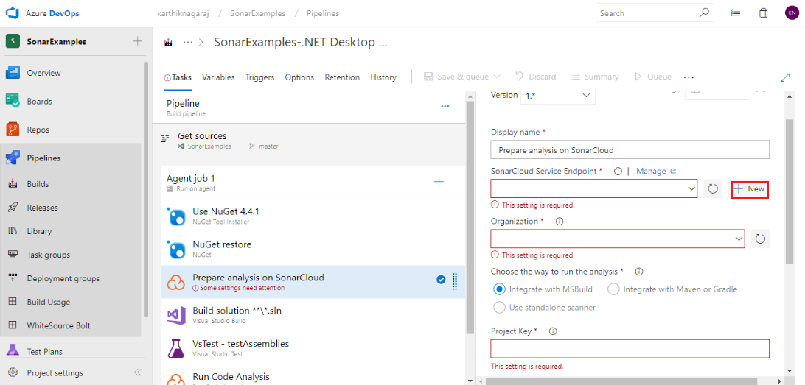

1. Create a SonarCloud account

   A service endpoint provides the information that Azure DevOps requires to connect to an external service, in this case SonarCloud. There is a custom SonarCloud endpoint that requires two pieces of information: The identity of the organization in SonarCloud and a token that Azure DevOps build can use to connect to SonarCloud. You will create both while setting up the endpoint.

   - Click on **your SonarCloud account security page** link

    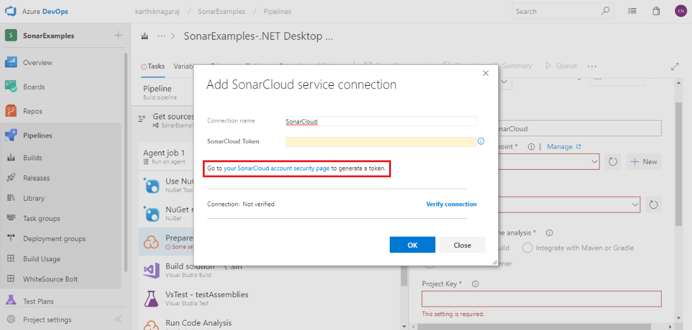

1. Select the identity provider to use to log in to SonarCloud

   As we are not currently logged in to SonarCloud we will be taken to the SonarCloud login page.

   - Select the identity provider you want use and complete the log in process

    

1. Authorize SonarCloud to use the identity provider

   > The first time you access SonarCloud, you will be asked to grant SonarCloud.io access to your account. The only permission that SonarCloud requires is to read your email address.

    

    After authorizing and logging in, you will be redirected to the **Generate token** page.

1. Generate a token to allow Azure DevOps to access your account on SonarCloud:

   - Enter a description name for the token e.g. "azuredevops_build" and click on **Generate** 

    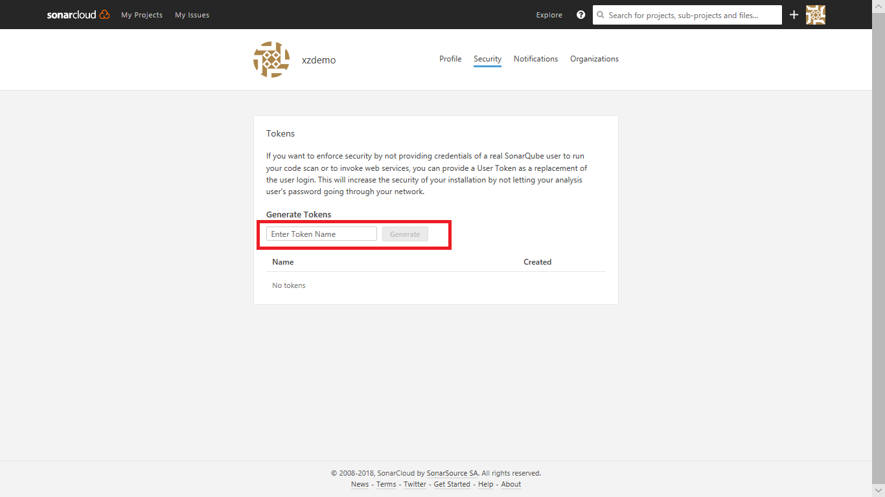

1. Copy the generated token

   - Click on **Copy** to copy the new token to the clipboard

    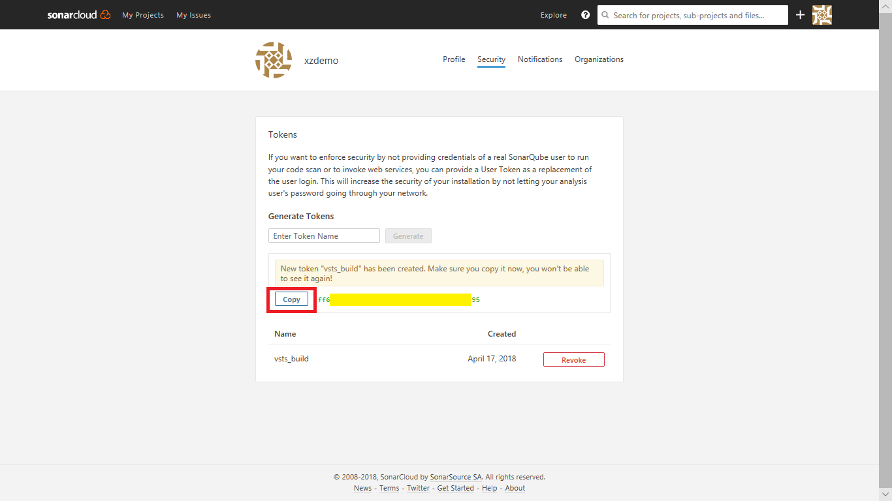

    

   You have now created an organization on SonarCloud and have the token needed configure the Azure DevOps endpoint.

1. Finish creating the endpoint in Azure DevOps
   - Return to Azure DevOps **Add new SonarCloud Connection** page, set the **Connection name** to **SonarCloud**, and enter the **SonarCloud Token** you have just created.

   - Click on **Verify connection** to check the endpoint is working, then click **OK** to save the endpoint.

    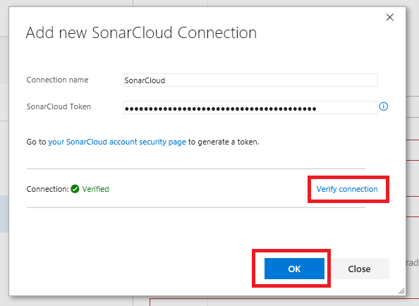

1. Finish configuring the **Prepare analysis on SonarCloud** task.

   - Click on **Organization** drop-down and select your organization.

   - Enter a unique key for your project e.g. **[your account].visualstudio.com.sonarexamples.netfx**

   - Enter a friendly name for the project e.g. **Sonar Examples - NetFx**

    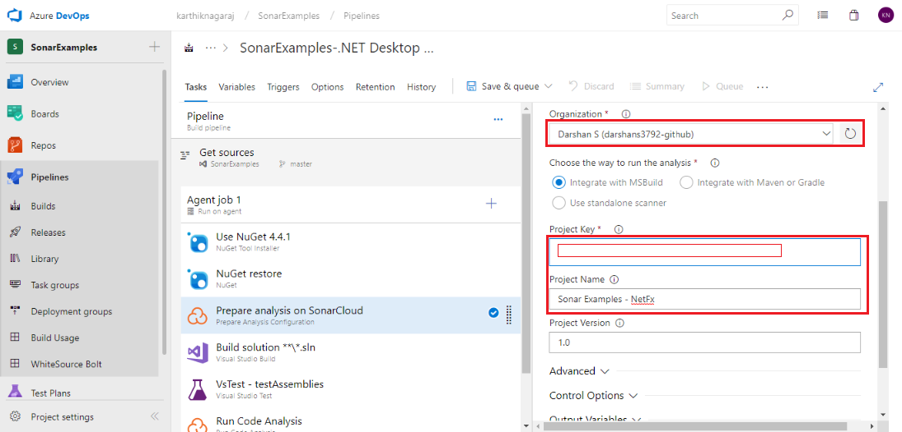

1. [Optional] Enable the _Publish Quality Gate Result_ step

   This step is not required and is disabled by default.
   If this step is enabled, a summary of the analysis results will appear on the _Build Summary_ page. However, this will delay the completion of the build until the 
   processing on SonarCloud has finished.

1. Save and queue the build.

   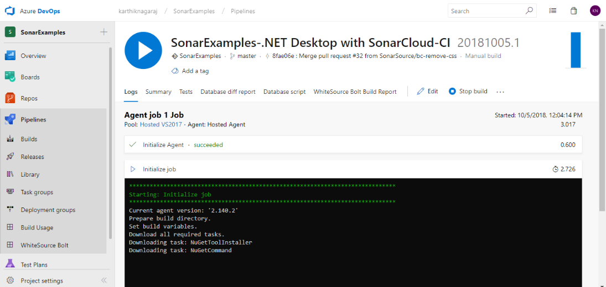

1. If you enabled the _Publish Quality Gate Result_ step above, the Build Summary will contain a summary of the analysis report. 

   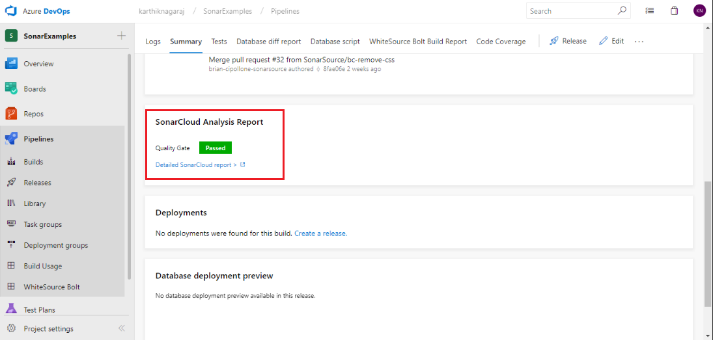

1. Either click on **Detailed SonarCloud Report** link in the build summary to open the project in SonarCloud or browse to SonarCloud and view the project.

   

   You have now created a new organization on SonarCloud and configured a Azure DevOps build to perform analysis and push the results of the build to SonarCloud.

## Exercise 2: Analyze SonarCloud Reports

Open the **Sonar Examples - NetFx** project in the SonarCloud Dashboard. Under ***Bugs and Vulnerabilities***, you can notice a bug that has been caught.

  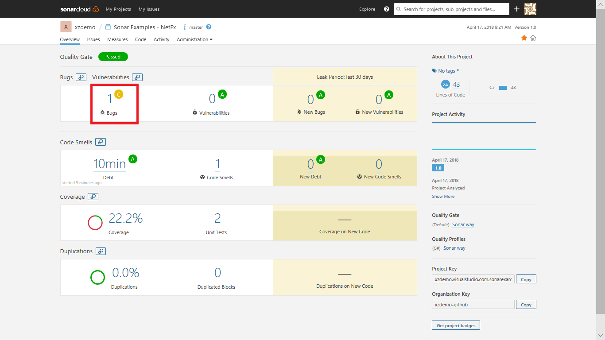

  The page has other metrics such as ***Code Smells***, ***Coverage***, ***Duplications*** and ***Size***. The following table briefly explains each of these terms.

   |Terms|Description|
   |-----|-----------|
   |**Bugs**|An issue that represents something wrong in the code. If this has not broken yet, it will, and probably at the worst possible moment. This needs to be fixed|
   |**Vulnerabilities**|A security-related issue which represents a potential backdoor for attackers|
   |**Code Smells**|A maintainability-related issue in the code. Leaving it as-is means that at best maintainers will have a harder time than they should making changes to the code. At worst, they'll be so confused by the state of the code that they'll introduce additional errors as they make changes|
   |**Coverage**|To determine what proportion of your project's code is actually being tested by tests such as unit tests, code coverage is used. To guard effectively against bugs, these tests should exercise or 'cover' a large proportion of your code|
   |**Duplications**|The duplications decoration shows which parts of the source code are duplicated|
   |**Size**|Provides the count of lines of code within the project including the number of statements, Functions, Classes, Files and Directories|

  

1. Click on the **Bugs** count to see the details of the bug.

   

1. Click on the bug to navigate to the code

   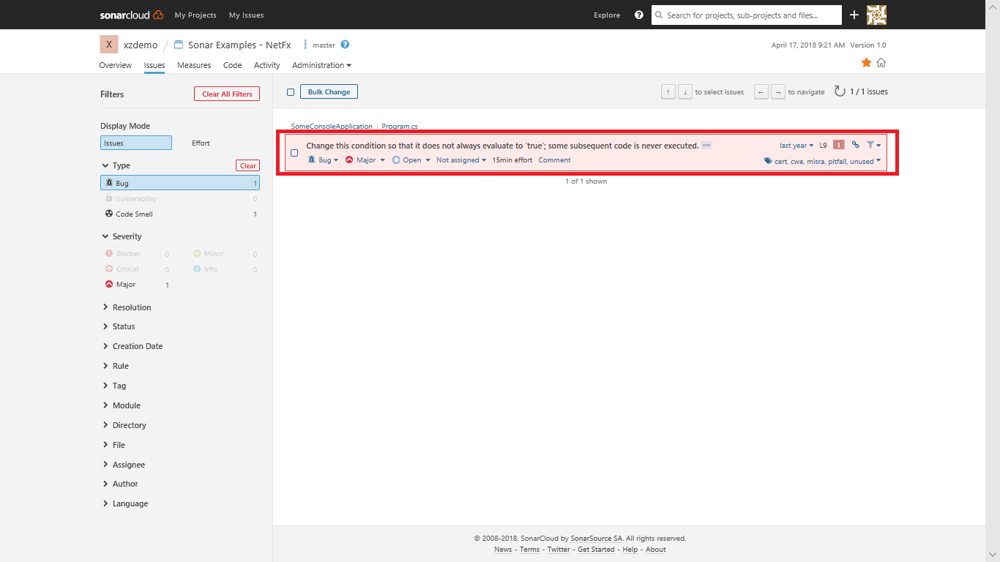

1. You will see the error in line number 9 of **Program.cs** file as **Change this condition so that it does not always evaluate to 'true'; some subsequent code is never executed.**.

   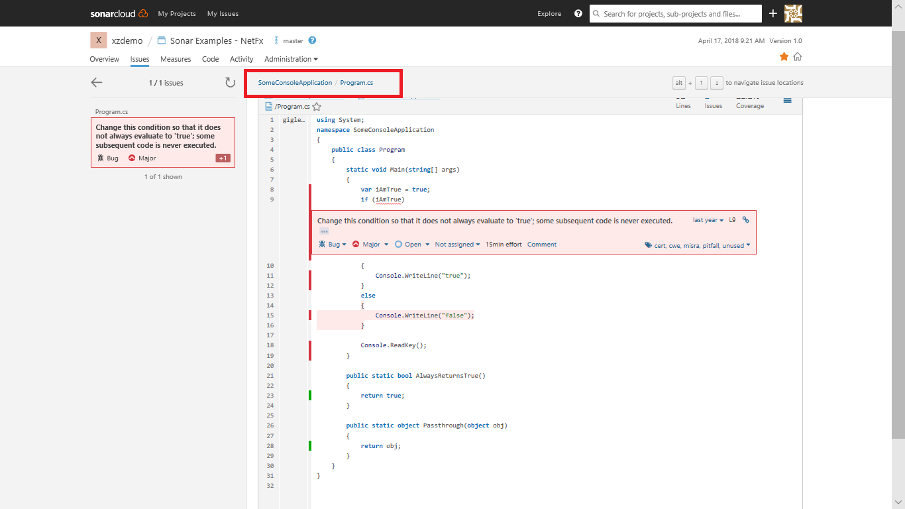

   You can also see which lines of code are not covered by tests.

   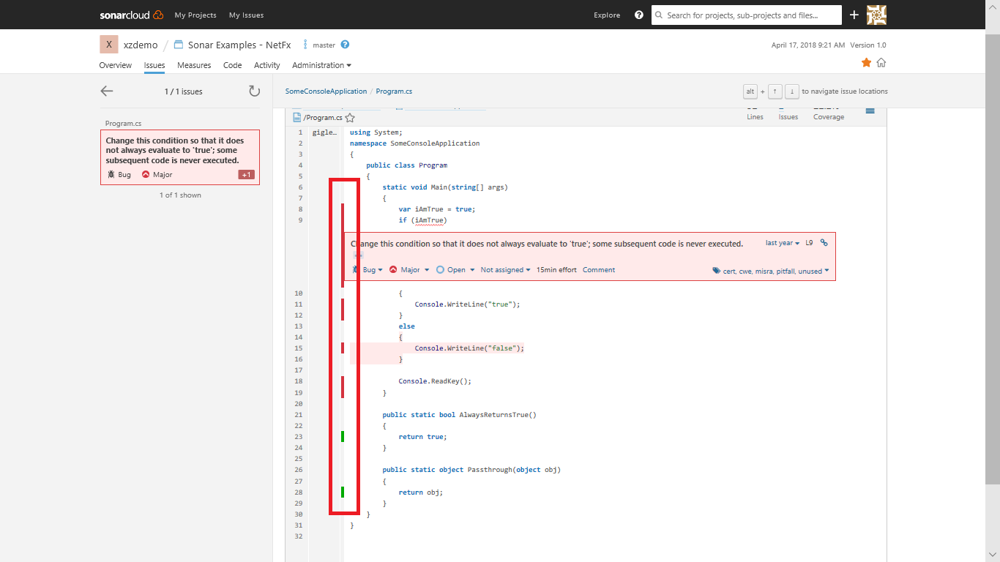

   The sample project is very small and has no historical data. However, there are thousands of [public projects on SonarCloud](https://sonarcloud.io/explore/projects){:target="_blank"} that have more interesting and realistic results.

## Exercise 3: Set up pull request integration
   
   Configuring SonarCloud analysis to run when a pull request is created has two parts:
   - The SonarCloud project needs to be provided with an access token so that it can add PR comments to Azure DevOps and
   - A Branch Policy needs to be configured in Azure DevOps to trigger the PR build

1. Create a **Personal Access Token** in Azure DevOps.

   - Follow the instructions in this [article](https://docs.microsoft.com/en-us/vsts/accounts/use-personal-access-tokens-to-authenticate){:target="_blank"} to create a token with **Code (read and write)** scope.

    > SonarCloud will post comments to the pull request as if it is user who owns the personal access token. The recommended practice is to create a separate "bot" Azure DevOps user for this so that it is clear which comments are from real developers and which are from SonarCloud.
   
   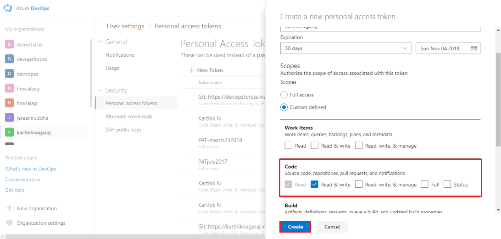

    

1. Configure SonarCloud to analyze pull requests

   - Browse to the **Sonar Examples - NetFx** dashboard in SonarCloud

   - Click on **Administration** -> **General Settings**
   
   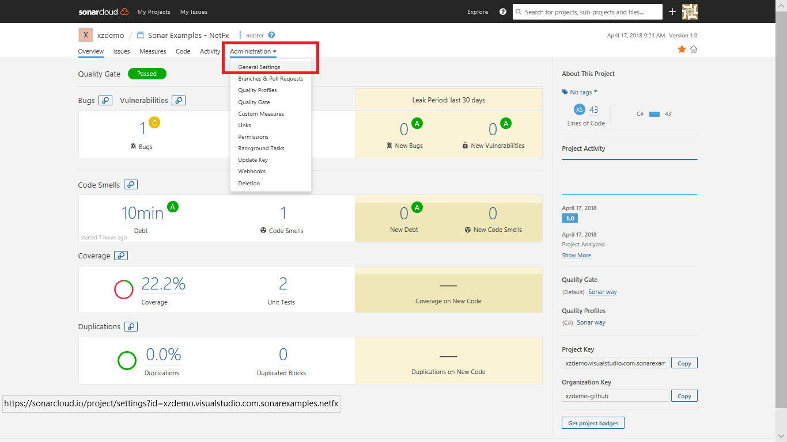

   - Select the **Pull Requests** tab

   - Set the **Provider** drop-down to **VSTS**

   - Set the **Personal access token**

   - Click on **Save**

   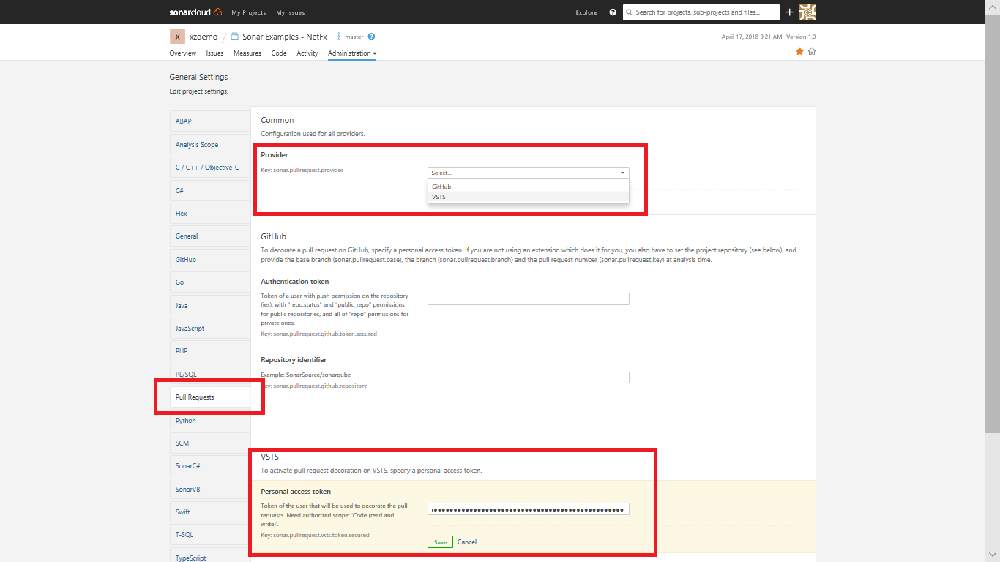

1. Configure the branch policy for the project in Azure DevOps

   - Navigate to the **SonarExamples** project in Azure DevOps

   - Click on **Repos** -> **Branches** to view the list of branches

   - Click on the settings link ("**...**") for **master** and select **Branch policies**

      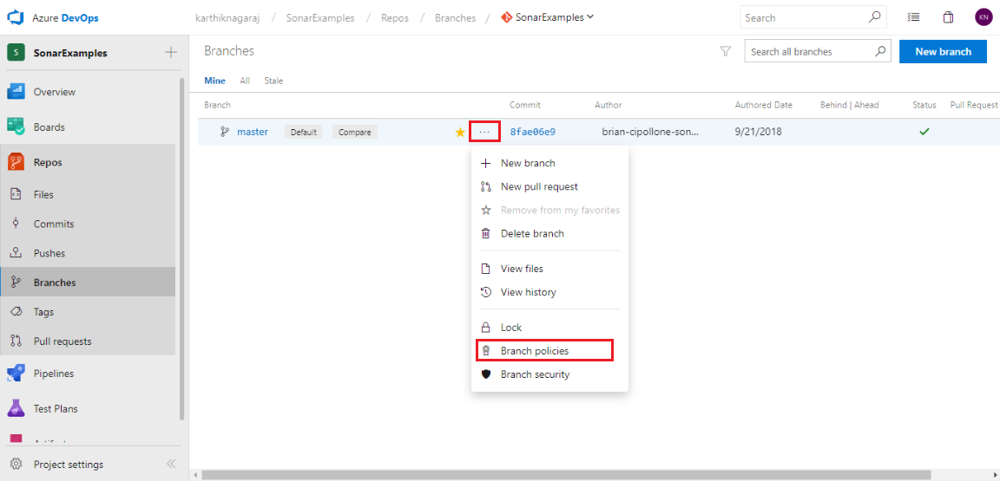

   - Click on **Add Build Policy**

      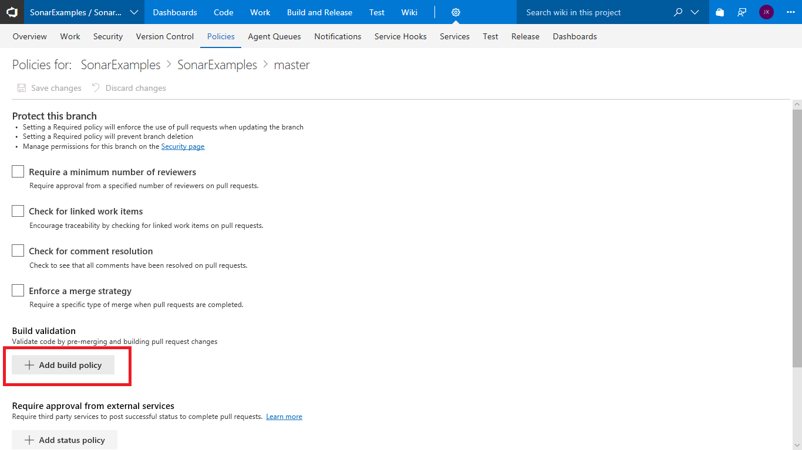

   - Select the build definition we created earlier from the **Build definition** drop-down

   - Set the **Display name** to **SonarCloud analysis**

   - Click on **Save**

      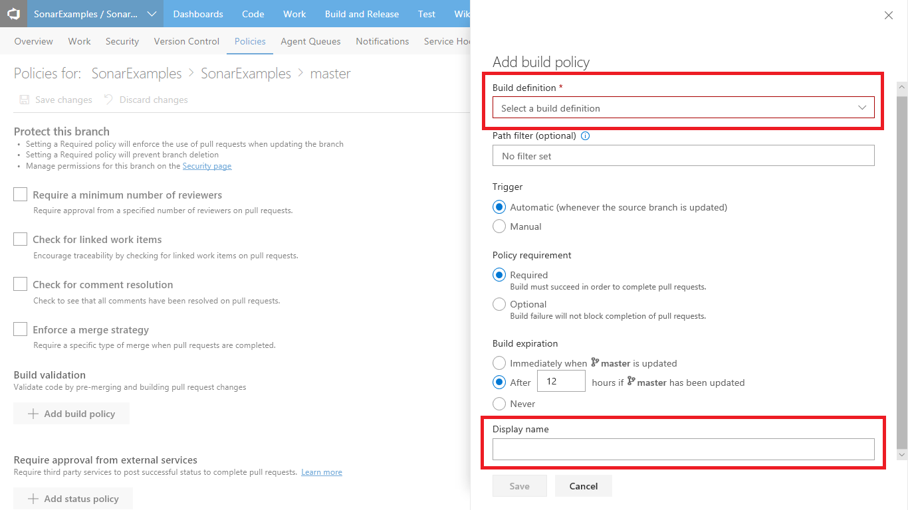

   Azure DevOps is now configured to trigger a SonarCloud analysis when any pull request targeting the **master** branch is created.

1. Create a new pull request
   
   Now you need to make changes to a file and create a new request, so that you can check, the pull request triggers the analysis.

   - Navigate to the code file **Program.cs** at **sonarqube-scanner-msbuild/CSharpProject/SomeConsoleApplication/Program.cs** and click on **Edit**

   - Add an empty method to the code as shown in the following screen shot, then click on **Commit...**

   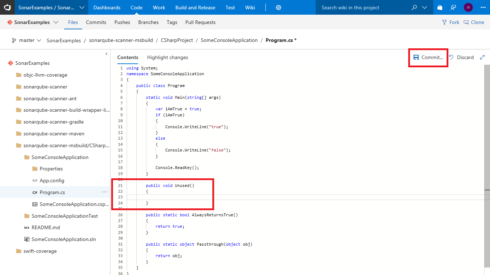

   In the dialogue that appears:
   - Change the branch name from **master** to **branch1**

   - Check the **Create a pull request** checkbox

   - Click on **Commit**, then click **Create** on the next screen to submit the pull request

   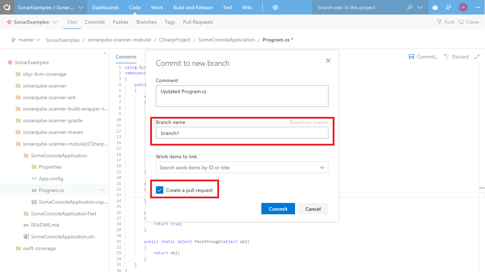
   
   If the pull request integration is correctly configured the UI will show that an analysis build is in progress.
   
   

1. Review the results of the Pull Request analysis

   The results show that the analysis build completed successfully, but the new code in the PR failed the Code Quality check.
   A comment has been posted to the PR for the new issue that was discovered.

   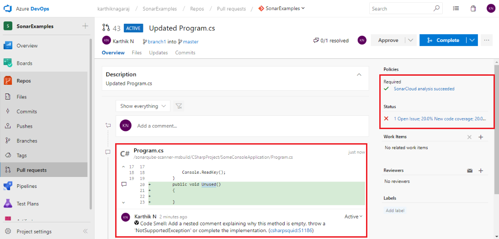

   Note that the only issues in code that was changed or added in the pull request are reported. Pre-existing issues in **Program.cs** and other files are ignored.

1. Block pull requests if the Code Quality check failed

   At this point it is still possible to complete the pull request and commit the changes even though the Code Quality check has failed.
   However, it is simple to configure Azure DevOps to block the commit unless the Code Quality check passes:

   - Return to the **Branch Policy** page
   - Click on **Add status policy**
   - Select **SonarCloud/quality gate** from the **Status to check** drop-down
   - Set the **Policy requirement** to **Required**
   - Click on **Save**

   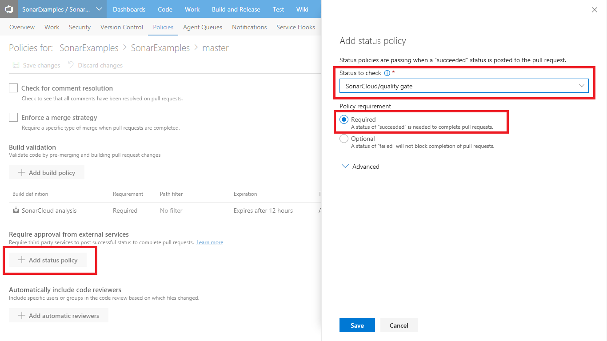

   Users will now be unable to merge the pull request until the Code Quality check is successful, either because all of the issues have been fixed or the the issues have been marked as **confirmed** or **resolved** in SonarCloud.

## Summary

With  the **SonarCloud** extension for **Azure DevOps**, you can embed automated testing in your CI/CD pipeline to automate the measurement of your technical debt including code semantics, testing coverage, vulnerabilities etc. You can also integrate the analysis into the Azure DevOps pull request process so that issues are discovered before they are merged.
