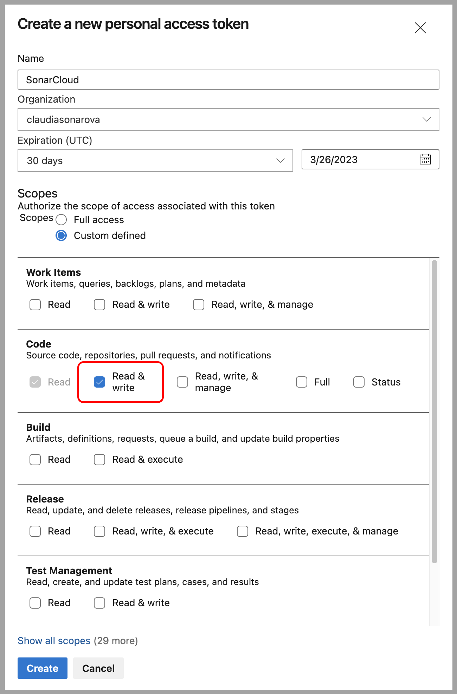
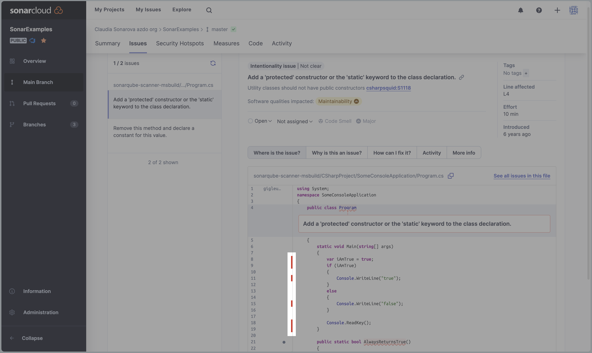
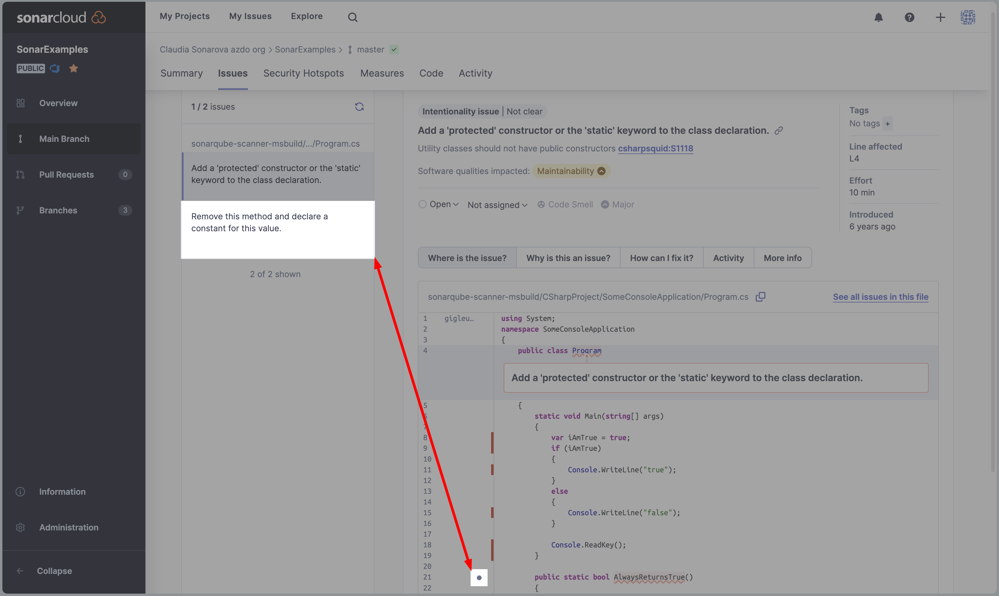

## Overview

[SonarCloud](https://www.sonarsource.com/products/sonarcloud/?utm_medium=referral&utm_source=azuredevopslab&utm_campaign=sc-signup&utm_content=signup-sonarcloud-listing-x-x&utm_term=ww-psp-x){:target="\_blank"} is a cloud-based clean code (code quality and security) service that is free for open source projects and offers a free trial for private projects. It features:

- 26 languages, including Java, JS, C#, C/C++, Objective-C, TypeScript, Python, ABAP, PLSQL, T-SQL, and more.
- More than 5,000 rules to track down hard-to-find bugs and quality issues thanks to powerful static code analyzers.
- Cloud CI Integrations, with Travis, Azure DevOps, BitBucket, AppVeyor and more.
- Deep code analysis, to explore all source files, whether in branches or pull requests, to reach a green Quality Gate and promote the build.
- Fast, automatic analysis of most languages - no configuration required.
- Free analysis for open-source projects and a no-commitment, free 14-day trial for your private repositories.
- IDE support with SonarLint when using [Connected Mode](https://docs.sonarcloud.io/improving/sonarlint/?utm_medium=referral&utm_source=azuredevopslab&utm_campaign=sc-signup&utm_content=signup-sonarcloud-listing-x-x&utm_term=ww-psp-x) to find code issues on the fly. SonarCloud rules and quality profiles synchronize with SonarLint, aligning teams around a single standard of Clean Code.

Want additional learning? Check out the <a href="https://docs.microsoft.com/en-us/learn/modules/scan-for-vulnerabilities/" target="_blank"><b><u> Scan code for vulnerabilities in Azure Pipelines</u></b></a> module on Microsoft Learn.

### What's covered in this lab

In this lab, you will learn how to integrate Azure DevOps Services with SonarCloud:

- Setup an Azure DevOps project and CI build to integrate with SonarCloud.
- Analyze SonarCloud reports.
- Integrate static analysis into the Azure DevOps pull request process.

### Prerequisites for the lab

1. You will need a Microsoft account.

1. Using this account, sign in to [**Azure DevOps Services**](https://azure.microsoft.com/en-us/products/devops/){:target="\_blank"}.

1. Create a new Azure DevOps project for this lab:
  
   Every project in Azure DevOps belongs to an organization. You will be placed into an automatically created default organization on sign in, the name of which is based on your user name (in our example, the user Claudia Sonarova has been given the organization **claudiasonarova**).
   
   Inside this organization, create a project called **SonarExamples**:
   
   > SonarCloud supports both private and public projects and offers a no-commitment, 14-day trial of SonarCloud for your private repositories completely free. Remember, SonarCloud analysis is always free for open-source projects! More details about [Pricing](https://docs.sonarcloud.io/managing-your-subscription/pricing/){:target="_blank"} is explained in the docs.

   

   Import the **Sonar Scanning Examples repository** from GitHub at https://github.com/SonarSource/sonar-scanning-examples.git or use the HTTPS address of your own repo. The scanning examples repository contains sample projects for a number of build systems and languages including C# with MSBuild, Maven, and Gradle with Java.
   
   Go to **Your project** > **Repos**:

   

   Then, select **Import**:

   

   See [this Microsoft documentation](https://docs.microsoft.com/en-us/azure/devops/repos/git/import-git-repository?view=azure-devops) for detailed instructions on importing a repository.

1. Install the SonarCloud Azure DevOps extension in your Azure DevOps account. The SonarCloud extension contains build tasks, build templates and a custom dashboard widget to help with the construction of your pipeline.

   Find the [SonarCloud extension](https://marketplace.visualstudio.com/items?itemName=SonarSource.sonarcloud) on the Visual Studio Marketplace and click **Get it free** to install it, then select **Proceed to organization** after the installation has finished.

   

   The page will update when your installation is complete. 

   

   > If you do not have the appropriate permissions to install an extension from the marketplace, a request will be sent to the account administrator to ask them to approve the installation.

1. Using the same account as you used for Azure DevOps, sign into SonarCloud: [https://sonarcloud.io/login](https://sonarcloud.io/login)

   

1. In SonarCloud, create an organization and, within that, a new project. The organization and project you set up in SonarCloud will mirror the organization and project that you set up in Azure DevOps.

   Once you sign in, select **Import an organization from Azure** on the Welcome to SonarCloud page.

   

   Follow the SonarCloud in-product tutorial to create an organization. First, add your **Azure DevOps organization name** (dev.azure.com/{YOUR-ORG}) in SonarCloud. Next in Azure, go to **Azure DevOps** > **User settings** > **Security** > **Personal access tokens** to create a new Personal Access Token (PAT); the SonarCloud in-product tutorial provides a link to Azure's User settings so if you are doing this in parallel, creating a PAT will be easy. See the Microsoft documentation to [Create a PAT](https://docs.microsoft.com/en-us/azure/devops/organizations/accounts/use-personal-access-tokens-to-authenticate?view=azure-devops&tabs=preview-page) if more details are needed.

   

   In Azure, define the token's **Name** and select the correct **Organization** (if you have multiple) from the list. Then, navigate to **Scopes** >  **Code** and select **Read & Write** before you **Create** the new token.

   
   
   Copy your PAT from Azure and paste it into SonarCloud before continuing with the SonarCloud in-product tutorial.

    
   
   Define an **Organization Key**. A key will be automatically formatted for you if you define the **Name** above. Note that the name/key must be unique within the SonarCloud system or you cannot continue. You have an opportunity to add additional info if desired.

   Select **Continue** to move to the final step.

   

   Lastly, choose your plan. For this example, we selected a free plan (that is, one for public repos only), but you can choose a paid plan if you intend to have private repos:

   

   You have now created the SonarCloud organization that will mirror your Azure DevOps organization.

   Now, from within your new organization, create a SonarCloud project that will mirror the Azure DevOps project *SonarExamples* we imported earlier. Select **Analyze a new project** to continue.

   

   Choose your Azure DevOps project(s) to add and select **Set Up** to create a project on SonarCloud.

   

   Let's follow the SonarCloud in-product tutorial to set up the scanning in Azure Pipelines. Select **With Azure DevOps Pipelines** to get started: 

   

   - You can skip **Install our extension** if done previously. 
   - Next, **Add a new SonarCloud Service Endpoint** to your Azure project. Go to **Project settings** > **Service connections** and use the token provided by the in-product tutorial.
   - With your Service Endpoint verified, move on to **Configure Azure Pipeline** and select the option that best describes your build: 
   
      
         
      We will use a **.NET** project for Exercise 1 to configure the Azure DevOps Pipeline.

## Exercise 1: Set up a pipeline that integrates with SonarCloud

We will set up a new build pipeline that integrates with SonarCloud to analyze the **SonarExamples** project. 

Azure DevOps offers two ways to create pipeline: using a .YAML file or with the classic editor. Both methods begin the same way, by creating a new pipeline.

In your new Azure DevOps project, go to the **Pipelines** > **Pipelines** tab and select **Create Pipeline**:

   

Here you have two options: you can configure the pipeline with either the **YAML** editor or choose to use the **Classic editor** to create a pipeline without YAML.

With the classic editor, you can take advantage of the pre-defined templates that were installed as part of the SonarCloud Extension above. With the YAML editor, you can use a separately provided YAML template file. We will cover both methods in this exercise, starting with the **YAML** editor.

### YAML Editor

1. On the **Where is your code?** page:: Because we have already cloned our repo to the SonarExamples project in Azure, we will select **Azure Repos Git**. You may have a different configuration in your project.

   

1. On the next screen select the git repository that you imported earlier, our repo is called **SonarExamples**:

   

1. Now select a YAML file template. We will be building and analyzing the .NET code in our example imported repository, so we will start by choosing the **.NET Desktop** YAML template:

   

1. The YAML editor will open with the template YAML file. In order to configure it correctly, you will need to adjust it (or replace it) so that it looks like the following example file:  [net-desktop-sonarcloud.yml](https://github.com/SonarSource/sonar-scanner-vsts/blob/master/yaml-pipeline-templates/net-desktop-sonarcloud.yml)

   We must customize it to fit our needs:

   1. **Modify the Build task**: change the pointer to the solution. Note that we: 
      - added a `solution` variable in this example to improve the template, 
      - we updated the `NuGetToolInstaller`, and 
      - we used wildcards because our `.sln` file is not located in the root of the repo:

      

   1. **Modify the `SonarcloudPrepare` task with your information**: Follow in-product tutorial from Sonarcloud to add the required steps in your pipeline. The steps will be different depending on your build option and because we are using .NET for this tutorial, we have these items to configure:

      
   
      1. **Set your Fetch Depth**: See SonarCloud for the code sample to copy/paste.
      
      1. **Prepare Analysis Configuration**: To continue, type `sonarcloud` in the Azure task search bar and select **Prepare Analysis Configuration**. Then, using the values provided by the SonarCloud in-product tutorial, complete the following steps:
      
         1. Select the SonarCloud endpoint you created a few minutes ago.
         2. Copy/paste your **Organization**.
         3. Depending on your choosen build option, SonarCloud will recommend the correct way to run the analysis.
         4. Copy/paste the **Project Key**.
         5. Copy/paste the **Project Name**.

         Note in the following image how Azure DevOps will format the task parameters for you.

         

   When you are done making the changes to the YAML file, edit the commit message and select **Save and run**:

   

### Classic Editor (skip this method if you chose the YAML option)

Use of the classic editor is still supported by Azure DevOps and therefore still supported by SonarCloud. 

To continue with this alternate part of **Exercise 1**, you should have already started the setup process in SonarCloud so that your service endpoint is created, and installed the [SonarCloud extension](https://marketplace.visualstudio.com/items?itemName=SonarSource.sonarcloud) in Azure DevOps.

1. To configure the pipeline using the classic editor, select **Use the classic editor** on the **Where is your code?** page:

   

1. Select your **source**, **Repository** and **Default branch** for builds. The selection needed for the steps followed in this tutorial are highlighted. Then click **Continue**.

   

   > The [SonarCloud extension](https://marketplace.visualstudio.com/items?itemName=SonarSource.sonarcloud) installed earlier provides SonarCloud-enabled custom build templates for Maven, Gradle, .NET Core and .NET Desktop applications. The templates are based on the standard Azure DevOps templates and have additional analysis-specific tasks as well as some pre-configured settings to make the process easierto configure.

1. Select the **.NET Desktop with SonarCloud** template and click **Apply**.

   

   The template contains all of the necessary tasks and most of the required settings. However, You will need to provide a few additional settings.

1. The pipeline editor will open and you must now define your tasks. First, select your **Agent pool** and **Agent Specification**; we used _Azure Pipelines_ for the Agent pool and, for our project, _windows-latest_ as the Agent Specification.

   

1. Go to **Get sources** in Azure and disable your **Fetch Depth**. The SonarCloud tutorial recommends to set the Fetch depth to `0`, but this is not an option when using the Classic editor. When the fetch depth is ≠ 0, some features, such as automatic assignment of issues, may be missing or broken. Disabling shallow clone is recommended for improving the relevancy of reports, but it is not required to run an analysis.

   

1. Next, we must add the analysis configuration values given by the SonarCloud in-product tutorial to the **Prepare analysis on SonarCloud** step in the pipeline.
   
   1. If you haven't already defined your **SonarCloud Service Endpoint**, do it now; it was the last step we took in SonarCloud before starting [Exercise 1](#exercise-1-set-up-a-pipeline-that-integrates-with-sonarcloud). To create a new service endpoint, click the **New** button then add your **SonarCloud Token** and **Verify** the connection. If verification works, give your token a name then select **Verify and save** to define it in the task.

       

      The SonarCloud in-product tutorial will generate an endpoint token for you during project setup. This token identifies your account on that system and allows other services, in this case, Azure DevOps, to connect to that account. You can create and revoke tokens at any time by going to **My Account** > **Security** in [SonarCloud](https://sonarcloud.io/account/security). For this tutorial, we used the token provided by the in-product tutorial.

      

   1. If the token was correctly copied, Azure DevOps should connect with your SonarCloud account and you should be able to click on the **Organization** drop-down to select the organization you created earlier; choose it from the dropdown (in our case `claudiasonarova-azdo-org`).

   1. SonarCloud's in-product tutorial gives you the next values you must define: **Choose the way to run the analysis**, copy/paste your **Project Key**, and copy/paste your **Project Name** (items 3 & 4 in the image).

      

   1. With all of the project settings defined in Azure, select **Save and queue**, add a commit message, and select **Save and run** to test your pipeline.

      

   If you set up everything correctly, the pipeline will run and your SonarCloud in-product tutorial page will refresh and present your project's first analysis results!

   

1. [Optional] Enable the **Publish Quality Gate Result** step in your pipeline.

   This step is added by default via the **.NET Desktop with SonarCloud** template, and is recommended to use SonarSource's Clean as You Code best practices. Enabling this feature will delay the completion of the build until the processing on SonarCloud has finished. However, it can be removed if desired.

   

1. **Save and queue** the build to update the pipeline after making changes. Once the build has started, you should see something like this:

   

1. If you did not change the default **Enabled** value in the _Publish Quality Gate Result_ step of your pipeline, the **Build Summary** > **Extensions** tab in Azure will contain a summary of the analysis report. See step 11 about setting up your Sonar Quality Gate.

    

1. Either select the **Detailed SonarCloud report >** link in the Azure build summary, or browse to SonarCloud and open the project to view the analysis results in SonarCloud.

1. To be able to see the Sonar Quality Gate result in your Azure Build summary, you must:
   - Run your first analysis to connect your Azure DevOps pipeline to your SonarCloud project. 
   - Define your [New Code Period](https://docs.sonarcloud.io/improving/new-code-definition/), and
   - Issue your first PR to check the new code against your [Quality Gate](https://docs.sonarcloud.io/improving/quality-gates/).

We have now created a new organization on SonarCloud and configured our Azure DevOps build to perform an analysis and push the results of the build to SonarCloud.

In Exercise 2, we will look at what to do with those reports in SonarCloud.

## Exercise 2: Review SonarCloud Reports

Let's keep using the **SonarExamples** project to illustrate concepts in this tutorial. In SonarCloud, navigate to **My Project** > **SonarExamples** and go to the **Summary** page by selecting **Main Branch**. 

In the **Maintainability** container, we can see that two code smells have been found.

The **Summary** page has other metrics such as **Vulnerabilities**, **Coverage**, **Code Smells**, **Security Hotspots**, **Duplications**, and will tell you how many **Lines of Code** you are using in this project. The following table briefly explains each of those terms.

| Terms | Description |
| --- | --- |
| **Bugs** | An issue that represents something wrong in the code. If this has not broken yet, it will, and probably at the worst possible moment. This needs to be fixed |
| **Vulnerabilities** | A security-related issue which represents a potential backdoor for attackers |
| **Coverage** | To determine what proportion of your project's code is actually being tested by tests such as unit tests, code coverage is used. To guard effectively against bugs, these tests should exercise or 'cover' a large proportion of your code |
| **Code Smells** | A maintainability-related issue in the code. Leaving it as-is means that at best maintainers will have a harder time than they should make changes to the code. At worst, they'll be so confused by the state of the code that they'll introduce additional errors as they make changes |
| **Duplications** | The duplications decoration shows which parts of the source code are duplicated |
| **Lines of Code** | Provides a count of lines of code being analyzed within the project; including the number of statements, functions, classes, files, and directories |

{% include important.html content= "Notice, inside of the **Reliability** container that a letter **C** grade is displayed alongside the bug count; this is the **Reliability Rating**. The grade **C** indicates that there is *at least 1 major bug* in this code. For more information on reliability ratings, check out our page on [Metric Definitions](https://docs.sonarcloud.io/digging-deeper/metric-definitions/#reliability). For information about how issues are defined by those metric definitions, see [here](https://docs.sonarcloud.io/digging-deeper/issues/); and also check out the information on [rule types and severities](https://docs.sonarcloud.io/digging-deeper/rules/#rule-types-and-severities) for more details about those topics." %}

1. Click on the **Code Smells** count number to open the **Issues** page with the Code Smell type filter applied:

   

2. Click on the issue to navigate to the code. If you select the first issue, you fill find that it is on line number 4 of the `Program.cs` file (note the breadcrumb in the UI): **Add a 'protected' constructor or the 'static' keyword to the class declaration.**:

   

3. We can also see which lines of code are *not covered* by tests; hover over those red lines to see a pop-up message giving you more details:

   

   And you can select and review other issues nearby (in your code) by clicking on the issue list (in the left menu) or on the grey dot (in the code explorer):

    

Our sample project is very small and has no historical data but, there are thousands of [public projects on SonarCloud](https://sonarcloud.io/explore/projects){:target="\_blank"} that have more interesting and realistic results. Go have a look!

## Exercise 3: Set up pull request integration

Configuring SonarCloud analysis to run when a pull request is created involves two steps.

1. A SonarCloud project needs to be provided with an access token so it can add PR comments to Azure DevOps, and
2.  A Branch Policy needs to be configured in Azure DevOps to trigger the PR build

### **Step 1: Create a PAT and apply it to SonarCloud**

- 1.1. To create a PAT in Azure DevOps:

   - Navigate to **User settings** > **Personal access tokens**, then select **New Token**.

   - Make sure to set the scope under **Code** to **Read & write**. 

   - When ready, click **Create** and copy the generated token and save it to a secure location. Personal Access Tokens are like passwords; it is recommended that you save them somewhere safe so that you can re-use them for future requests.

      

   If you need more details about creating tokens, there are instructions in this [article](https://docs.microsoft.com/en-us/azure/devops/organizations/accounts/use-personal-access-tokens-to-authenticate?view=azure-devops).

   > SonarCloud will post comments to the pull request as if it is a user who owns the personal access token. The recommended practice is to create a separate "bot" Azure DevOps user for this so that it is clear which comments are from real developers and which are from SonarCloud.

- 1.2 Apply your PAT to SonarCloud:

   - Navigate to the **Sonar Examples** dashboard in SonarCloud (or your Project's dashboard).
   - Select **Administration** > **General Settings**

     

   - Select the **Pull Requests** tab.
   - Set the **Provider** drop-down to **Azure DevOps Services** and **Save**.
   - Paste in the **Personal access token** you copied earlier and **Save**.

      

Remember that your PAT will expire and should be updated as needed or your PR analysis will fail. In addition, Azure DevOps cannot allow PATs to be configured at the organization *and* project levels simultaneously.

### **Step 2: Add a branch policy to your project in Azure**

   - 2.1. To configure the branch policy for the project in Azure DevOps:

   - Navigate to the **SonarExamples** project in Azure DevOps
   - Select **Repos** > **Branches** to view the list of branches.
   - Find your `master` branch and click on the 3-dots menu to open the **More options** > **Branch policies** page.

     

   - Click the **+** beside **Build Validation** to add a new build policy:

      

   - From the **Build definition** drop-down, select the build policy your just created, 
   - Set the **Display name** to *SonarCloud analysis* and,
   - click **Save**.

     

   Azure DevOps is now configured to trigger a SonarCloud analysis when any pull request targeting the **master** branch is created.

### **Test your setup**

Now we will make a change to a file and create a new request so that we can check that the pull request triggers an analysis.

1. Create a new pull request

   - In Azure, navigate to the code file **Program.cs** at **sonarqube-scanner-msbuild/CSharpProject/SomeConsoleApplication/Program.cs** and select **Edit**
   - Add an empty method (such as ``public void Unused(){}``) to the code as shown in the following screen shot.
   - Then select **Commit...** to continue:

      

   In the Commit dialog box that appears:

   - Change the branch name from **master** to **branch1**.
   - Select the **Create a pull request** checkbox.
   - Then select **Commit**, and **Create** on the next screen to create a new pull request.

      

      

      If the pull request integration is configured correctly, the UI will show that an analysis build is in progress.

     

2. Review the results of the Pull Request analysis

   The results show that the analysis builds completed successfully, but that the new code in the PR failed the Code Quality check.
   Comment has been posted to the PR for the new issue that was discovered.

   

   

   Note that the only issues in code that were changed or added in the pull request are reported - pre-existing issues in **Program.cs** and other files are ignored.

### **Block pull requests if the Code Quality check failed**

   At this point, it is still possible to complete the pull request and commit the changes even though the code quality check has failed. Nevertheless, it is simple to configure Azure DevOps to block the PR unless the Sonar Quality Gate check passes.

1. As we did in Step 2.1 above to add a branch policy, go to the **Branch Policy** page of the **master** branch. Because the `master` branch is the one you will want your PRs to merge into, this is where you have to adjust the policy.
   - Under Status Checks, Click **Add status policy**

      

   - Select **SonarCloud/quality gate** from the **Status to check** drop-down.
   - Set the **Policy requirement** to **Required**.
   - Select **Save** to continue.

     

   Users will now be unable to merge their pull request until the Code Quality check is successful (the Code Quality check succeeds when all issues have been either fixed or marked as **confirmed** or **resolved** in SonarCloud).

## Exercise 4: Check the SonarCloud Quality Gate status in a Continuous Deployment scenario (In Preview)

**Disclaimer: This feature is in preview, and may not reflect its final version. Please look at the notes at the end of this exercise for more information.**

Starting from version 1.8.0 of the SonarCloud extension for Azure DevOps, a pre-deployment gate is available for your release pipeline. It allows you to check the status of the SonarCloud Quality Gate for the artifact you want to deploy and block the deployment if the Quality Gate failed.

Prerequisites :

- Enable the **Publish Quality Gate Result** in your build pipeline
- Have an artifact built and published in this pipeline to feed the release pipeline

Setup :

1. In the left panel, navigate to **Pipelines** > **Releases**, and select **New pipeline** to get started.

   

1. On the next page, choose the template you want. We will select **Empty job** for this exercise.

   

1. For now, ignore the Stage properties and select the **Pre-deployment conditions** on Stage 1.

   

1. Select **Enabled** beside **Gates**
1. Select **+ Add**, then choose the **SonarCloud Quality Gate status check** Deployment gate. 

   

1. To have the fastest result possible for this exercise, we recommend you to define the Evaluation options as shown in this screenshot. Check the Microsoft Documentation for more information about how [Deployments gates](https://docs.microsoft.com/en-us/azure/devops/pipelines/release/approvals/gates?view=azure-devops) in Azure DevOps.

   

1. That's it. You can close this panel.
1. Next, select **Add an artifact** on the left. Currently, only build artifacts are supported. Choose the project and the source (the build pipeline) of your artifact; its alias should match the name of the artifact published in the build pipeline.
1. When finished defining the Project, Source, and alias, select **Add** to continue.

    

1. Enable the **Continuous deployment trigger**.

   

1. You can now **Save** your pipeline.
1. Go back to the build pipeline section and trigger a build of the pipeline that creates CD artifact. Once the build is completed and succeeded, it will trigger the CD automatically.
   
1. Go to the **Pipelines** > **Releases** page. After few minutes, (as defined by adding an artifact in step 8 of this exercise) your Quality Gate check should have been performed at least twice to get a 'go/nogo' for the stage. If it's green, it should look like this:

   

Otherwise, if it's failed, then read the important notes below to find out what happened and how to get a green Sonar Quality Gate.

**Important notes about this feature**

- The **Publish Quality Gate Result** task in your build pipeline has to be enabled in order for the release gate to work.
- If the Sonar Quality Gate is in the failed state, it will not be possible to get the pre-deployment gate passing because the initial status will remain unchanged. You will have to execute another build with either the current issues corrected in SonarCloud, or with another commit that fixed those issues.
- Please note also that the current default behavior of pre-deployment gates in release pipelines is to check the status every 5 minutes, for a duration of 1 day. However, if a Sonar Quality Gate for a build has failed, it will remain failed so there is no point in re-checking the status. Knowing this, you can either set the timeout after which gates fail to a maximum of 6 minutes so the gate will be evaluated only twice, or just cancel the release itself.
- Only the primary build artifact-related quality gate of the release will be checked.
- If multiple analyses are performed during a build, all of the related quality gates are checked. If one of the checks has the status either WARN, ERROR, or NONE, then the quality gate status on the Release Pipeline will be **Failed**.

## Summary

With the **SonarCloud** extension for **Azure DevOps Services**, you can embed automated testing in your CI/CD pipeline to automate the measurement of your technical debt including code semantics, testing coverage, vulnerabilities. etc. You can also integrate the analysis into the Azure DevOps pull request process so that issues are discovered before they are merged.

Do you want to see more examples of SonarCloud in action? Please explore current [open-source projects in SonarCloud](https://sonarcloud.io/explore/projects?sort=-analysis_date) that use the [Clean as You Code](https://docs.sonarcloud.io/improving/clean-as-you-code/?utm_medium=referral&utm_source=azuredevopslab&utm_campaign=sc-signup&utm_content=signup-sonarcloud-listing-x-x&utm_term=ww-psp-x) methodology.