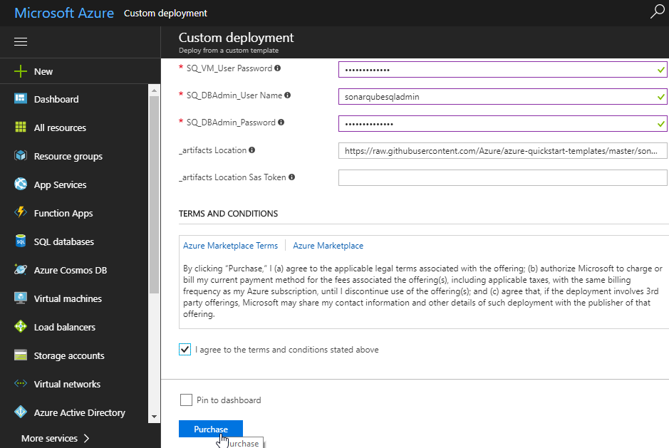
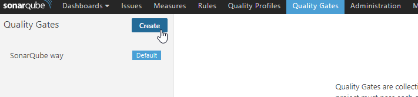
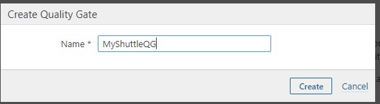
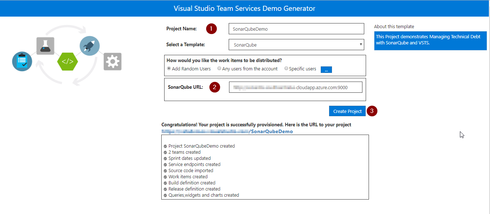
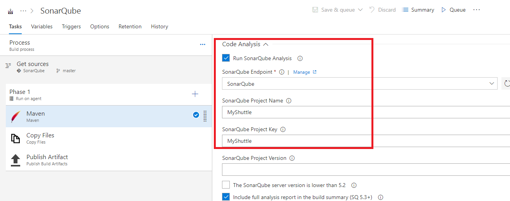
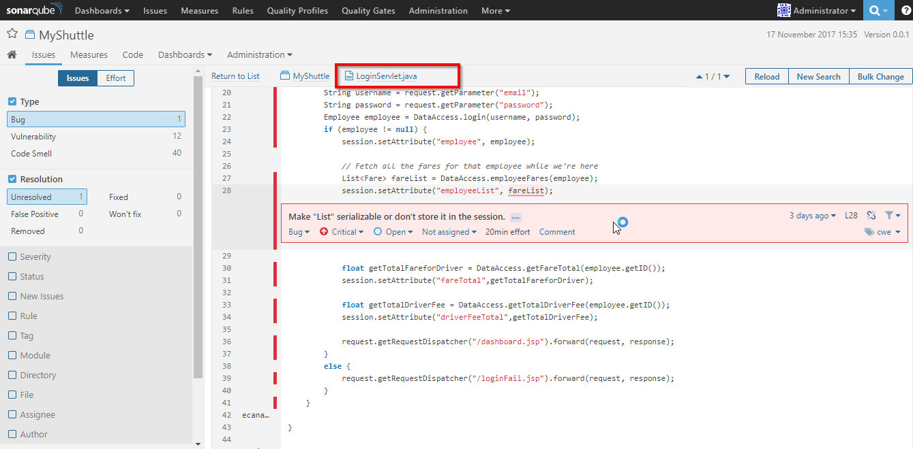
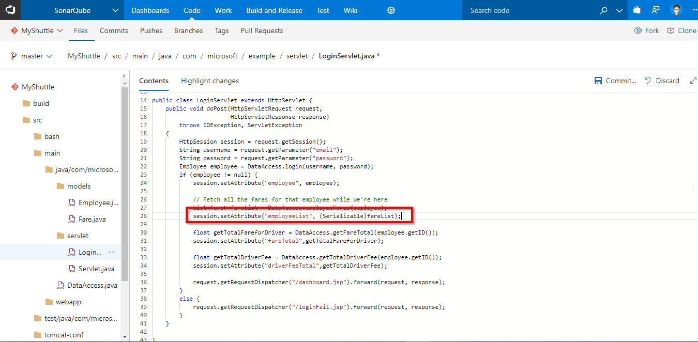
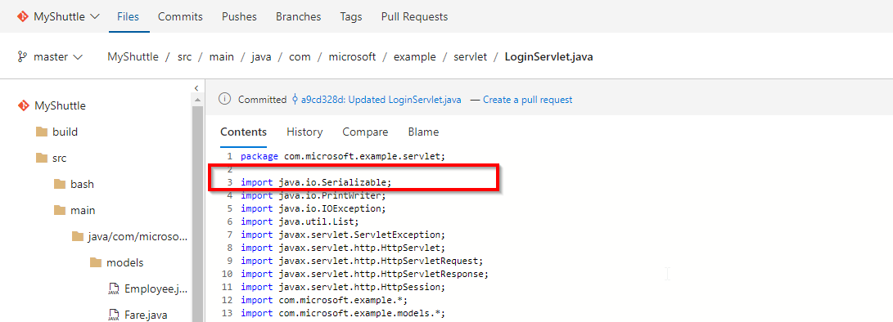
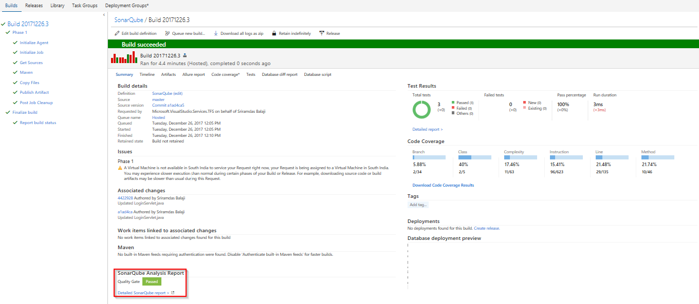
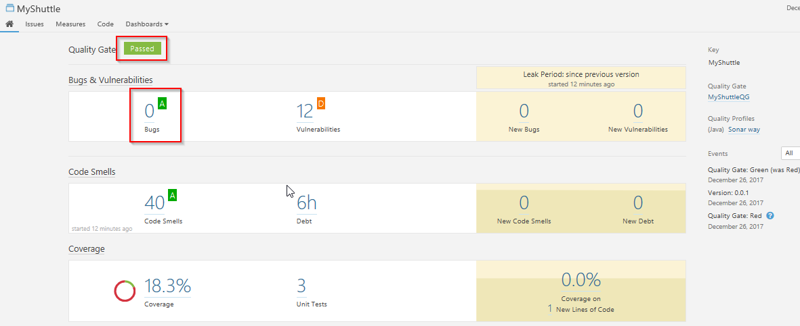

Last updated : {{ "now" | date: "%b %d, %Y" }}.
## Overview

Technical debt is the set of problems in a development effort that make forward progress on customer value inefficient. Technical debt saps productivity by making code hard to understand, fragile, time-consuming to change, difficult to validate, and creates unplanned work that blocks progress. Unless they are managed, technical debt can accumulate and hurt the overall quality of the software and the productivity of the development team in the long term

[SonarQube](https://www.sonarqube.org/) an open source platform for continuous inspection of code quality to perform automatic reviews with static analysis of code to:

- Detect Bugs
- Code Smells
- Security Vulnerabilities
- Centralize Quality

### What's covered in this lab

In this lab, you will learn how to setup SonarQube on Azure and to integrate Visual Studio Team Services

- Provision SonarQube server from an Azure template
- Setup SonarQube project
- Setup a VSTS project and CI build to integrate with SonarQube
- Analyze SonarQube reports

### Pre-requisites for the lab

1. An active **Microsoft Azure** account.

1. An active **VSTS** account. Create a new account from [here](https://docs.microsoft.com/en-us/vsts/accounts/create-account-msa-or-work-student).

1. A [Personal Access Token](https://docs.microsoft.com/en-us/vsts/accounts/use-personal-access-tokens-to-authenticate) (PAT).

## Setting up the Environment

1. Click the **Deploy To Azure** button below to provision SonarQube Server on Azure VM.

   

    

    

   Provide the following parameters as shown.

   |Parameter Name| Description|
   |--------------|------------|
   |**Subscription Details**|Choose the active Azure subscription, create a new resource group along with the location of creation|
   |**SQ_VM_Name**|name of the VM where SonarQube will be installed|
   |**SQ_DNS_NAME**|**unique** dns name to be provided with the following pattern:- **^[a-z][a-z0-9-]{1,61}[a-z0-9]$** or it will throw an error. For ex: sonarqubedns|
   |**SQ_VM_UserName**|local admin account for the SonarQube VM|
   |**SQ_VM_UserPassword**|password for the SonarQube VM|
   |**SQ_DBAdmin_UserName**|admin account for Azure SQL Server|
   |**SQ_DBAdmin_Password**|password for Azure SQL Server|
   |**_artifacts Location**|This value will be automatically generated. Leave the field as it is|
   |**_artifacts Location Sas Token**|The Sas Token will be automatically generated. Leave the field as it is|

1. After providing all of the required values in the above table, check the ***Terms & Conditions*** checkbox and click on the **Purchase button**.

   

   {% include important.html content= "The deployment in Azure can take up to 30 minutes. At the end of the deployment, SonarQube will be configured to run as a Windows Service on the SonarQube VM. When the SonarQube service starts for the first time, it will configure its database. This can take an additional 15 minutes  to complete during which time the Azure deployment shows as completed but you still won't be able to reach the SonarQube home page. Please give SonarQube some time to update. Click [here](https://blogs.msdn.microsoft.com/visualstudioalmrangers/2016/10/06/easily-deploy-sonarqube-server-in-azure/) for more information." %}

1. Once the deployment is successful, you will see the resources in Azure Portal.

   

## Exercise 1: Create a SonarQube Project and configure Quality Gate

1. Access the **SonarQube** portal providing the DNS name suffixed by the port number.

   

   

1. Open a browser and login to the SonarQube Portal using the following credentials-

   >**Username= admin, Password= admin**

   

1. Click on **Administration** in the toolbar, go to **Projects** tab and click **Management**.

   

1. Create a project with **Name** and **Key** as **MyShuttle**.

   - **Name**: Name of the SonarQube project that will be displayed on the web interface.

   - **Branch**[Optional]: Code branch which is tracked and reviewed for quality of code.

   - **Key**: The SonarQube project key that is unique for each project.

   

   Let us create a Quality Gate to enforce a policy which fails the gate if there are bugs in the code. A Quality Gate is a PASS/FAIL check on a code quality that must be enforced before releasing software.

1. Click on **Quality Gates** menu and click **Create** in the Quality Gates screen.

   

   

1. Enter name for the Quality Gate and click **Create**.

   

1. Let us add a condition to check for the number of bugs in the code. Click on **Add Condition** drop down and select the value **Bugs**.

   

1. Change the **Operator** value to **is greater than** and the **ERROR** threshold value to **0** (zero) and click on the **Add** button.

   

   

1. To enforce this quality gate for **MyShuttle** project, click on **All** under **Projects** section and select the project checkbox.

   

## Exercise 2: Setting up the VSTS project

1. Use [VSTS Demo Data Generator](https://vstsdemogenerator.azurewebsites.net/?name=SonarQube&templateid=77364) to provision a project on your VSTS account.

   

1. Provide the **Project Name**, the **SonarQube URL** that was created previously and click on **Create Project**. Once the project is provisioned, click the URL to navigate.

   

## Exercise 3: Modify the Build to Integrate with SonarQube

Now that the SonarQube server is running, we will modify VSTS build definition to integrate with SonarQube to analyze the java code provisioned by the VSTS Demo Generator system.

1. Go to **Builds** under **Build and Release** tab, edit the build definition **SonarQube**. This is a Java application and we are using Maven to build the code. The Maven task in VSTS includes OOB support for SonarQube. All you need to is to point the SonarQube endpoint that you just created.

1. Click on the **Maven** task and scroll down to the **Code Analysis** section. Configure the SonarQube settings as follows-

   |Parameter|Value|Notes|
   |---------|-----|-----|
   |**SonarQube Project Name**|MyShuttle|The name of the project in SonarQube|
   |**SonarQube Project Key**|MyShuttle|The unique key of the project in SonarQube|

   

   

1. Save and queue the build.

   

1. You will see that the build has failed since the associated  **SonarQube Quality Gate** has **failed**. The  count of bugs is also displayed under **SonarQube Analysis Report**.

   

1. Click on the **Detailed SonarQube Report** link in the build summary to open the project in SonarQube.

   

## Exercise 4: Analyze SonarQube Reports

The link will open the **MyShuttle** project in the SonarQube Dashboard.  Under ***Bugs and Vulnerabilities***, we can see a bug has been caught.

  

  The page has other metrics such as ***Code Smells***, ***Coverage***, ***Duplications*** and ***Size***. The following table briefly explains each of these terms.

   |Terms|Description|
   |-----|-----------|
   |**Bugs**|An issue that represents something wrong in the code. If this has not broken yet, it will, and probably at the worst possible moment. This needs to be fixed|
   |**Vulnerabilities**|A security-related issue which represents a potential backdoor for attackers|
   |**Code Smells**|A maintainability-related issue in the code. Leaving it as-is means that at best maintainers will have a harder time than they should making changes to the code. At worst, they'll be so confused by the state of the code that they'll introduce additional errors as they make changes|
   |**Coverage**|To determine what proportion of your project's code is actually being tested by tests such as unit tests, code coverage is used. To guard effectively against bugs, these tests should exercise or 'cover' a large proportion of your code|
   |**Duplications**|The duplications decoration shows which parts of the source code are duplicated|
   |**Size**|Provides the count of lines of code within the project including the number of statements, Functions, Classes, Files and Directories|

  

1. Click on the **Bugs** count to see the details of the bug.

   

   

1. You will see the error in line number 28 of **LoginServlet.java** file as **Make "List" serializable or don't store it in the session**.

   

1. The error is because the session attribute accepts only serialized objects. This can be fixed by explicitly casting the list object to serializable. Lets fix this bug -

   Go to below path to edit the file in **VSTS** code tab:-

   >src/main/java/com/microsoft/example/servlet/LoginServlet.java

   Make the following changes in the code as shown:

   - Go to line number **28** and replace the existing code with below snippet.

      >session.setAttribute("employeeList", (Serializable)fareList);

      

   - Import the below package.

      >import java.io.Serializable;

      

1. Commit the changes.

1. Once the CI build completes, you will see the Quality Gate as **Passed** in the build summary along with a brief view of **Test Results**, **Code Coverage** and link to SonarQube Analysis Report.

   

1. Go to SonarQube portal. You will see the bug count is **0**.

   

## Summary

With  the **SonarQube** extension for **Visual Studio Team Services**, you can embed automated testing in your CI/CD pipleine to automate the measurement of your technical debt including code semantics, testing coverage, vulnerabilities. etc.
