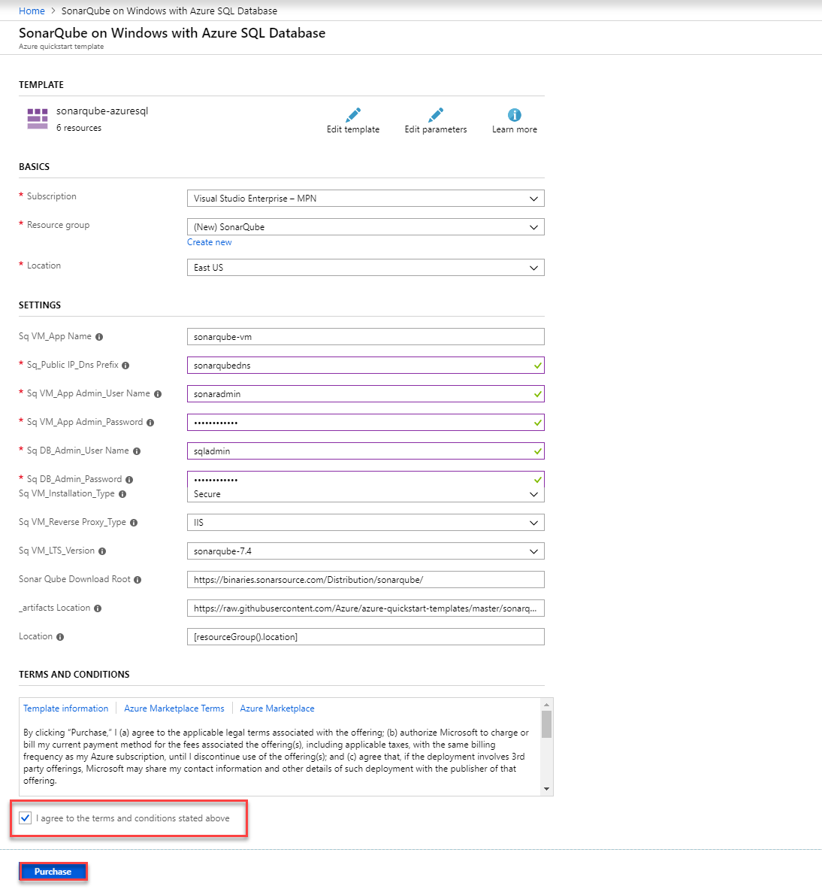
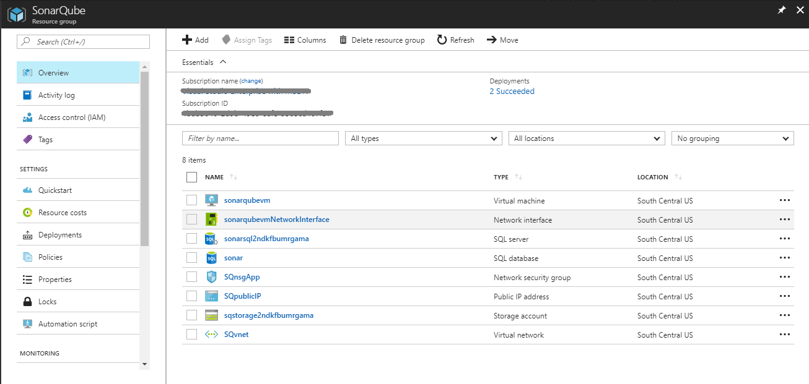

<div class="rw-ui-container"></div>

## Setup SonarQube Server on Azure VM

1. Click the **Deploy To Azure** button below to provision SonarQube Server on Azure VM.

   [](https://portal.azure.com/#create/Microsoft.Template/uri/https%3A%2F%2Fraw.githubusercontent.com%2FAzure%2Fazure-quickstart-templates%2Fmaster%2Fsonarqube-azuresql%2Fazuredeploy.json){:target="_blank"}

   

   Provide the following parameters as shown.

   |Parameter Name| Description|
   |--------------|------------|
   |**Subscription Details**|Choose the active Azure subscription, create a new resource group along with the location of creation|
   |**SQ_VM_App Name**|Name of the VM where SonarQube will be installed|
   |**SQ_Public IP_DNS Pefix**|**unique** DNS name to be provided with the following pattern:- **^[a-z][a-z0-9-]{1,61}[a-z0-9]$** or it will throw an error. For ex: sonarqubedns|
   |**SQ VM_App Admin_User Name**|Local admin account for the SonarQube VM|
   |**SQ VM_App Admin_User Password**|Password for the SonarQube VM|
   |**SQ DB_Admin_User Name**|Admin account for Azure SQL Server|
   |**SQ DB_Admin_Password**|Password for Azure SQL Server|
   |**SQ DB_DBEdition**|Choose **Standard** as the Azure SQL database edition|

1. After providing all of the required values in the above table, check the ***Terms & Conditions*** checkbox and click on the **Purchase button**.

   
   {% include important.html content= "The deployment in Azure can take up to 20 minutes. At the end of the deployment, SonarQube will be configured to run as a Windows Service on the SonarQube VM. When the SonarQube service starts for the first time, it will configure its database. This can take an additional 15 minutes  to complete during which time the Azure deployment shows as completed but you still won't be able to reach the SonarQube home page. Please give SonarQube some time to update. Click [here](https://blogs.msdn.microsoft.com/visualstudioalmrangers/2016/10/06/easily-deploy-sonarqube-server-in-azure/){:target=\"_blank\"} for more information." %}

1. Once the deployment is successful, you will see the resources in Azure Portal.

   


1. [RDP](https://docs.microsoft.com/en-us/azure/virtual-machines/windows/connect-logon) into the machine and download Java JDK 8 from Oracle http://www.oracle.com/technetwork/java/javase/downloads/jdk8-downloads-2133151.html.

    - To enable the file download on Internet Explorer, follow the below steps on the browser :
        - Click Tools and then Internet options.
        - Click on the security tab.
        - Select the Internet Zone
        - Click on the Custom Level Button and then scroll down to Download
        - Make sure to enable *File download*
        - Click Apply and OK
        - Restart Internet Explorer and check if that helps.


1. Install JDK by the following the wizard.

1. Start the **SonarQube** service by typing below command in command line
   ```
   net start SonarQube
   ```

1. Use the [Azure DevOps Demo Generator](https://azuredevopsdemogenerator.azurewebsites.net/?TemplateId=77364&Name=SonarQube){:target="_blank"} to provision a project on your Azure DevOps Organization.

1. Access the **SonarQube** portal providing the DNS name suffixed by the port number.

   

   

1. Open a browser and login to the SonarQube Portal using the following credentials-

   >**Username= admin, Password= admin**