

## Overview

Microsoft Teams is the chat-centered workspace that provides instant access to everything needed for DevOps teamwork. It is that dedicated hub that brings your teams, conversations, content, and tools from across Azure DevOps, GitHub, and Office together into one place.

 

## Task 1: Integrate Microsoft Teams with Azure DevOps and GitHub

1. Launch Microsoft Teams - you can either open the web app or download the app to your desktop from [here](https://teams.microsoft.com/dl/launcher/launcher.html?url=/_%23/l/home/0/0&type=home)

1. Azure DevOps Services integration with Microsoft Teams provides a comprehensive chat and collaborative experience across the development cycle.  Follow the instructions [here](https://azuredevopslabs.com/labs/vstsextend/teams/#integrating-microsoft-teams-with-azure-devops-services) to integrate Teams with your Contoso-Air Azure DevOps project.

1. Install and configure the Azure Pipelines app with Teams to monitor the events for your pipelines. Follow the instructions [here](https://azuredevopslabs.com/labs/vstsextend/teams/#azure-pipelines-with-microsoft-teams) to set up and manage subscriptions for releases, pending approvals, completed builds etc. and get notifications right into your Teams channel

1. Install GitHub for Microsoft Teams application from Microsoft Teams App Store.

    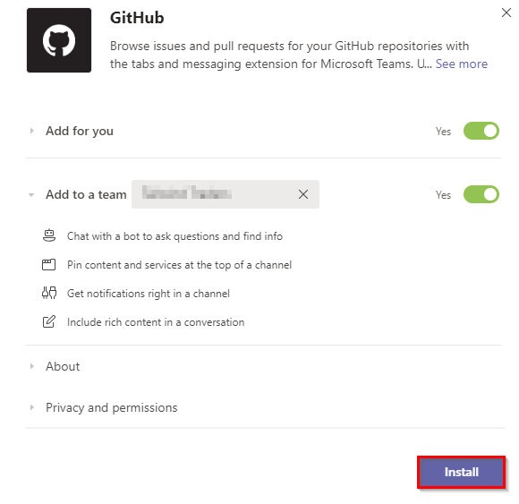

1. Setup a tab for GitHub Pull requests in your Teams channel. While configuring the tab, select the repository for which you would like to pin the issues or pull requests view. Once the tab is pinned, everyone in the team can view the tab but only those who’ve access to the repository would be able to see the issues/pull requests content.

      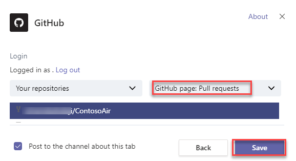

## Task 2: Using Microsoft Teams as Your DevOps Hub

1. Open the **Conversations** tab.
 
      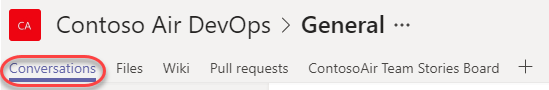

1. You have subscribed to the updates from Azure DevOps for work items, build summary etc.. by installing Azure DevOps Services connector in the previous task.

1. You should be able to see work item notifications as shown below.
     
      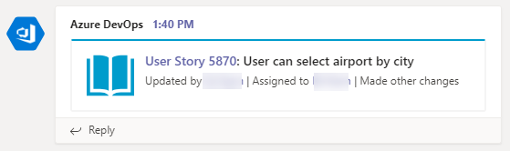

 1. You can also manually link items from GitHub and Azure DevOps in conversation. 
     
      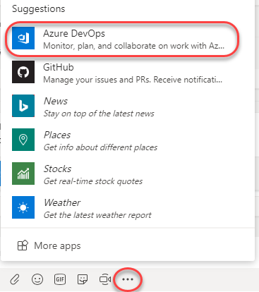

1. Select the recently closed user story.
  
      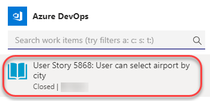

1. Enter a message and press **Enter** to share with the team.

      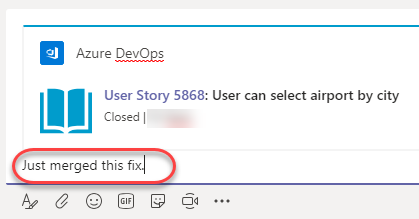

1. Now everyone on the team can see the progress.
 
      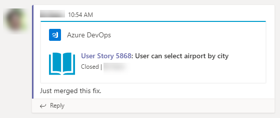

1. Select the **Pull requests** tab which you have set up in the previous task. This provides a way to check in on GitHub pull requests without having to leave the context of other conversations and collaboration being done for this specific project.

      

1. You can open pull requests directly from Teams. Click the newly created one to open it in a new browser tab. Close the tab when satisfied.

      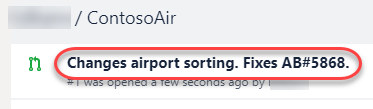

1. Switch to the **Stories Board** tab. If you have not setup earlier follow the instructions [here](https://azuredevopslabs.com/labs/vstsextend/teams/#azure-devops-kanban-board--dashboards-in-teams) to bring in your team's kanban board or favourite dashboard directly into Microsoft Teams. This provides interactive access to the Azure DevOps Kanban board directly from Microsoft Teams.

     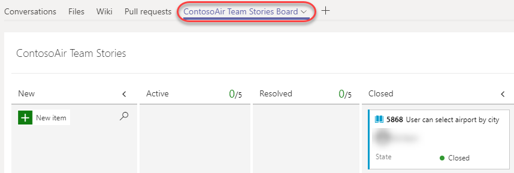

## Task 3: Managing DevOps Processes from Microsoft Teams

Microsoft Teams is a great place to manage certain DevOps processes, such as approving deployments. To illustrate this, we’ll add a pre-deployment approval to the release pipeline and invoke it using the same GitHub pull request model as before.

1. Navigate to the Azure DevOps browser tab.

1. Select your Release pipeline. Select **Edit \| Edit pipeline**.
   
      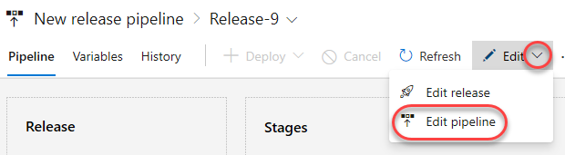

1. Click **Pre-deployment conditions** for **Stage 1**.

      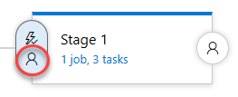

1. Select the option to **Enable** the **Pre-deployment approvals** and add yourself as an approver.
      
      

1. Click **Save**.
     
      

1. Return to the GitHub browser tab. You need to make a minor change to the codebase so that you can create a pull request and generate an approval request.

1. Select the **Code** tab in your repo.
   
     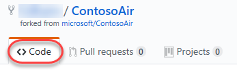

1. Click the **Edit** button to make a quick update to the readme.
   
    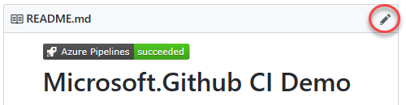

1. Make a minor change (such as adding a new line). Check **Create a new branch** and give it a name. Click **Propose file change**.

     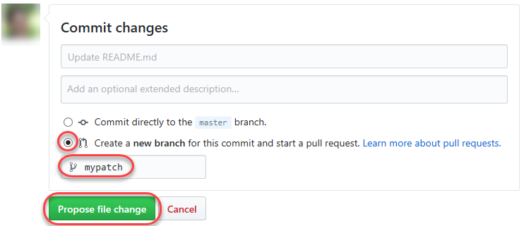

1. Click **Create pull request**.

     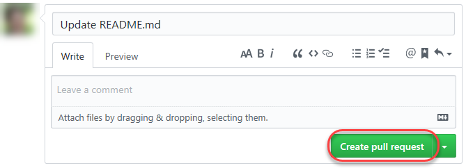

1. Switch to **Microsoft Teams** now. There should be new conversation notifications for the commit and pull request as shown below.

     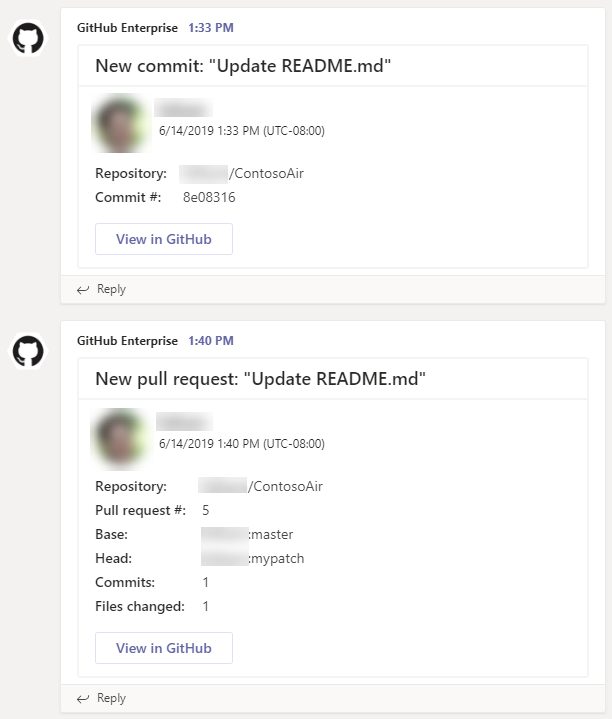

1. Return to GitHub and click **Merge pull request**.

     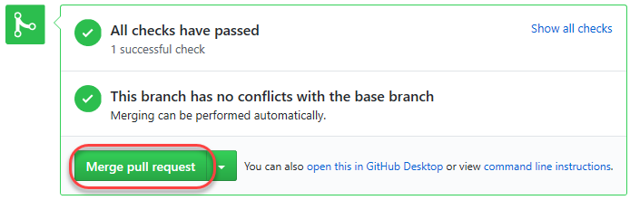

1. Click **Confirm merge**.

     

1. Return to Microsoft Teams. When the release pipeline is ready to deploy, you will receive an approval notification in Teams. Click **Approve** to approve the release.

     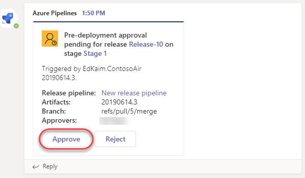

1. Once the deployment succeeds, you will receive another notification of the success.

    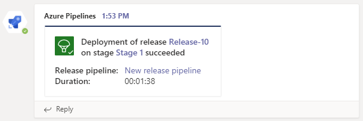
