

## Overview

**[Microsoft Teams](https://teams.microsoft.com/start)** is a hub for teamwork in Office 365. Keep all your team's chats, meetings, files, and apps together in one place. Software development teams get instant access to everything they need in a dedicated
hub for teamwork, that brings your teams, conversations, content and tools from across Office 365 and Azure DevOps together into one place.



## Prerequisites

1. You should have Office365 account in order to integrate **Azure DevOps Services** with **Microsoft Teams**.

1. Only Azure DevOps organizations in the same organization (AAD tenant) can be used to integrate with your Microsoft Teams account.

**You can start a free trial if you don't have Office365 account from [here](https://teams.microsoft.com/start){:target="_blank"}**

In this lab, you’ll learn about how **Azure DevOps** integrates with **Microsoft Teams** to provide a comprehensive chat and collaboration experience, across your Agile and development work.

## Getting started with Microsoft Teams

1. Launch **Microsoft Teams** - you can either open the web app or download the app to your desktop from [here](https://teams.microsoft.com/dl/launcher/launcher.html?url=/_%23/l/home/0/0&type=home){:target="_blank"}

   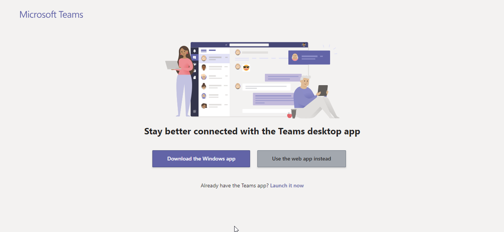

1. After launching the app, on the left side of **Teams**, click **Teams**, and then at the bottom of the teams list, click **Join or create a team**. A team is a collection of people who gather together around a common goal. 
    
    

1. In the **Join or create team** window select **Create team**.
    
    

1. Give a name for your team and description if needed. Select the privacy settings and click on **Next**.

    

1. Add members for your team in order to get notified the events that occur and also start conversations with your team members.

   

## Integrating Microsoft Teams with Azure DevOps Services

**Azure DevOps Services** integration with Microsoft Teams provides a comprehensive chat and collaborative experience across the development cycle. Teams can easily stay informed of important activities in your Azure DevOps team projects with notifications and alerts on work items, pull requests, code commits, build and release.

1. Select **Tailwind Traders** team that was created.  Click the ellipsis or **'...'** at the top nav of your team channel, and then select **Connectors**.
   
    

1. Select **Azure DevOps** connector from the list and click **Add**.

   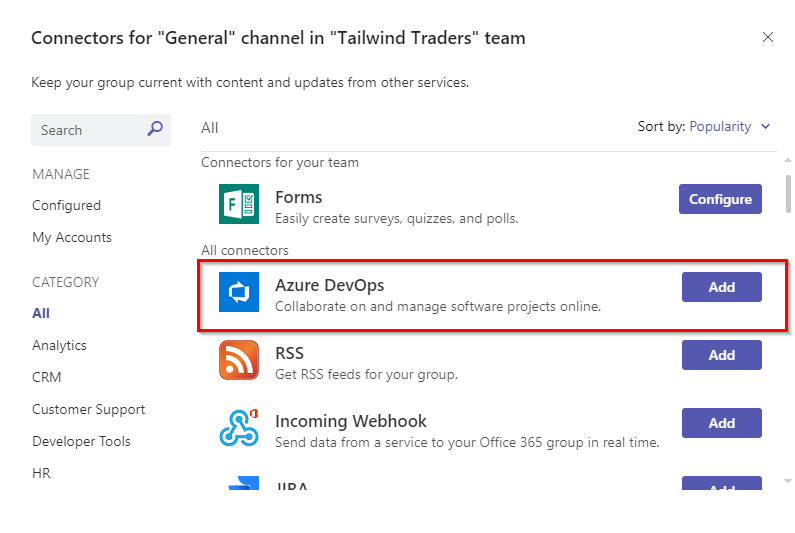

1. Click **Install** to add the connector for your team.
   
    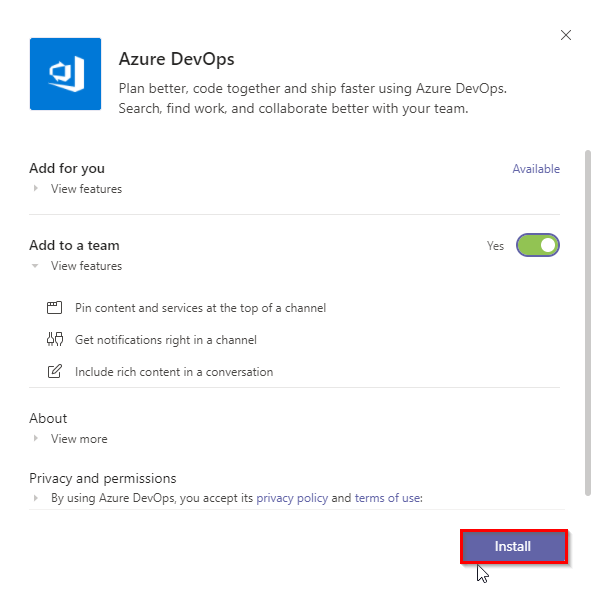

1. Select your organization (you may be prompted to sign in first), the project, and your team. Choose the type of activity you want to be notified about. Depending on the event, you may be given further fields to filter down the notifications so you can filter out notifications your team does not care about. For example, for work item events, you can filter by area path, work item type, and even particular field changes.

   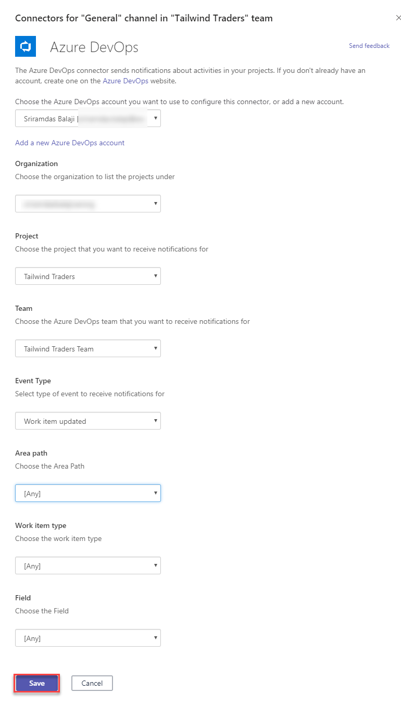

   When you are happy with the configuration, **Save** it.

1. Since Azure DevOps is configured now, activity from your Azure DevOps Services project will start appearing in your Teams channel.
   
   

1. If you want to make a change to an existing connector, navigate to the **Configured** tab on the **Connector** dialog, find the connector, and click **Manage**. 

   

## Azure DevOps Kanban board & Dashboards in Teams 

Your Kanban board turns your backlog into an interactive signboard, providing a visual flow of work. As work progresses from idea to completion, you update the items on the board. Each column represents a work stage, and each card represents a user story (blue cards) or a bug (red cards) at that stage of work.

You can bring in your teams kanban board or favourite dashboard directly into Microsoft Teams.
These can be added using Tabs. **Tabs** allow team members to access your service on a dedicated canvas, within a channel or in user's personal app space. You can leverage your existing web app to create a great tab experience within Teams.

1. To bring your Kanban board or Dashboard into Microsoft Teams, click the **+** icon to add new tab. Find the Azure DevOps icon and select **Azure DevOps**

   

   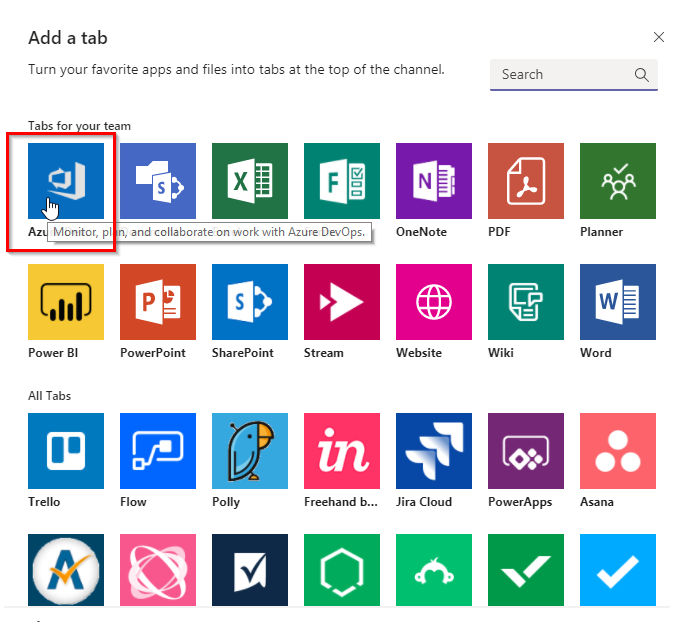

 

1. Select the Organization

   

   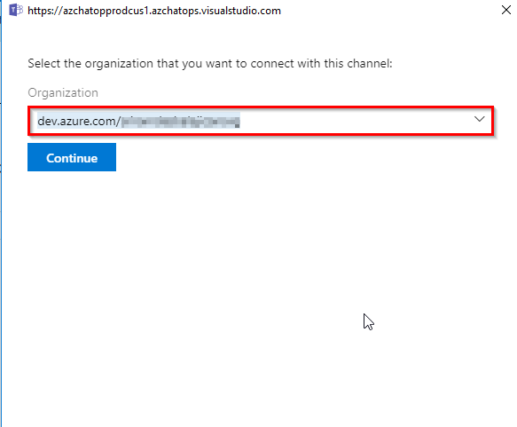

   
 
1. Once you have authenticated and selected your organization, you will be displayed a screen to select a **Kanban board** or **Dashboard**. 

   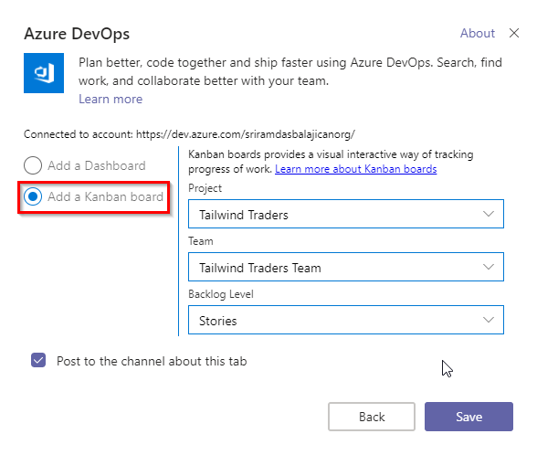

   Select the **Kanban board** and select your project, team, backlog level. **Save** the configuration.

1. Now you can see the **Kanban Board** appearing in the tab.

   

1. All the work can be monitored during the daily standup's and the updates are real when the work items states are changed. It also allows us to customize the Kanban Board from within the Teams and synced.

## Collaboration Experience

Messages are a good way to connect and keep a history of the conversation. It's even better to use emoji, stickers, and GIFs to make a great impression.

1. Start having conversations with your team members by selecting the **Conversations** tab.

   

1. All the conversations could be retrieved at any time without losing the history which helps the entire team to have a collaborative experience

1. Teams can have a collaborative experience with the latest updates with respect to the **work items, build summary** etc so that it helps in better transparency

1. **Easily find and discuss work items from DevOps in Teams** : You can easily search, find and discuss work items from Azure DevOps in Teams, keeping the conversation and collaboration within your Teams app. For example if you would like to discuss about any User Story you can click on **Azure DevOps** icon. It will prompt a window where you can search your project workitems. Select the work item to discuss and enter your comments.

      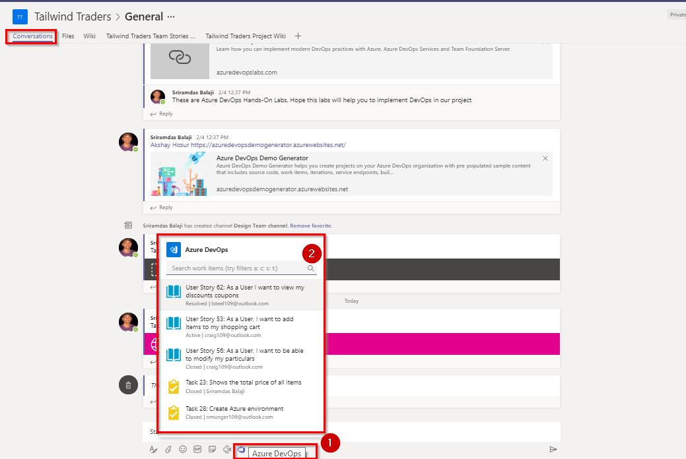
      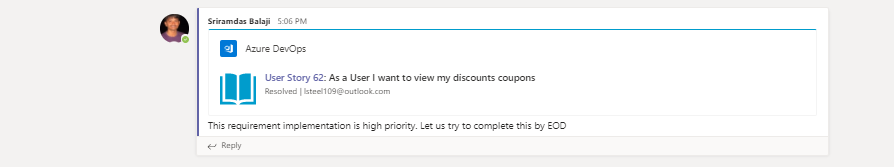
      
For more information about using the Conversation tab in Microsoft Teams click [here](https://support.office.com/en-us/article/using-the-conversation-tab-in-microsoft-teams-53d1c530-3797-4a6f-9892-6760f8763df2)

## Working with Channels

**Channels** are dedicated sections within a team to keep conversations organized by specific topics, projects, disciplines—-whatever works for your team!

- Team channels are places where everyone on the team can openly have conversations. Private chats are only visible to those people in the chat.

- Channels are most valuable when extended with apps that include tabs, connectors, and bots that increase their value to the members of the team.

To learn more about best practices for creating teams and channels view this short [video](https://youtu.be/hjJWtoaRJeE).
1. Select the **Team** that was created earlier and click on **ellipsis (...)**

   

1. Give a name and description for your channel and click on **Add**

   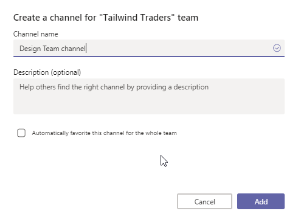

1. Once the channel is created, the conversations can be started among the team members.

   

## Sharing the Contents

As your team works together you'll undoubtedly have files that you'll want to share and collaborate on. Microsoft Teams makes it easy to share files within channels. If the files are Word, Excel. PowerPoint or Visio files your colleagues can even view, edit, and collaborate on the files right within Teams. For Word, Excel, and PowerPoint, they can see each others changes in almost real time.

1. Select **Files** and select **Upload** to share a document with the team. You can also use **Drag and drop** (Using your mouse, drag the file from where it's currently located and drop it on the Teams window among the files.) method to upload files.

   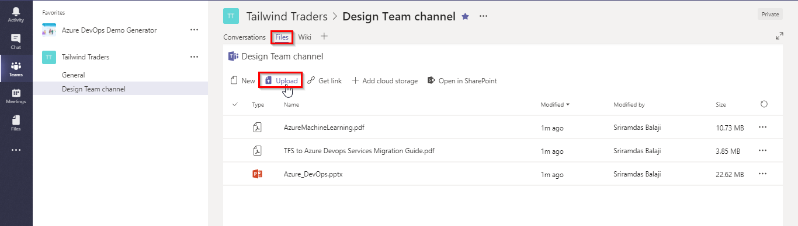

1. Click on the document that was uploaded from the list to start editing and having a live conversation with your team members

   

1. You can also share the related websites within the Teams as Tabs. As we use **Wiki** to explain project objectives, epics, specs, release notes, best practices or other content to ensure all your team members and stakeholders learn, you can also share your Team's **[Wiki](https://azure.microsoft.com/en-in/services/devops/wiki/)** content as website within teams as tab. 

1. Navigate to your Azure DevOps projects Wiki page. Copy the URL.
       
    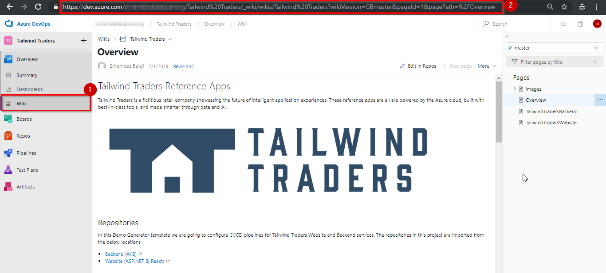

1. Now switch back to the **Teams**. Click on **+** and select **Website**

   

   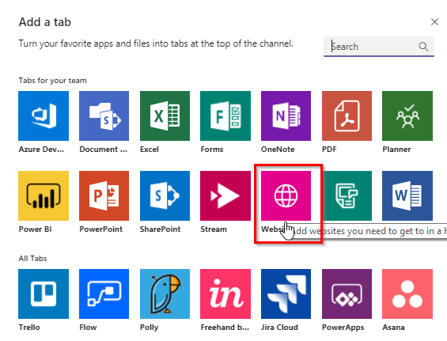

1. Provide a name for the website, enter the wiki URL copied in previous step and click on **Save**. It appears on the channel where all of the team members can access to get quick information if there were any updates done

    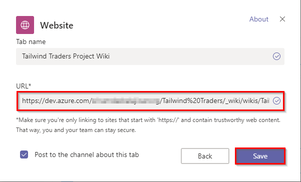

1. This is how the website/Wiki looks when added to the channel.

   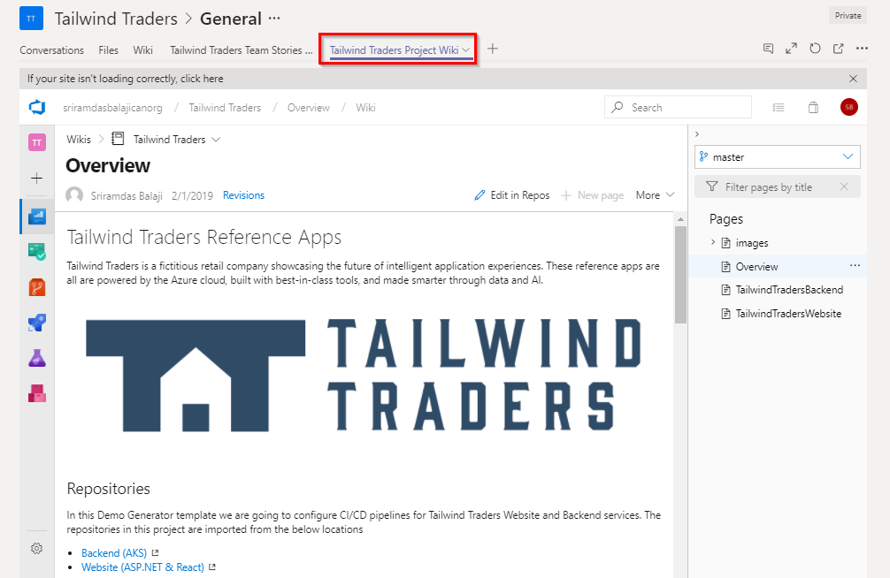

Now that you have connected Microsoft Teams and Azure DevOps think about the other development team information that you can expose via Microsoft teams, for example: 

- [Add a OneNote notebook to Teams](https://support.office.com/en-us/article/Add-a-OneNote-notebook-to-Teams-0ec78cc3-ba3b-4279-a88e-aa40af9865c2) to keep meeting notes such as **Sprint Planning Meetings** and **Retrospective Meetings**. 
- [Connect Azure DevOps to Power BI ](https://docs.microsoft.com/en-us/azure/devops/report/powerbi/?view=azure-devops) and [add a Power BI tab ](https://support.office.com/en-us/article/add-a-powerbi-tab-to-teams-708ce6fe-0318-40fa-80f5-e9174f841918) that displays advanced reports from Azure DevOps or other data related to your project.
## References

- [Microsoft Teams with Azure DevOps Services](https://docs.microsoft.com/en-us/azure/devops/service-hooks/services/teams?view=azure-devops)

- [Get started with Microsoft Teams](https://docs.microsoft.com/en-us/microsoftteams/get-started-with-teams-quick-start)

- [Chat, teams, channels, & apps in Microsoft Teams](https://docs.microsoft.com/en-us/microsoftteams/deploy-chat-teams-channels-microsoft-teams-landing-page)
