

## Overview 
**7pace Timetracker** is a professional full-feature time recording and management solution that seamlessly integrates with Azure DevOps. Designed for software engineers, by software engineers, Timetracker exists within the same environment in which you work, allowing you to quickly and easily plan, estimate, enter, and track time directly on work items, and then use the resulting data to improve your productivity. This integration between work done and time tracked lets you know exactly how much time you’re spending on your work items, leading to better estimation and more efficient time management. The entire development team can see team members' individual pace, remaining time, and decreasing burndown.

**Timetracker** also offers an optional desktop Windows Client that can be installed on your local system. In Timetracker 4.0, time tracking moved to the server with a built-in Web Client that allows you to start tracking right from any work item. You can use multiple desktops, run the Windows Client everywhere or just open your browser; you will see a synced time interface that you can control from wherever you are.

## What’s covered in this lab

In this tutorial, you will see how you can easily add time from various locations within Timetracker and Azure DevOps and then use that time data to increase your knowledge and productivity:
1.	How to Record Your Time on the Work Item Form (Details tab **Start Tracking** and Time tab **Add Time** buttons)
1.	How to Record Your Time with Timetracker’s Windows and Web Clients
1.	How to Record Your Time with Timetracker’s **Monthly**, **Timesheet** (Add **New Time** Timesheet Cells and List Editor) and **Times Explorer** Pages
1.	How to Add External Time into Timetracker with Microsoft Excel
1.	How to View the Health of Your Sprint on Timetracker’s **Iterations** Page.

## Prerequisites for the lab
You will need an **Azure DevOps Organization**. If you do not have one, you can sign up for free [here](https://go.microsoft.com/fwlink/?LinkId=2014881)

## Setting up the environment

This section helps you with the steps to enable **7pace Timetracker** for your Azure DevOps Organization and (optional) install the Windows Client to your local system. 

1. Login to your valid Azure DevOps Organization account. 
1. Click [here](https://marketplace.visualstudio.com/items?itemName=7pace.TfsTimetracker) to navigate to the **Timetracker** extension in Azure DevOps Marketplace. Or Search for **Timetracker** in Azure DevOps Marketplace and click on the **Timetracker** icon.

   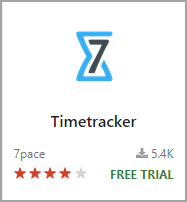

1. On the Timetracker application page, click **Get**.

1. Select the drop-down in **Select an Azure DevOps organization** field and select your Azure DevOps Organization, then select **Start 30 day free trial**. With this Timetracker extension will be installed to your VSTS account.

   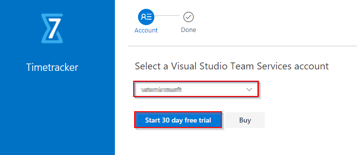

1. Once the Timetracker server component is enabled on your account, ensure that the **Time** menu selection appears on the main menu bar of Azure DevOps Project.

   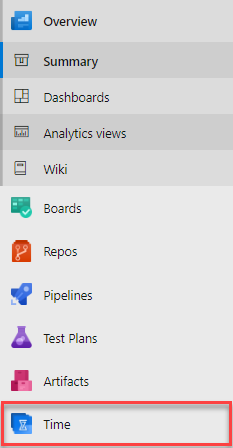

1. Once the above steps have been completed, you have the option of downloading the Windows Client. Click **Yes, I agree** to accept the Privacy Terms. From the main menu bar, select **Time -> Apps**. Click the **Download client** link within **7pace Timetracker Windows client**.

     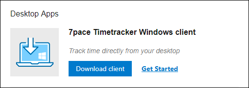

1. (Optional) Pair the Windows Client with your Azure DevOps account by following the 7pace’s [Client Installation and Pairing Guide] guide.(https://support.7pace.com/hc/en-us/articles/115000516926-7pace-Timetracker-Client-Installation-and-Pairing-Guide).

   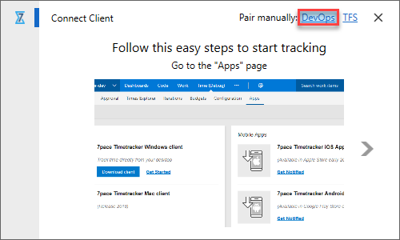

## Exercise 1:How to Record Your Time on the Work Item Form (Details tab Start Tracking and Time tab Add Time buttons)

7pace Timetracker is fully integrated with your Azure DevOps Project. Throughout each sub-tab of Timetracker or within your Azure DevOps Project, any time you click on a work item, the work item details popup window displays.

1. Open any work item on your Azure DevOps Project sprint board.

   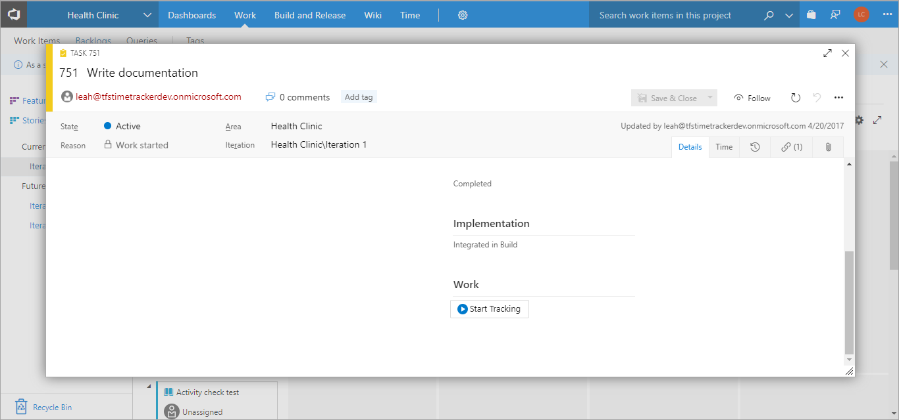 

1. Under the **Details** tab, you will find a new section **Work**. Under that section, you will find the **Start Tracking** button.

1. Click the **Start Tracking** button.
 
   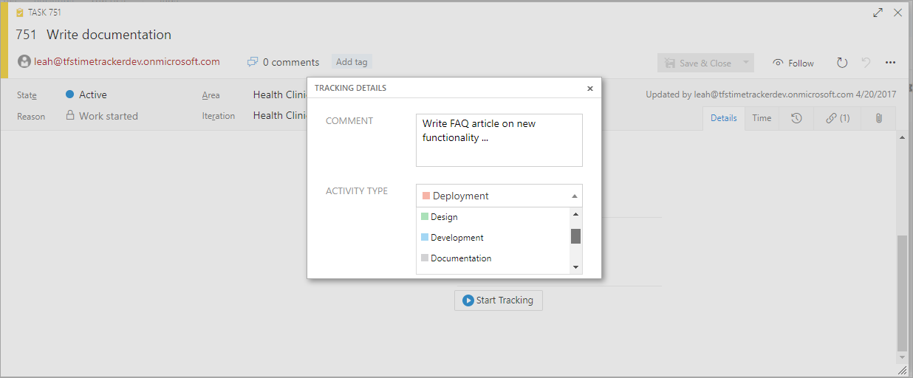
   
1. The **Tracking Details** dialog box displays ONLY if your administrator has enabled **Tracking details are required** under the **Configuration -> Time Tracking**. If not, tracking begins immediately, without further prompt.

1. Fill in the optional fields and click **Start Tracking**.
 
   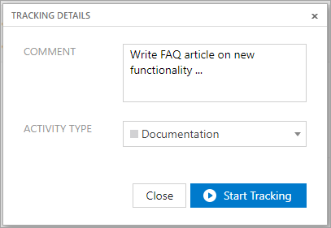

   Time tracking immediately initiates on that work item and you can see the timer keeping track of time spent.

   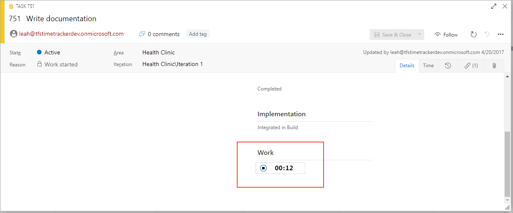

   The Web Client (built into every page of Timetracker) and the optional Windows Client (if installed), also start tracking simultaneously (see Exercise 2). All three methods of timetracking are synced. 

1. Click on the **Time** tab, added when you installed Timetracker, on the work item form. 

 
   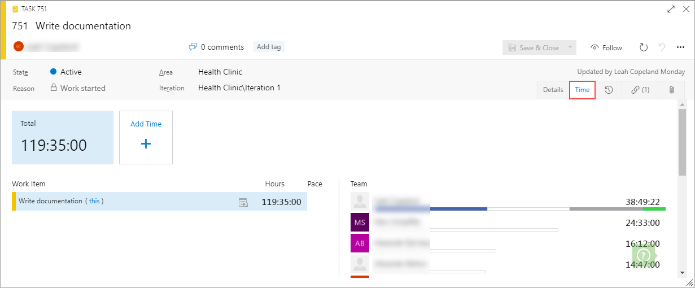

   This tab shows the total time spent by you and your team members on that work item and all child items. 

   If the **Activity Types** feature is enabled by an admin in your **Configuration** tab, the **Time** tab also displays any time tracked to work items that have been assigned an activity category in the **Activities** section.
  
   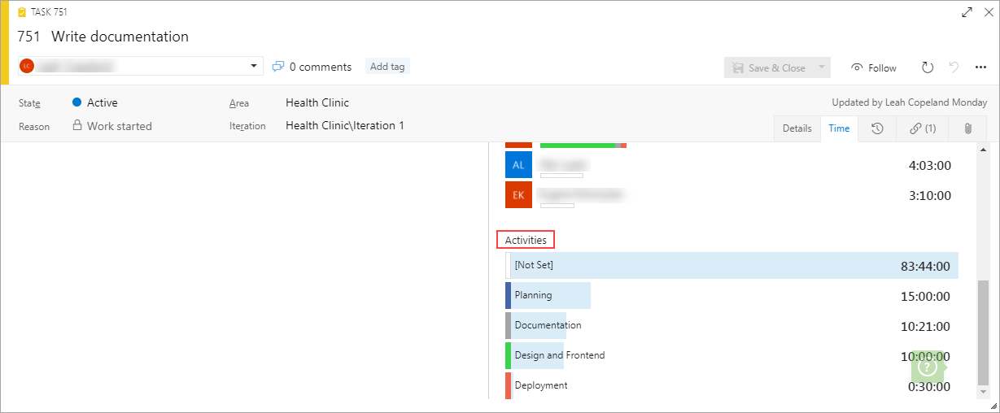
 

1. Click on the **Add Time** button.

    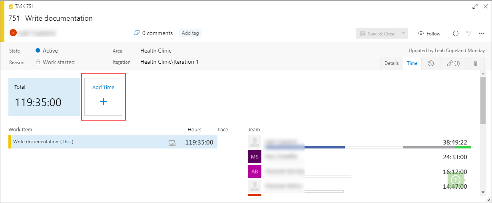

   The resulting **Add/Edit Time Record** dialog box renders certain fields, like the **Person** (name) and **TFS ID** fields as read-only. These fields automatically populate with the signed-in user's name in the **Person** field and with the current TFS ID.

   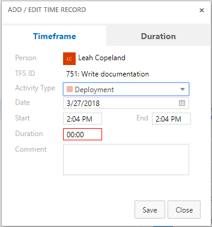

1. Fill in the fields and click **Save**.

   Time is added directly to the work item.

## Exercise 2: How to Record Your Time with Timetracker’s Windows and Web Clients

As mentioned in **Exercise 1**, when you open a work item and click the **Start Tracking** button on the **Details** tab, it immediately initiates tracking via the Windows Client, if you have downloaded it. For the purposes of this exercise, we will assume that tracking has not begun.

1. Open the Windows Client from your system tray.

   This is the main window of the Timetracker 4 Windows Client as it appears after the initial start of the application and while idle:

   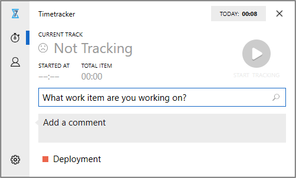

1. Place your cursor in the **What work item are you working on?** text field.
 
   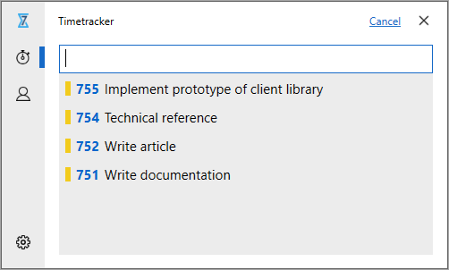

   The predictive text feature automatically populates a list of suggested TFS-only work items (non-TFS items you have previously tracked on do not display in this list) you have tracked on in the past. 

1. Select an item in the list (you can also place your cursor in the text field and manually start typing a work item ID or title and the system will perform a search for matching TFS items). 

   This will return you to the original window, with the item now displaying in the text field. 

   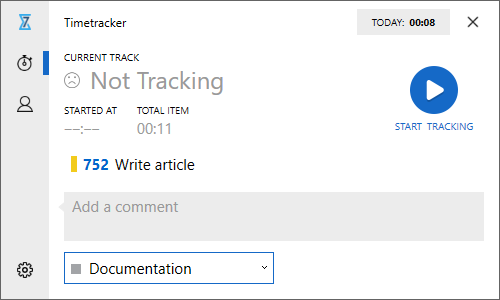

1. (Optional) Type in a comment in the **Add a comment** text field.  
1. (Optional) Select an **Activity Type** from the configured dropdown list.

1. Click the **Start Tracking** button.

   Tracking begins on the selected work item 

   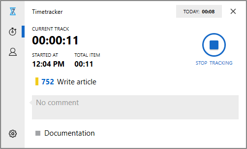

1. Click on the **Time** tab of your VSTS menu bar and select any Timetracker sub-tab:

   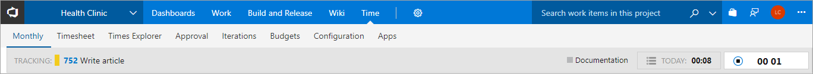

   You’ll notice that time tracking has also kicked off within Timetracker’s server side Web Client.

   >Note: If you have not logged any time with the Web Client in the current day yet, the "TODAY" field will display 00:00 (this field updates as you track time with the Web Client and reflects time tracked on all work items within the current calendar day). If you have previously tracked on an item, the last item you tracked will display on the minimized Web Client bar and you can just click the "Start Tracking" button to resume tracking. "Your tracker is not currently running" will display if you are not tracking time.  

1. Click anywhere on the gray area of the tracker bar. The Web Client fields expand and display:

    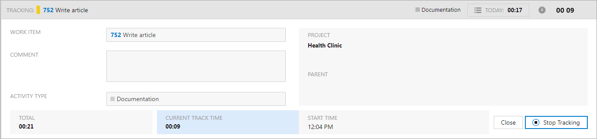

1. Click the **Stop Tracking** button.
Tracking stops on that work item. This also stops the Windows Client from tracking, if downloaded.

1. Place your cursor in the **Work Item** field.
If you have previously tracked time on a work item(s), the prediction feature of the Web Client automatically populates the items you were previously working on or assigned in the **Work Item** field (it displays a maximum of 10 items). The last item you tracked time on will be the default selection that displays first in the list.

   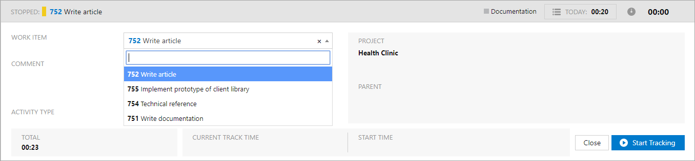

11.  Select an item in the **Work Item** field from the list or begin typing in a new item utilizing the smart search feature.

12. Once selected, the **Project** and **Parent** fields will also populate (**Parent** field will be blank if it is the top-level item). The **Work Item** and **Parent** fields include item ID links that when clicked, will open the corresponding work item forms. When you click on the **Work Item ID**, you'll notice that on the item form that opens, the **Start Tracking** button on the **Details** tab of that project also reflects that time tracking has commenced.

13. (Optional) Enter additional information in the **Comment** text field.

14. (Optional) Select an **Activity Type** from the dropdown list.

15. Click the **Start Tracking** button. 

     Time tracking commences.

    >**Important**: You’ll  notice that when you start tracking via the Web Client, if you also have the Windows Client downloaded and paired with your account, it begins tracking too. As mentioned, above, if you open the work item form, it too will show tracking has commenced on the "Details" tab. All time tracking within Timetracker is synced.

16. Click the **Close** button.

     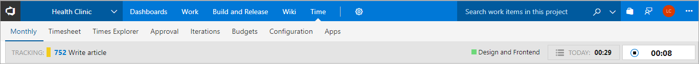

    The tracker fields are minimized, allowing you to continue your work. The current work item number and description displays in the **Tracking** field, as well as the **Activity Type** you selected (if any), the total length of time you have worked on this item in the current calendar day (**TODAY** field), and the current length of time you have tracked on the item since hitting **Start Tracking**(to the right of the **TODAY** field).

## Exercise 3: How to Record Your Time with Timetracker’s Monthly, Timesheet (Add New Time, Timesheet Cells and List Editor) and Times Explorer Pages

1. On the 7pace Timetracker menu bar, click the **Monthly** selection.
The **Monthly** page's calendar interface allows you to enter time, track, and maintain your work efforts. You can easily navigate to different months and years, view daily, weekly, and monthly totals of time entered, as well as view the time entry details of a particular day.

1. Hover your mouse over the day/block on which you want to add a new time entry.

   The system displays the plus (**+**) icon on the selected day.

   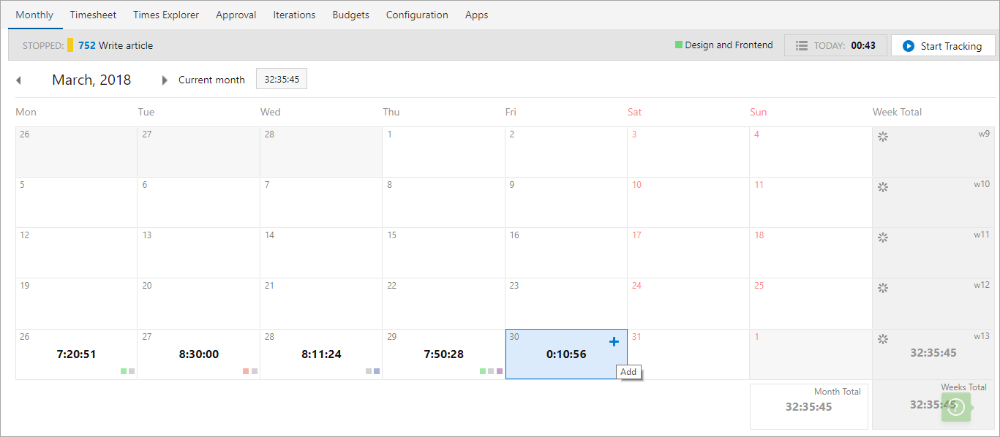

1. Click the **+** icon.
The **Add/Edit Time Record** dialog box displays:

  
   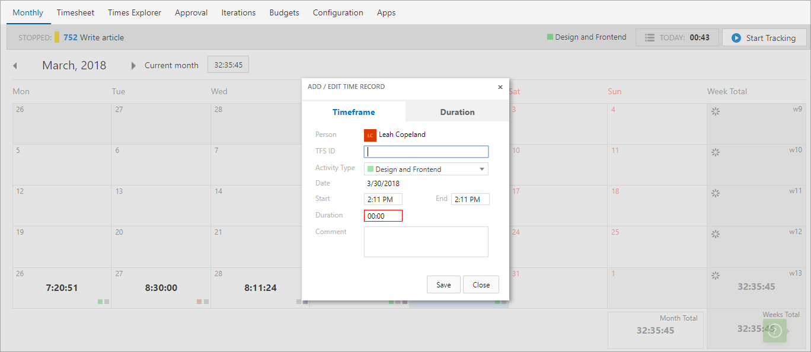

1. Enter in the fields and click **Save**.
The dialog box closes and time is added to that calendar day.
 
1. Click on a calendar day/square. 
The time details panel populates below the day on which you clicked, displaying details of the time logged/tracked on that day.

   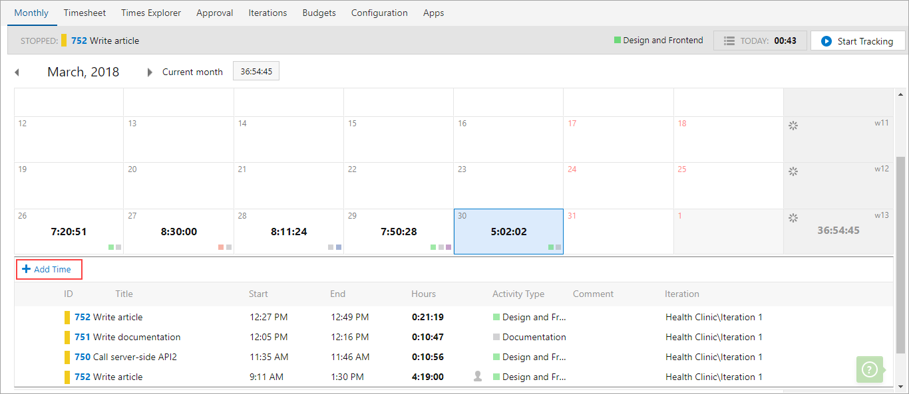

1. Click on the **Add Time** link. 
The Add/Edit Time Record dialog box displays.

   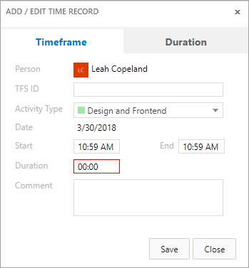

1. Fill in the keyboard optimized fields and click **Save**. The dialog box closes and the time entry is saved for that day.

1. On the 7pace Timetracker menu bar, click the **Timesheet** selection.

   The keyboard-optimized **Timesheet** page lets you view the work items for time you've worked or entered time on during a given week, the level of effort assigned to PBIs, features, and epics, the total time you've tracked for work items, as well as the total hours logged on a work item on a given day or for the current week. 

1. Click the **New Time** link to add an entry from scratch. The **Add/Edit Time Record** dialog box displays.

   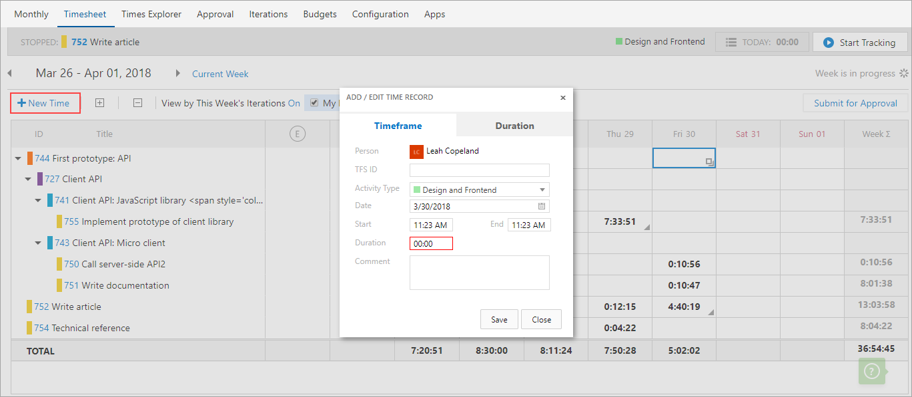

1. Enter in the fields and click **Save**.

1. Click on the **My Items Only** checkbox.
With this **On"**, the page is filtered **By Iterations** view and by in progress items assigned to you. These cells also display as blue on the Timesheet matrix. With this selection turned **Off**, the page populates with the items assigned to the whole team.

   The () icon within a cell indicates that you have multiple time records for that work item ID on that day and the ( ) icon means that you have a single time entry or none.

1. Double-click in an empty or single-time entry table cell where you want to add or edit time. 
The cell becomes an editable textbox.

   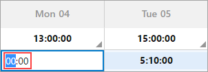
 
1. Enter your time in **HH:MM** format.
1. Use the arrow keys to select hours and minutes.
1. Press Tab or Enter on your keyboard to save the time entry.

1. Click on either (  and ) icons within a timesheet cell.

   The **Add Time** list editor displays and acts like a keyboard-optimized spreadsheet, allowing you to add up to five (5) entries of time.
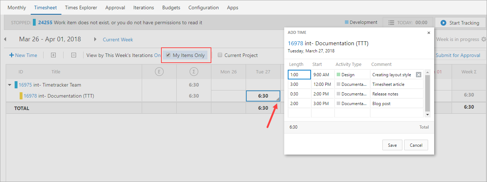
 

1. Click in the Length, Start, (Activity Type, if configured) and Comment cells, and either add or change the time and details.

1. Click in the empty cells to add a new time record on a new row and then **Save**.

1.  On the 7pace Timetracker menu bar, click the **Times Explorer** selection.

    The **Times Explorer** page acts as a central toolbox that helps you organize all your tracked time records in a way that makes the most sense for you.

1. Click the **Add Time** button.
The **Add/Edit Time Record** dialog box displays.

   
 
 

1. Click in the **Person** dropdown.
This field is editable on the **Times Explorer** page, so that based on permission level, you can add time on behalf of someone else on your team.

1. Fill in the appropriate values in the other fields and click **Save**.

## Exercise 4: How to Add External Time into Timetracker with Microsoft Excel

You can import time that you’ve tracked outside of 7pace Timetracker on the **Times Explorer** page and the imported time details are then stored in the Timetracker database. 

1. On the **Times Explorer** page, click on **Import**.

   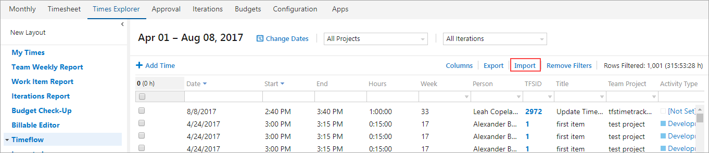
 

   The **Import Times** popup box displays:

   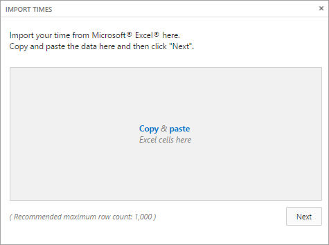

1. Copy and paste the time details that you copied from Excel or another source application.

   

1. Click the **Next** button.

   Timetracker analyzes the data that you pasted and displays it in a tabular format so you can properly associate each time detail to the appropriate Timetracker field.

   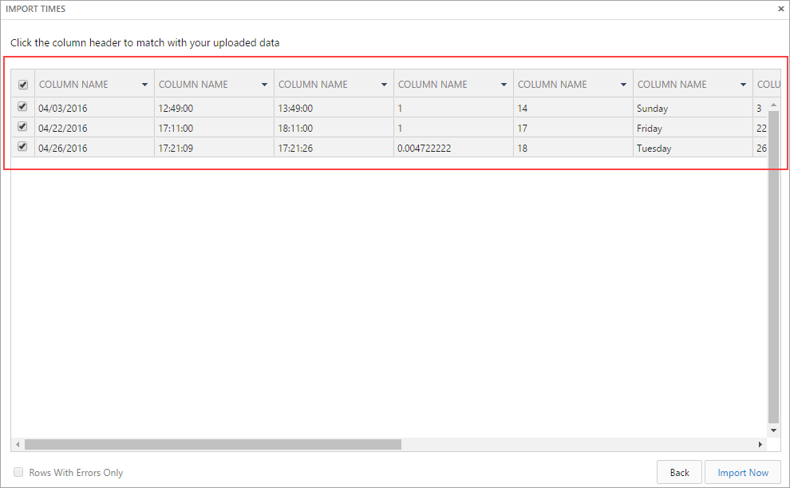

1. (Optional) In the far-left column, check the boxes for the time details you want to import. By default, all are selected.

1. In the **Column Name** headers, click the dropdown arrows on each and select the appropriate header names for the time details below.

1. Click the **Import Now** button.

   Once the time details are successfully imported, you can view them on the **Times Explorer** page.  

## Exercise 5: How to View the Health of Your Sprint on Timetracker’s **Iterations** Page

1. On the 7pace Timetracker menu bar, click the **Iteration** selection.

   The **Iterations** page of Timetracker provides you with a quick snapshot of how your sprint is progressing. Featuring a sprint-oriented view of the time spent by your team that is similar to the look and feel of the VSTS **Backlog** page, you can view the tracked time details of work items according to the specific iterations to which they belong. 
 
   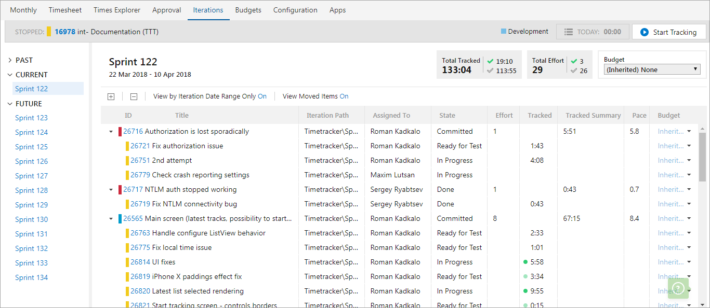

1. Look in the **Iteration Path** column.
Because a sprint is dynamic, this column also displays the new iteration path for work items that are moved from the selected iteration, into the backlog. Any time that has been tracked on that item, even though it has been moved to a different sprint, will be retained. 

1. Look in the **Assigned** column.
The name of the person to whom the work item is assigned is displayed.

1. Look in the **State** column.
The current state of the work item is displayed.

1. Look in the **Effort** column.  This shows the number of user story/complexity points estimated for the work item.

1. Look in the **Tracked** column.
This displays the total time tracked for the work item in two states - time tracked within the last two (2) hours and the last 48 hours.

7. Hover your mouse over your entry to see the state of the work item. 

1. Look in the **Tracked Summary** column.
Displays the total tracked time for the parent work item and all its child work items.
1. Look in the **Pace** column.
Shows the pace at which each task is performed. This number is calculated by dividing the number of hours by estimated effort. You can easily see what the team’s pace is on particular work items or the sprint as a whole, how accurate your team’s estimations were, and be alerted if something requires attention.

1. Look in the **Budgets** column.
Displays the current budget assigned to the work item. Budgets are usually assigned to iterations or even whole releases. However, if you don't want to bill a customer for certain work items in a sprint/iteration, you can exclude them from one budget (e.g. "Company X Billable") and move them to a different budget instead (e.g. "Company X Non-Billable") by clicking on the "Budget" column dropdown arrow next to each work item row.

1. Toggle back and forth between the **On** and **Off** of the **View by Iteration Date Range Only** and **View Moved Items** selections:

    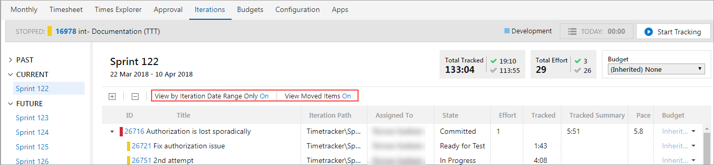
 
    **View by Iteration Date Range Only** displays the total tracked time of the work items according to the iteration timeframe. If you set this field to **ON**, the total tracked time for work items is shown only by the iteration period. If you set this field to **OFF**, total time for all work items is shown. 

    **View Moved Items** displays the work items that were a part of the selected iteration at the beginning of the iteration, but were later moved to different one. 
    If a date range was not configured for the iteration, these fields are disabled and set to NA.
1. Look at the **Total Tracked** information on the page:

   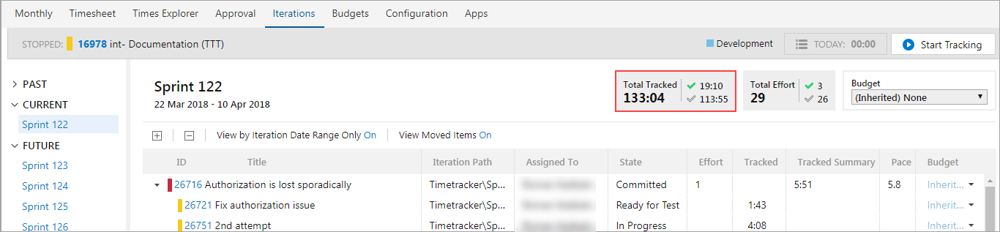

   This section shows total time tracked for all work items from the selected iteration. Additionally, the total tracked time for work items in a completed state ( ) and work items in an incomplete state () is also displayed.

1. Look at the **Total Effort** section of the page:

   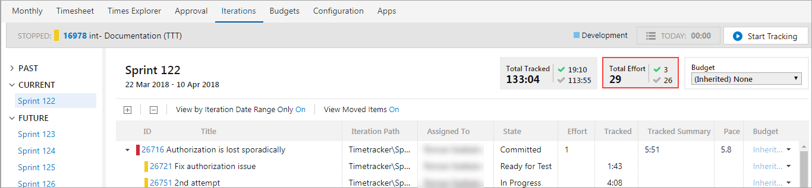

   This shows the Total Story Points (total effort) of all work items from the selected iteration. Additionally, you can separately view the total effort/story points for the work items in a completed and incomplete state.

   >Note: This field displays the total only if you configure the Pace Calculation option on the Configuration page of Timetracker. If you don’t, the Total Effort field displays the status as Inactive. 

1. Look in the **Budget** dropdown section of the page:

    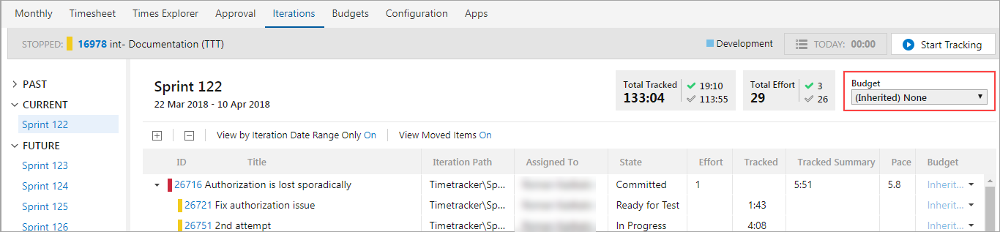

   This displays the budget inherited from the parent item or specifically assigned to the iteration. If there is no budget assigned to the iteration, this field displays **None**.

   The **Iterations** page has helps you answer the following questions:
   - How is the sprint running?
   - What work items are currently being worked on and by whom?
   - Which work items were moved to a different iteration?
   - What is progressing well in the sprint and what requires our attention?
   - How accurate were our team's estimations?
   - What is the team's pace on particular work items or the sprint as a whole.

