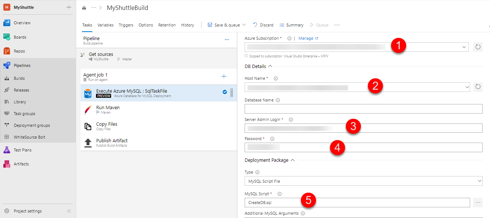

Last updated : {{ "now" | date: "%b %d,%Y" }}

## Overview

In this lab, you will learn how you can use Azure Pipelines in Azure DevOps to deploy a Java web application to [Apache Tomcat](http://tomcat.apache.org/){:target="_blank"} with a MySQL database on Azure. Apache Tomcat is an open-source Java Servlet Container developed by the Apache Software Foundation (ASF). MySQL is a very popular open-source relational database management system.

For this lab, you will use Azure App Service and Azure Database for MySQL, a relational database service based on the open source MySQL Server engine. It is a fully managed database as a service,  capable of handing mission-critical workload with predictable performance and dynamic scalability.



### What's covered in this lab

This lab will show how you can

- Create a new Azure App Service and configure it to use Apache Tomcat
- Create a new MySQL database
- Use Azure App Service Task to deploy a WAR file

### Prerequisites for the lab

1. Refer the [Getting Started](../Setup/) page before you begin following the exercises.

1. Use  **MyShuttle** as a template to provision the new Azure DevOps project using the [Azure DevOps Demo Generator](https://azuredevopsdemogenerator.azurewebsites.net/Environment/Create?TemplateId=77373&TemplateName=MyShuttle){:target="_blank"}.

## Exercise 2: Creating Azure Web App and MySQL database

1. Use the **Web App + MySQL** Azure template from the Azure Marketplace to create a Website and MySQL Database together to start developing even faster.

    [](https://portal.azure.com/#create/Microsoft.WebSiteMySQLDatabase){:target="_blank"}

1. This template provides two MySQL options :

    - **Azure Database for MySQL** provides a managed database service for app development. ***You will choose this option.***
    - **MySQL In app** is an App Service feature where MySQL database is created for your web app. In this scenario, MySQL server is running on the same instance side by side with your web server hosting the site. This is recommended for development purposes and has no additional cost.

    

1. Wait for the Web App and the database to be provisioned. It roughly takes 3-5 minutes.

1. Navigate to the resource group that you have created. You should see a **Azure Database for MySQL server** provisioned. Select the database server.

   

1. Select **Properties**. Note down **SERVER NAME** and **SERVER ADMIN LOGIN NAME**.

    

    In this example, the server name is **myshuttle-1-mysqldbserver.mysql.database.azure.com** and the admin user name is **mysqldbuser@myshuttle-1-mysqldbserver**.

## Exercise 3: Updating the App Settings for the Web App

Next, navigate to the Web app that you have created. As you are deploying a Java application, you need to change the web app's web container to Apache Tomcat.

1. Click on **Application Settings**. To change it to Tomcat, you will first need to install Java. Select a **Java Version** to install and then change **Web container** to use Apache Tomcat. For this purpose of the lab, you will choose ***Java 8*** and ***Apache Tomcat 9.0*** though the version number would not matter much for the simple app that we are deploying.

    

1. Click on **Save** and wait for the update to be applied. Then navigate to the web app URL again and now you should see a different page.

    

    Next, you need to update the connection strings for the web app to connect to the database correctly. There are multiple ways you can do this - but for the purpose of this lab, you will take a simple approach. You will update it directly on the Azure portal.

1. From the Azure portal, select the Web app you provisioned. Select **Application Settings** and scroll down to the **Connection Strings** section.

1. Add a new **MySQL** connection string with **MyShuttleDb** as the name, paste the following string for the value and replace **MySQL Server Name**, **your user name** and **your password** with the appropriate values -

   `jdbc:mysql://{MySQL Server Name}:3306/alm?useSSL=true&requireSSL=false&autoReconnect=true&user={your user name}&password={your password}`

1. Click on **Save** to save the connection string.

    > 

    ````Java
    String conStr = System.getenv("MYSQLCONNSTR_MyShuttleDb");
    ````

You have now setup and configured all the resources that is needed to deploy and run the MyShuttle application.

## Exercise 4: Deploy the changes to Web App

1. Select **Pipelines** and then **Releases**.

1. Select **MyShuttle Release** and click **Edit Pipeline** to open the release definition.

   

1. If you are following this lab from Jenkins hands-on-lab, make sure the artifact is pointing to Jenkins. Otherwise, it should be pointing to the **Build** artifact as shown below:

   


1. Click **Tasks** and select **Execute Azure MySQL : SqlTaskFile** task and provide the following details. 

    * Azure Subscription Details : Select the appropriate subscription, click **Authorize** and login to your Azure subscription in the pop-up window.
    * Host Name : Select the **MySQL Database server** that was created.
    * Server Admin Login : Provide the **SERVER ADMIN LOGIN NAME** that you noted down previously.
    * Password : Provide the password that you created under *Database* in the **Web App + MYSQL** blade of Azure portal.

   

1. Select the **Deploy Azure App Service** task, select the Azure subscription from the drop down and ensure that the created app service name is reflected correctly.

   


1. Click on **Save** and then **+Release \| Create Release** to start a new release

   

1. Wait for the release to complete. Then navigate to the Web App and select the **URL** from the overview blade. Add **/myshuttledev** context to the URL. For instance -  [http://myshuttle1.azurewebsites.net/myshuttledev](http://myshuttle1.azurewebsites.net/myshuttledev){:target="_blank"}

1. Select **Login** and try logging in to the site with any one of the following credentials.

   |Username|Password|
   |--|--|
   |barney|barneypassword|
   |fred|fredpassword|

1. If your database was setup correctly and the connection parameters are valid, you should be able to login to the portal.

    

    
