Last updated : {{ "now" | date: "%b %d,%Y" }}

## Overview

In this lab, you will learn how you can use Release Management(RM) in Visual Studio Team Services (VSTS) to deploy a Java web application to [Apache Tomcat](http://tomcat.apache.org/) with a MySQL database on Azure. Apache Tomcat is an open-source Java Servlet Container developed by the Apache Software Foundation (ASF). MySQL is a popular open-source relational database management system.

For this purpose of the lab, we will use Azure App Service and Azure Database for MySQL, a relational database service based on the open source MySQL Server engine. It is a fully managed database as a service offering capable of handing mission-critical workload with predictable performance and dynamic scalability.



### What's covered in this lab

This lab will show how you can

- Create a new Azure App Service and configure it to use Apache Tomcat
- Create a new MySQL database
- Use Azure App Service Task to deploy a WAR file

## Pre-requisites for the lab

1. An active **Microsoft Azure** account.

1. An active **VSTS** account. Create a new account from [here](https://docs.microsoft.com/en-us/vsts/accounts/create-account-msa-or-work-student).

1. A [Personal Access Token](https://docs.microsoft.com/en-us/vsts/accounts/use-personal-access-tokens-to-authenticate) (PAT).

## Exercise 1: Setting up Visual Studio Team Services

1. Provision a new VSTS project using the [VSTS Demo Data Generator](https://vstsdemobuildertest.azurewebsites.net/?TemplateId=77371&name=myshuttle)

    

1. Use  **MyShuttle** for the template. Provide the Project Name and select **Create Project**. After the project is provisioned, click the URL to navigate to the project.

    

## Exercise 2: Creating Azure Web App and MySQL database

1. We will use the **Web App + MySQL** Azure template from the Azure Marketplace to create a Website and MySQL Database together to start developing even faster.

    [](https://portal.azure.com/#create/Microsoft.WebSiteMySQLDatabase)

1. This template provides three MySQL options :

    - **Azure Database for MySQL(Preview)** provides a managed database service for app development. ***We will choose this option***
    - [**ClearDB**](http://w2.cleardb.net/azure/) is a Microsoft Partner solution for a fully integrated MySQL service on Azure
    - **MySQL in-app** is an App Service feature where MySQL database is created for your web app. In this scenario,MySQL server is running on the same instance side by side with your web server hosting the site. This is recommended to development purposes and has no additional cost.

    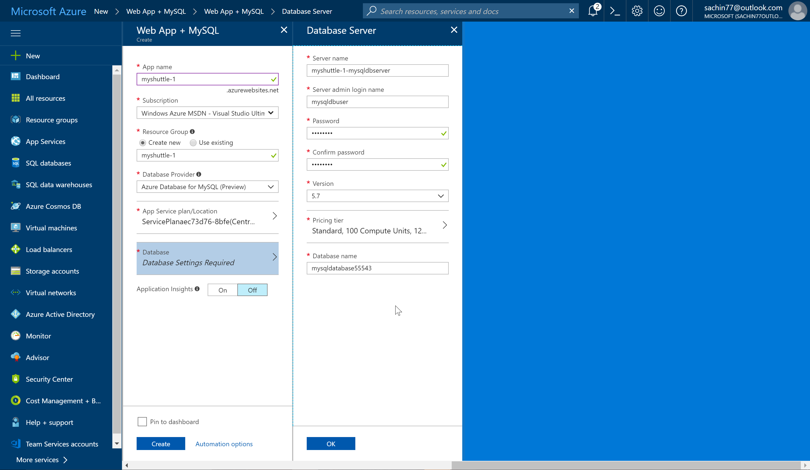

1. Wait for the Web App and the database to be provisioned. It should roughly take 3-5 minutes.

## Exercise 3: Configuring MySQL database

1. Navigate to the resource group that you have created. You should see a **Azure Database for MySQL server** provisioned. Select the database server.

   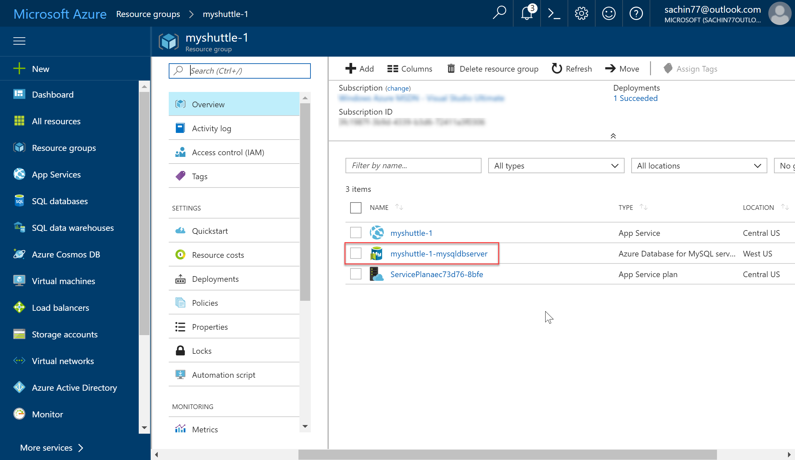

1. Select **Properties**. Note down **SERVER NAME** and **SERVER ADMIN LOGIN NAME**.

    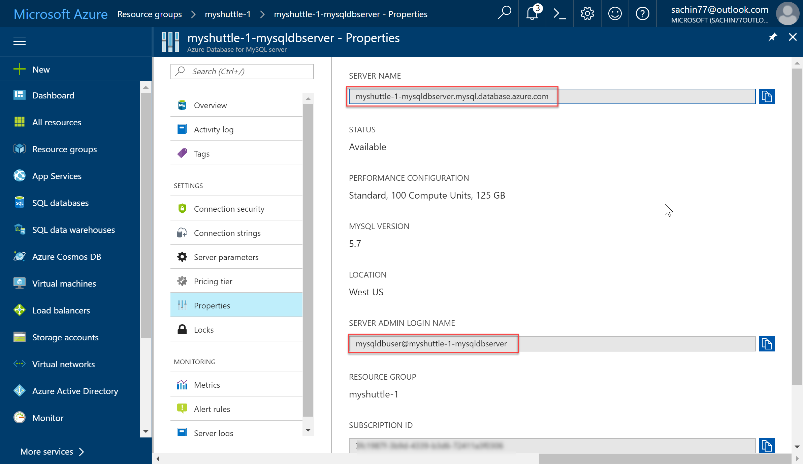

    In this example, the server name is *myshuttle-1-mysqldbserver.mysql.database.azure.com* and the admin user name is *mysqldbuser@myshuttle-1-mysqldbserver*.

1. We will use the MySQL command-line tool to establish a connection to the Azure Database for MySQL server. We will run the MySQL command-line tool from the Azure Cloud Shell in the browser.To launch the Azure Cloud Shell, click the `>_` icon in the top right toolbar.

   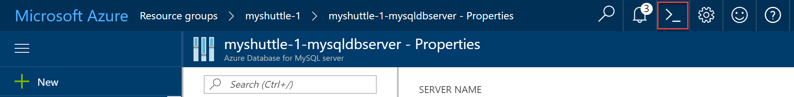

1. Enter the following command

    ```HTML
    wget https://raw.githubusercontent.com/hsachinraj/azure-arm-templates/master/vstsazurejl_arm/mydbscript.script
    ```
    This should download the file that we want to execute on the server.

1. Next, we will execute the SQL from the downloaded file on the database server. Enter the following command

    ````SQL
    mysql -h myshuttle-1-mysqldbserver.mysql.database.azure.com -u mysqldbuser@myshuttle-1-mysqldbserver -p < mydbscript.script
    ````
    Enter the password that you specified during provisioning the database

    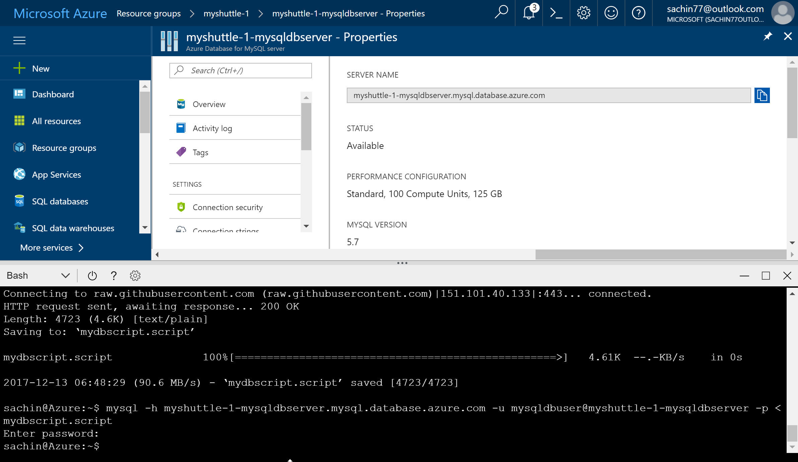

    

## Exercise 4: Updating the App Settings for the Web App

Next, navigate to the Web app that you have created. As we are deploying a Java application, we need to change the web app's web container to Apache Tomcat.

1. Click **Application Settings**. To change it to Tomcat, we will first need to install Java. Select a **Java Version** to install and then change **Web container** to use Apache Tomcat. For this purpose of the lab, we will choose ***Java 8*** and ***Apache Tomcat 9.0*** though the version number would not matter much for the simple app that we are deploying.

    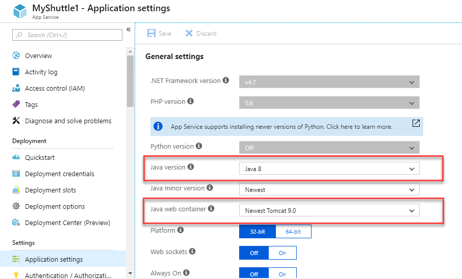

1. Click **Save** and wait for the update to be applied. Then navigate to the web app URL again and now you should see a different page.

    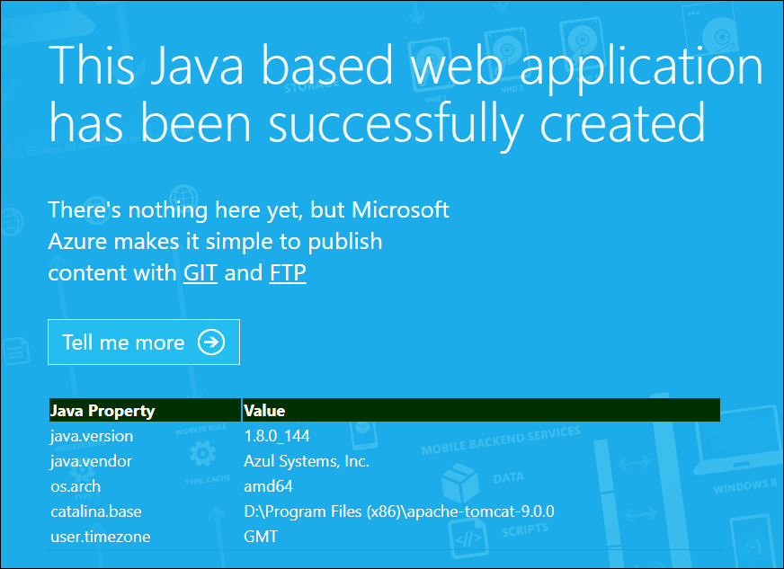

    Next, we need to update the connection strings for the web app to connect to the database correctly. There are multiple ways you can do this - but for the purpose of this lab, we will take a simple approach. We will update it directly on the Azure portal.

1. From the Azure portal, Select the Web app you provisioned. Select **Application Settings**. Scroll down to the **Connection Strings** section.

1. Add a new MySQL connection string with **MyShuttleDb** as the name and the following string for the value -

   `jdbc:mysql://{MySQL Server Name}:3306/alm?useSSL=true&requireSSL=false&autoReconnect=true&user={your user name}&password={your password}`

1. Click **Save** to save the connection string.

    

    ````Java
    String conStr = System.getenv("MYSQLCONNSTR_MyShuttleDb");
    ````

You have now setup and configured all the resources that is needed to deploy and run the MyShuttle application.

## Exercise 5: Deploying to App Service from VSTS

1. Navigate to the VSTS project that you provisioned.

1. Select **Build and Release** and then **Releases**.

1. Select **MyShuttle Release** and click **Edit** to open the release definition.

   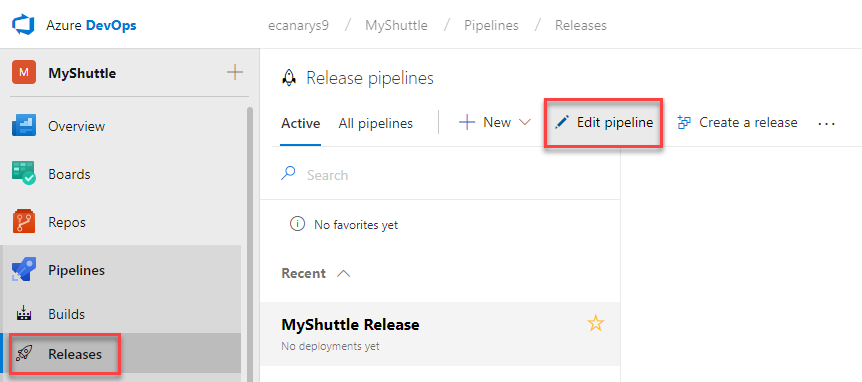

1. If you following this lab from Jenkins hands-on-lab, make sure the artifact is pointing to Jenkins. Otherwise, it should be pointing to the **Team Build** artifact as shown below:

   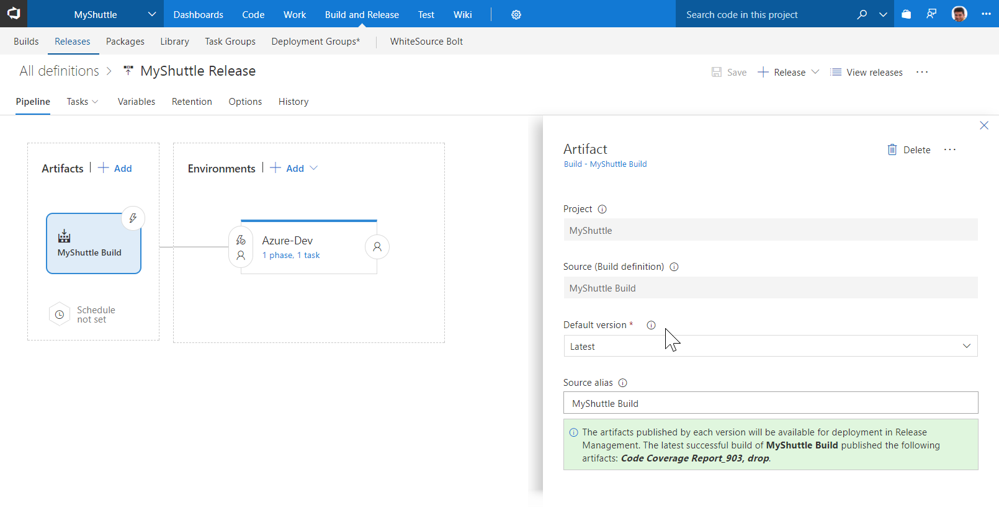

1. Select the **Azure Dev** deployment process and make sure that **Azure Subscription** and **App Service Name** fields have the right values.

   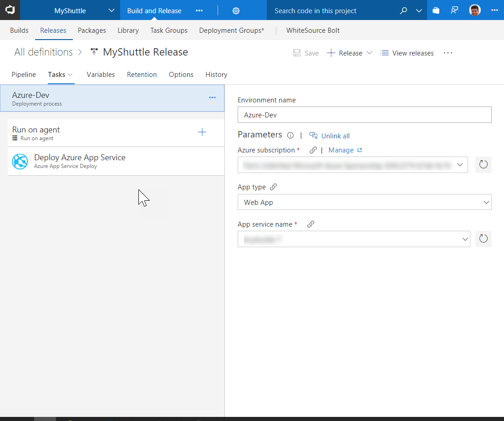

   The subscription and the app service selected here will be used throughout the tasks in the process.

1. Select the **Deploy Azure App Service** and ensure that the subscription and the app service name are reflected correctly.

   

1. Click **Save** and then **+Release \| Create Release** to start a new release

   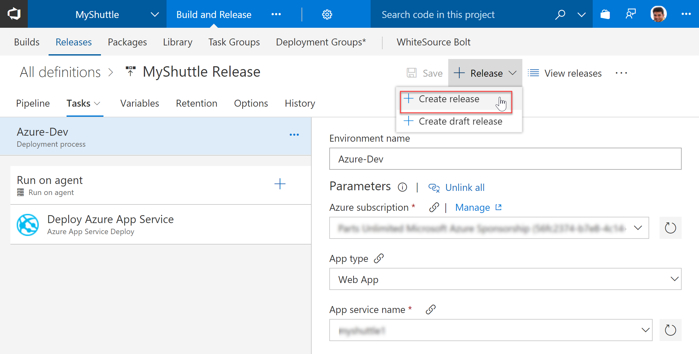

1. Wait for the release to complete. Then navigate to the Web App and select the **URL** from the overview blade. Add **/myshuttledev** context to the URL. For instance -  [http://myshuttle1.azurewebsites.net/myshuttledev](http://myshuttle1.azurewebsites.net/myshuttledev)

1. Select **Login** and try logging in to the site with anyone of the following credentials.

   |Username|Password|
   |--|--|
   |barney|barneypassword|
   |fred|fredpassword|

1. If your database was setup correctly and the connection parameters are valid, you should be able to login to the portal.

    

    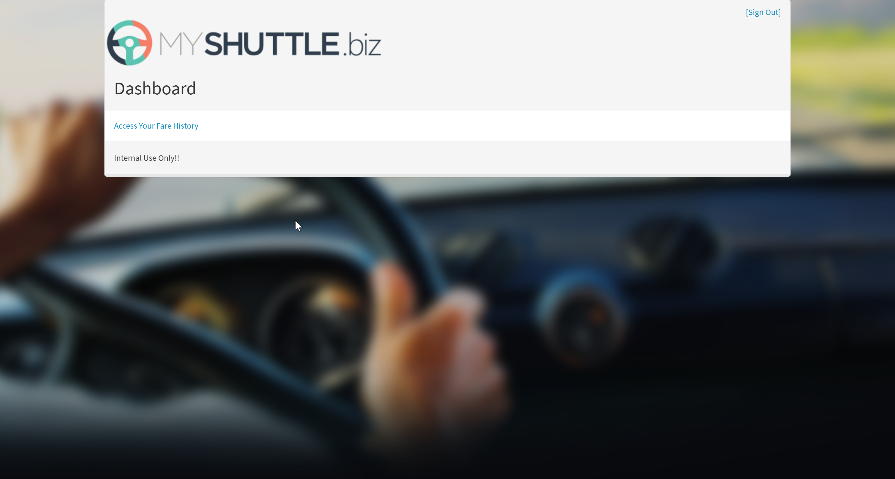
