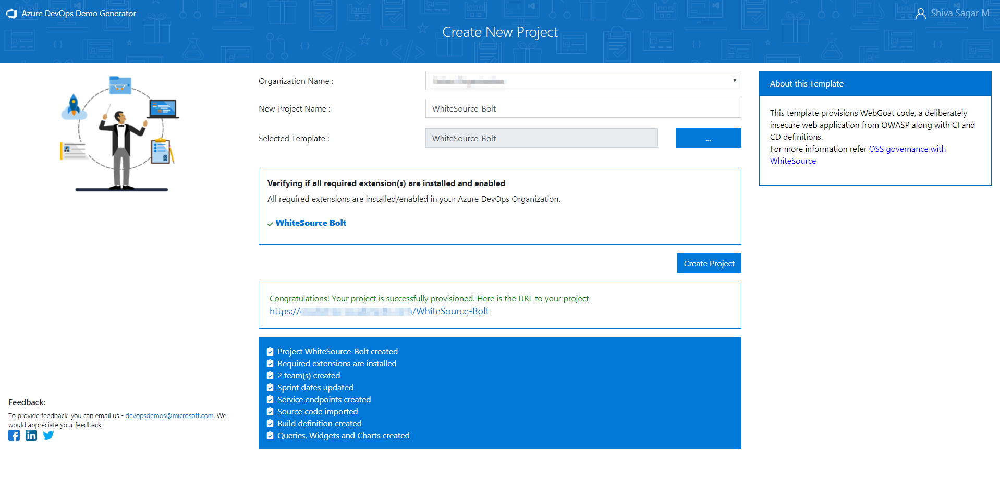
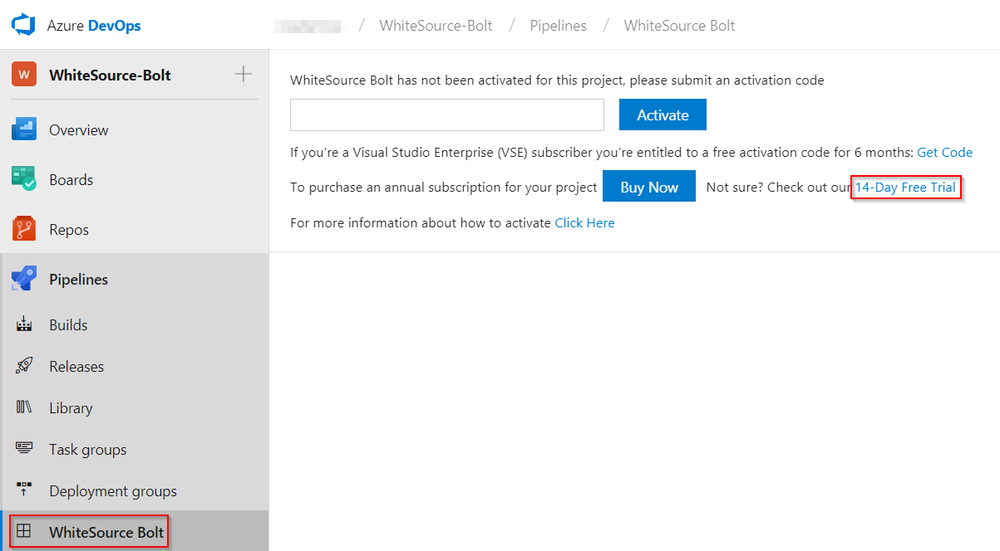
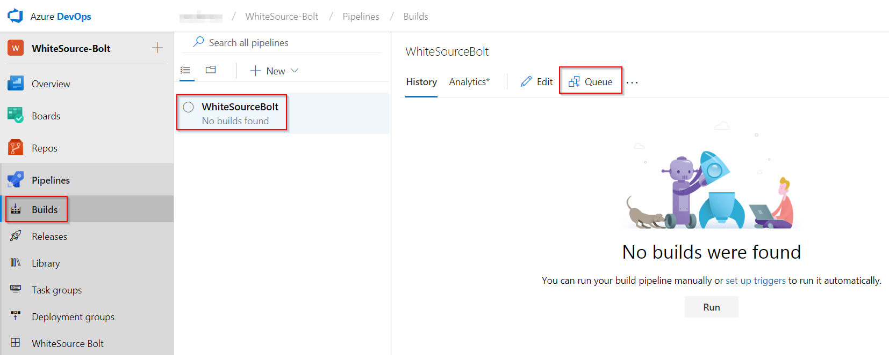
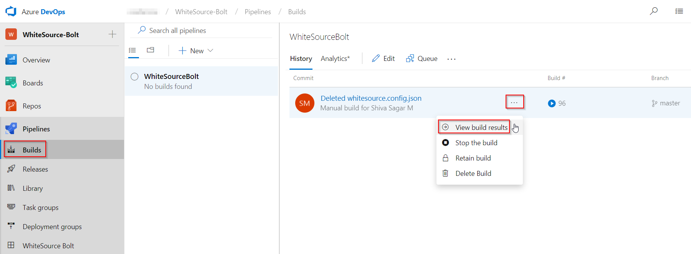
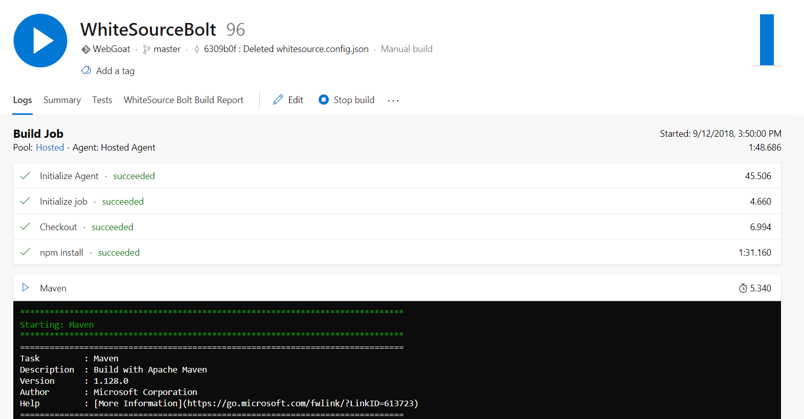
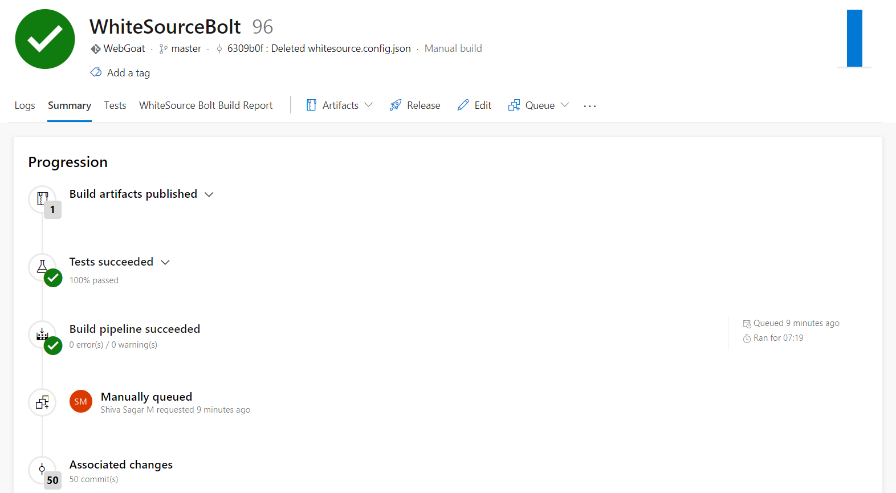

Last updated : {{ "now" | date: "%b %d,%Y" }}

## Overview

[WhiteSource](https://www.whitesourcesoftware.com/){:target="_blank"} is the leader in continuous open source software security and compliance management. WhiteSource integrates into your build process, irrespective of your programming languages, build tools, or development environments. It works automatically, continuously, and silently in the background, checking the security, licensing, and quality of your open source components against WhiteSource constantly-updated definitive database of open source repositories.

WhiteSource provides WhiteSource Bolt, a lightweight open source security and management solution developed specifically for integration with Azure DevOps and Azure DevOps Server. It works per project, and does not offer real-time alert capabilities like the **Full platform**  which is generally recommended for larger development teams, wanting to automate their open source management throughout the entire software development lifecycle (from the repositories to post-deployment stages) and across all projects and products.

### What's covered in this lab

This lab shows how you can use **WhiteSource Bolt with Azure DevOps** to automatically detect alerts on vulnerable open source components, outdated libraries, and license compliance issues in your code. You will be using WebGoat, a deliberately insecure web application, maintained by OWASP designed to teach web application security lessons.

Azure DevOps integration with WhiteSource Bolt will enable you to:

1. Detect and remedy vulnerable open source components.
1. Generate comprehensive open source inventory reports per project or build.
1. Enforce open source license compliance, including dependencies’ licenses.
1. Identify outdated open source libraries with recommendations to update.

### Prerequisites for the lab

1. You will need an **Azure DevOps Organization**. If you do not have one, you can sign up for free [here](https://www.visualstudio.com/products/visual-studio-team-services-vs){:target="_blank"}

1. The **WhiteSource Bolt** extension from the [Extensions for Azure DevOps](https://marketplace.visualstudio.com/items?itemName=whitesource.ws-bolt){:target="_blank"} needs to be installed and enabled on your Azure DevOps Organization.

## Setting up the Azure DevOps project

1. Use [Azure DevOps Demo Generator](https://azuredevopsdemogenerator.azurewebsites.net/?name=WhiteSource-Bolt&templateid=77362){:target="_blank"} to provision the WhiteSource project on your Azure DevOps Organization.

   > **Azure DevOps Demo Generator** helps you create team projects on your Azure DevOps Organization with sample content, that include source code, work items, iterations, service endpoints, build and release definitions based on the template you choose during the configuration.

   

1. Once the project is provisioned, click on the URL to navigate to the project.

   

## Exercise 1: Activate WhiteSource Bolt

After installing the extension, you will need to activate your project with an activation code.

If you are a Visual Studio Enterprise subscriber, you are entitled to 6-months free subscription. You can get your activation code from the [Visual Studio Enterprise benefit page](https://my.visualstudio.com/){:target="_blank"} and follow the [instructions](https://www.whitesourcesoftware.com/vse_whitesource_bolt//#activate){:target="_blank"}

In your Team project, under **Pipelines** section, go to **White Source Bolt** tab and activate **14-days** [trial license](https://www.whitesourcesoftware.com/whitesource_bolt_visualstudio_2017/#activate){:target="_blank"}

Upon activation, the below message is displayed.

## Exercise 2: Trigger a build

Now you have a **Java code** provisioned by the Azure DevOps demo generator. You will use **WhiteSource Bolt** extension to check the vulnerable components present in this code.

1. Go to **Builds** section under **Pipelines** tab, and select the build definition **WhiteSourceBolt** and click on **Queue** to trigger a build.

   

1. To view the build in progress status, click on ellipsis and select **View build results**.

   

   

1. While the build is, in progress, let's explore the build definition. The tasks that is used in the build definition are listed in the table below.

    |Tasks|Usage|
    |----|------|
    | **Maven**| builds Java code with the provided pom xml file|
    | **WhiteSource Bolt**| scans the code in the provided working directory/root directory to detect security vulnerabilities, problematic open source licenses|
    | **Copy Files**| copies the resulting JAR files from the source to the destination folder using match patterns|
    | **Publish Build Artifacts**| publishes the artifacts produced by the build|

1. Once the build is completed, you will see the summary which shows **Test results, Build artifacts** etc. as shown below.

   

1. From the build summary, go to **WhiteSource Bolt Build Report** to see the vulnerability report.

   

## Exercise 3: Analyze Reports

WhiteSource bolt automatically detects OpenSource components in the software including transitive dependencies and their respective licenses.

### Security Dashboard

The security dashboard shows the vulnerability of the build.
This report shows the list of all vulnerable open source components with **Vulnerability Score, Vulnerable Libraries, Severity Distribution**.

You can see the opensource license distribution and a detailed view of all components and links to their metadata and licensed references.

### Outdated Libraries

WhiteSource Bolt also tracks outdated libraries in the project, getting all the detailed information and links to newer versions and recommendations.

## Summary

With Azure DevOps and WhiteSource Bolt integration you can *shift-left* your open source management. The integration allows you to have alerts in real time, on vulnerabilities and other issues to help you take immediate action.