#Introduction to Coded UI Test with VS Enterprise 2017

##Overview

**[Coded UI](https://msdn.microsoft.com/en-us/library/dd286726.aspx)** tests provide a way to create fully automated tests to validate the functionality and behavior of your application’s user interface. In this lab, you will gain a basic understanding of coded UI tests by creating a new test and adding validation logic to it.

<p align="center">

</p>

##Pre-requisites

- Visual Studio 2017 (download [here](https://www.visualstudio.com/vs/visual-studio-2017-rc/))

- Download the Parts Unlimited project [here](https://github.com/Microsoft/PartsUnlimited/tree/aspnet45)

- Download the **Selenium Components** from [here](https://marketplace.visualstudio.com/items?itemName=AtinBansal.SeleniumcomponentsforCodedUICrossBrowserTesting) and follow the same document for the required setup


###Task 1: Recording a User Scenario

In this exercise, you will learn how to use the **Coded UI Test Builder** to generate test code for the Parts Unlimited Web application and modify the generated code in order to enable Cross Browser testing.

1. Launch **Visual Studio 2017** in an administer mode.

2. Go to **File | New Project** and select **Test | Coded UI Test**.

  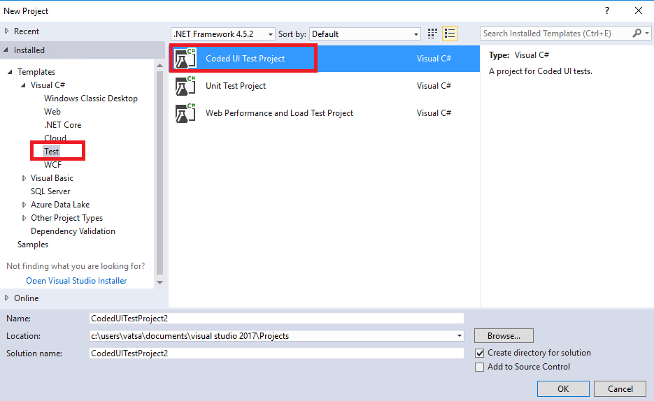
 
3. Since we have generated from the **Action Recording** in our previous demo, we will be going with the **Recording Actions from CUI Test builder**. Select the **first** radio button and click **OK**

  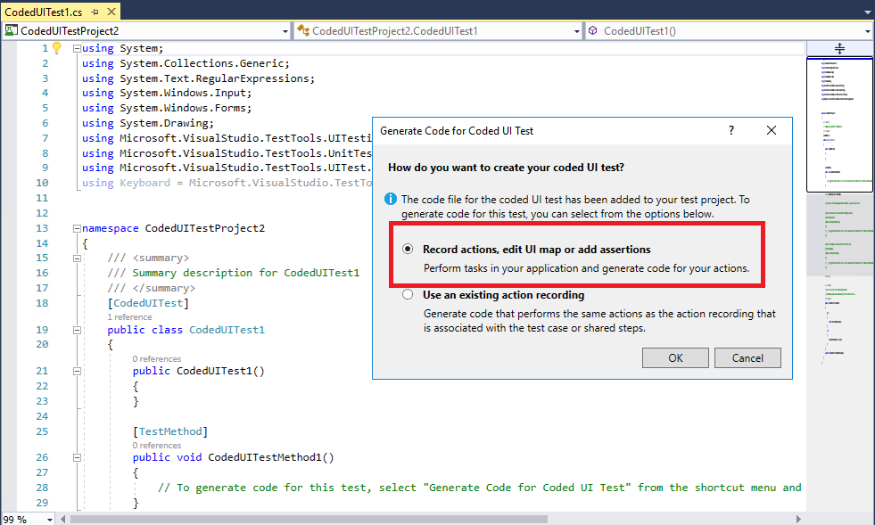
 
4. You should see the **CUI Test Builder** at the right bottom of your screen.

  
 
5. Click on **Start Recording** and browse the website by navigating to azure hosted site http://partsunlimitede2edemo.azurewebsites.net or locally hosted of yours.

  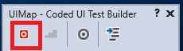

6. Record the scenario and click on **Generate code** to generate the code for your recorded scenario. You can also see the steps recorded at this moment.

 

7. You can close the **Coded UI Test builder** and see that the method would be generated.

 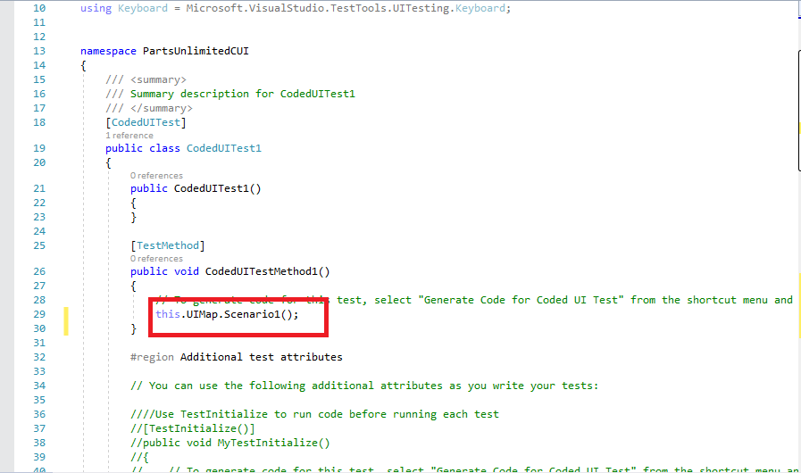

8. Right click on the **Generated method** and **Run Tests**.

 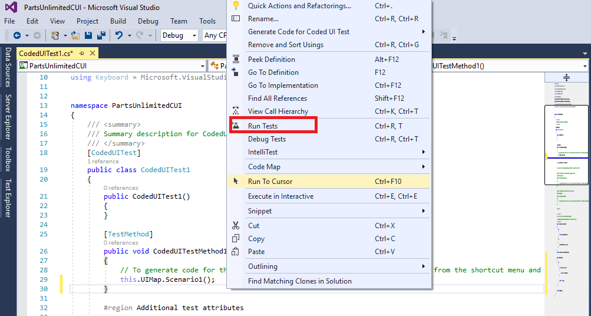

9. You should see the successful executed tests from your **Test Explorer**.

 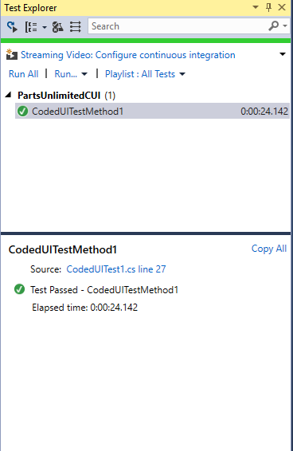

10. Let's add this test as a **regression test** to our **Playlist**. Right click on the **Test** and say **Add to Playlist** | **New**.

 

11. Once added you should see your test listed in the **Playlist**. Select a **Playlist** and run the tests.

 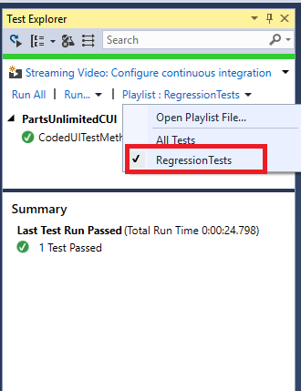
 
###Task 2: Cross browser Testing using Coded UI

Coded UI tests can automate testing for web applications by recording your tests using **Internet Explorer**. You can then customize your test and play it back using either **Internet Explorer or other browser types for these web applications**.


1. Once you have the pre-requisite setup, you can use the existing recorded scenario from our previous **Task 1** or you can record    a new scenario. In this case you can see that i have a **Scenario2**.

 Add **BrowserWindow.CurrentBrowser = "Chrome";** snippet in your **Test Method** as shown. 

 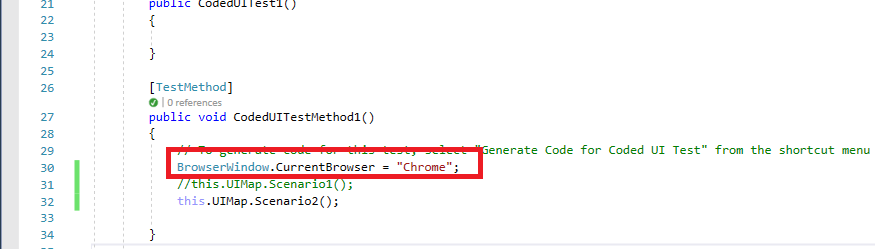

2. You can see the tests are executing in Chrome. You can use **IE, Firefox, Edge** as well to run the tests. 
 
 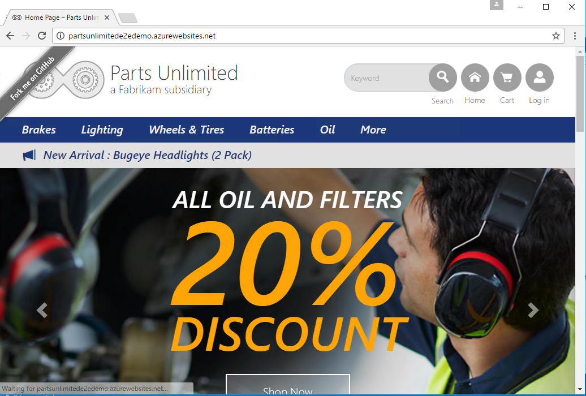
 
3. To run the tests in **Internet Explorer**, just replace **Chrome** with **IE** in the above code snippet. And you should see the tests running in **IE**.
  ````
  BrowserWindow.CurrentBrowser = "IE";
  ````
 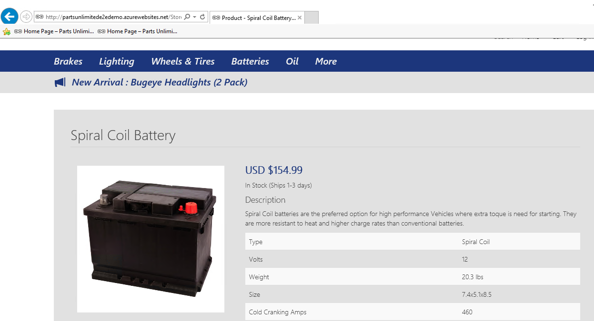
 
4. To run the tests in **Firefox**, just replace **Firefox** in the above code snippet. And you should see tests running in **Firefox**.
  ````
   BrowserWindow.CurrentBrowser = "Firefox";
  ````
 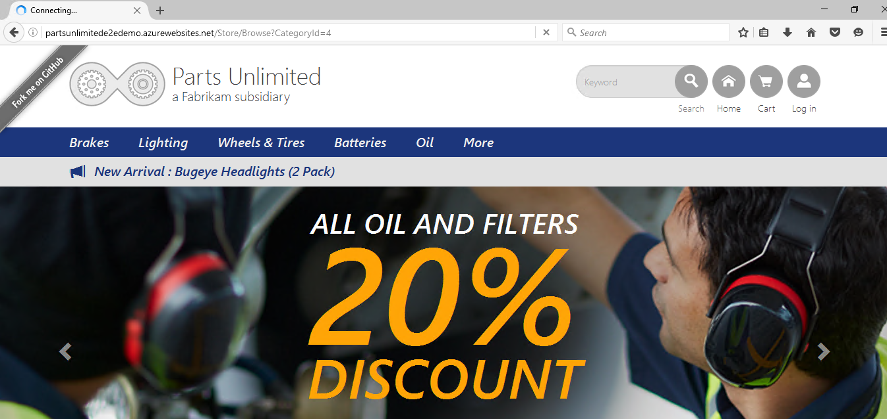
