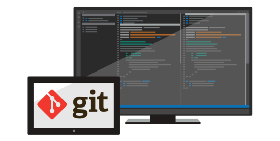


<span id="_Toc428376556" class="anchor"><span id="_Toc430533659" class="anchor"><span id="_Toc472630954" class="anchor"></span></span></span>**Overview**
---------------------------------------------------------------------------------------------------------------------------------------------------------

In this lab, you’ll learn about Git support in Team Foundation Server 2017 and Visual Studio 2017. Git is a distributed version 
control system. Git repositories can live locally (such as on a developer’s machine) and can now be hosted by Team Foundation Server.
You will learn how to establish a local Git repository, which can easily be synchronized with a centralized Git repository in Team 
Foundation Server. In addition, you will learn about Git branching and merging support.

### **Pre-requisites**

*  In order to complete this lab you will need the Visual Studio 2017
    virtual machine provided by Microsoft. For more information on
    acquiring and using this virtual machine, please see [this blog
    post](http://aka.ms/ALMVM).

### About the Fabrikam Fiber Scenario

This set of hands-on-labs uses a fictional company, Fabrikam Fiber,
    as a backdrop to the scenarios you are learning about. Fabrikam
    Fiber provides cable television and related services to the
    United States. They are growing rapidly and have embraced Windows
    Azure to scale their customer-facing web site directly to end-users
    to allow them to self-service tickets and track technicians. They
    also use an on-premises ASP.NET MVC application for their customer
    service representatives to administer customer orders.

In this set of hands-on labs, you will take part in a number of
    scenarios that involve the development and testing team at
    Fabrikam Fiber. The team, which consists of 8-10 people, has decided
    to use Visual Studio application lifecycle management tools to
    manage their source code, run their builds, test their web sites,
    and plan and track the project.


### Exercises

This hands-on lab includes the following exercises:

   * Getting Started with Git

   * Git Branching and Merging

Estimated time to complete this lab: **60 minutes**.


## Exercise 1: Getting Started with Git
  

In this exercise, you will learn how to create, clone, and push commits to a Git repository with Team Foundation Server.    

### Task 1: Create a Git Repository

1.  Log in as **Sachin Raj** (VSALM\\Sachin). All user passwords are
    **P2ssw0rd**.

2.  Launch **Visual Studio 2017** from the taskbar and open **Team
    Explorer**. You should now be connected to the FabrikamFiber
    team project. If you are not automatically connected to the
    FabrikamFiber project, click the **Connect to Team Projects** button
    () to do so.

3.  There are a few reasons why Fabrikam Fiber might want to use Git as
    their source control option within Team Foundation Server. One
    reason could be that they are collaborating with developers using a
    tool such as Xcode, which supports the Git protocol natively.
    Another reason could be that they have developers working offline
    (such as during a commute) who want to commit code locally when they
    are offline and check this code into Team Foundation Server when
    they get into the office. Microsoft now offers teams the ability to
    utilize Git without sacrificing the integrated application lifecycle
    management capabilities offered by Team Foundation Server. Visual
    Studio 2017 also provides developers with a great experience for
    working with any Git repository – whether it’s hosted by Team
    Foundation Server, a local repository, or another Git provider.

4.  Select **File | New | Team Project** from the main menu.

5.  Name the new project “**FabrikamCommunity**” and click **Next**.

    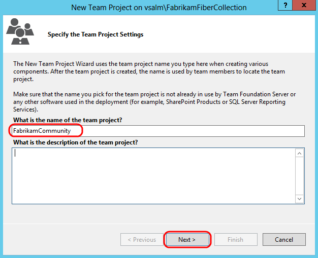
    
   
6.  Select the **Scrum** process template and click **Next**
    to continue.

    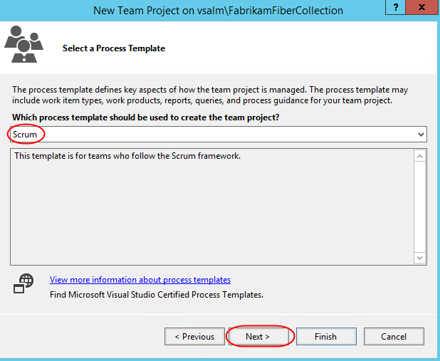


7.  Select the **Git** version control system and then click **Finish**.

    


8.  After the new Git team project has been created, click **Close** to
    return to Visual Studio.
 

### Task 2: Clone Git Repository

1.  In **Team Explorer**, click **Clone this repository**.

    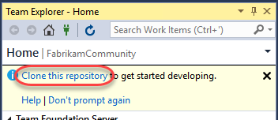


2.  Accept the default endpoint and repository location and then click
    **Clone**.

    
 

### Task 3: Commit Code and Link to Work Item

1.  In **Team Explorer – Home**, click **Settings**.

    


2.  Click **Global Settings** under **Git**.

    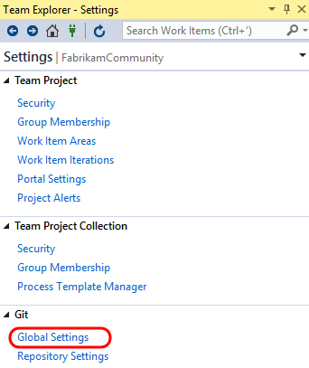


3.  Enter an email address for Sachin Raj (**Sachin@vsalm**) and then
    click **Update**.

    


4.  Click the **Home** button in **Team Explorer**.

    

5.  Create a new work item for the product backlog by selecting **Team |
    New Work Item | Product Backlog Item** from the main menu. This will
    launch the **New Product Backlog Item** form in TFS via a browser.

6.  Enter a title of “**Create new web site**” and then click the
    **Save** button. Take note of the **ID** once the work item
    is saved.

    


7.  Return to Visual Studio. In **Team Explorer – Home**, click **New…**
    underneath the **Solutions** section.

    


8.  In the **New Project** window, select the **Visual C\# | Web |
    ASP.NET Web Application** template and click **OK**.

    


9.  Select the **MVC** template, **de-select** the option to “**Host in
    the cloud**”, and then click **OK**.

    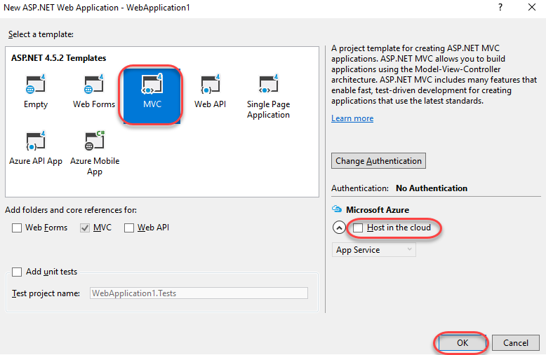


10. In **Team Explorer – Home**, click **Changes**.

    


11. Scroll down the list of included changes to the end and note that
    .gitattributes and .gitignore files were automatically added to
    the project. The **.gitattributes** file contains various settings
    to control Git behavior whereas the **.gitignore** file specifies
    patterns and extensions to ignore when detecting changes.

    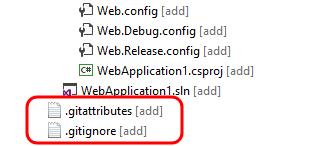


12. Enter a commit message of “**initial MVC site for work item
    \#247**”. If the Product Backlog Item that you saved has a different
    ID, use that number instead. Typing ‘**\#**’ followed by the work
    item ID will automatically link the commit to the work item when
    pushed to the server.

    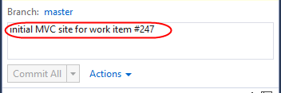


13. Commit the changes by clicking **Commit All**. Note that the commit
    is persisted locally and is not shared with the server.

    


14. Let’s make a small change to the web site. In **Solution Explorer**,
    open **\_Layout.cshtml** from the **Views\\Shared** folder.

    

15.  Modify the title as shown in the following screenshot (from “**My
     ASP.NET Application**” to “**Community**”).

     


16. In **Team Explorer – Changes**, enter a commit message and then
    click **Commit All**. **Save** changes to files when prompted.

    


### Task 4: Synchronize Commits with Server

1.  Navigate to the commits view by clicking **Sync**.

    

2.  The **Team Explorer – Synchronization** view shows both incoming and
    outgoing commits. However, since this project has not yet been
    published to source control, you will need to do that now by
    clicking **Publish**. Once the project has been published, we’ll use
    **Push** for future changes.

    

3.  Click **Sync** to perform both a **pull** and a **push** to ensure
    we have the latest source before pushing our updates. It’s unlikely
    that anyone else has made any changes since our initial checkin, but
    it won’t hurt to check.

    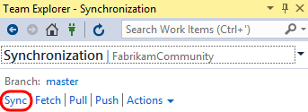

    


4.  Finally, let’s take a quick peek at what these commits look like in
    the web portal. In **Team Explorer – Home**, click **Web Portal**.

    


5.  From the **Code** dropdown in the web portal, select **History**.

    


6.  This view lists commits. Note that the relative size of the commits
    (in terms of number of modified files) can be determined by viewing
    the size of the circles rendered to the left of the commits. Click
    the first (bottom) commit.

    
````
Note: It may take a few moments after pushing a commit before the commit size indicators show up. You can refresh the page
    if necessary.
````

Note that the “**Create new web site**” work item is linked to the commit. Click the link to open the work item.

````
Note: It may take a few minutes before the work item gets linked to the commit. In the event that the link has not been made yet, go
    ahead and continue on with the rest of the lab.
````
  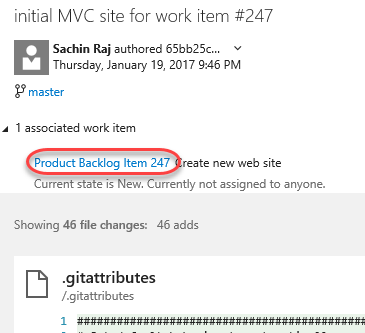

  


## Exercise 2: Git Branching and Merging

In this exercise, you will learn about Git branching and merging
    support in Visual Studio. In general, branching is often used to
    help switch development contexts and to isolate risk. Git branching
    is no different in that regard. Creating a Git branch is a
    lightweight (and therefore fast) operation, as you are simply
    creating a new reference to an existing commit. This is very
    different from Team Foundation Version Control (TFVC) branching
    where the entire source tree needs to be duplicated server-side. We
    will also take a quick look at the merging support for Git projects.

### Task 1: Branching

1.  Return to Visual Studio and open **Team Explorer – Home**.

2.  Click **Branches**.

    


3.  Let’s say that we would like to create a new branch to do some
    development work on the web site. Right-click the **master** branch
    node and select **New Local Branch From**.

    


4.  Provide a name of **Development**, select the **master** branch,
    select the **Checkout Branch** option, and then click **Create
    Branch**.

    


5.  Note that you are now connected to the new local branch, and that it
    has not been published to the server yet.

    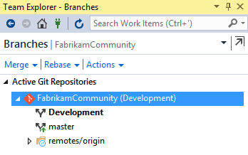


6.  In **Solution Explorer**, open the **HomeController.cs** file from
    the **Controllers** folder.

7.  Modify the **About** method as shown in the following screenshot.

    

8.  Right-click somewhere in the whitespace of the editor and select
    **Source Control | Commit**.

    

9.  In **Team Explorer - Changes**, enter a commit message of “**dev
    version**” and click **Commit All**. Save the changes when prompted.

    


10. At this point, the changes have been committed locally. In the **Team Explorer – Changes** window, click the **Development** branch
    link to quickly navigate to the **Team Explorer - Branches** view.

    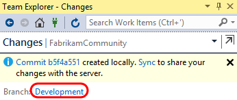


11. Double-click the **Master** branch and note that original version of
    the *HomeController.cs* file is shown in the code editor window.

    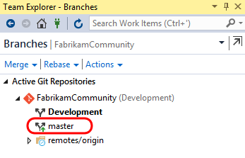

    

12. You don’t have to publish the branch to the server yet if you want
    to continue working locally. As you saw in the previous exercise,
    you can continue to work locally and add additional commits to the
    new branch. In **Team Explorer – Branches**, **right-click** the
    **Development** branch and select **View History**.

    

    

13. When you are ready, you can delete the branch, merge it back into
    your master branch, or push it to the server-side repository so that
    teammates can access it. Let’s go ahead and publish the branch by
    **right-clicking** the Development branch and selecting the
    **Publish Branch** option.

    

    


14. Now let’s say that another team member makes a modification to the
    **HomeController.cs** file and commits that change to the master
    branch, before Sachin has a chance to merge in her
    development changes.

15. Open a **Remote Desktop** session to **VSALM**. Connect using user **Deniz Ercoskun** (VSALM\\Deniz). All user passwords are
    **P2ssw0rd**.

16. Launch **Visual Studio** from the taskbar.

17. Connect to the **FabrikamCommunity** team project (using the
    **Manage Connections** button as before, and this time select
    **Manage Connections | Connect to Team Project**).

18. Select the **FabrikamCommunity** team project and then click
    **Connect**.

    

19. From **Team Explorer**, click **Clone this repository**.

    

20. Click **Clone** to perform the clone.

    

21. **Double-click** the **MvcApplication1.sln** solution shown in
    **Solution Explorer**.

    

22. Modify the same ***HomeController.cs*** file that Sachin did, but
    this time change the text to be something different.

    

23. As before, right-click within the whitespace of the code editor and
    select **Source Control | Commit**.

24. In **Team Explorer – Changes**, enter a commit message of “**Deniz
    version**” and then click **Commit All**. Save changes
    when prompted. Note that Deniz has committed changes to the
    master branch.

    


25. Click **Sync** from the commit response.

    

26. Click **Sync** to execute the actual sync.

    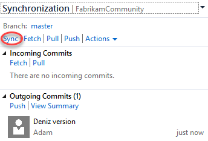

27. Switch users back to **Sachin** by minimizing the remote
    desktop session.

### Task 2: Merging

1.  From Sachin’s perspective, he has so far created a local branch
    based off the master, made a change to a file, and then published
    that branch. He would then like to go ahead and merge his
    Development branch back into the master branch.

2.  In **Team Explorer – Branches**, select the **Merge** dropdown.

    

3.  Select **Development** as the source and **Master** as the target.
    Click **Merge** to start the process.

    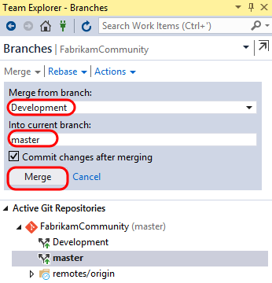


4.  Note that the **Master** repository is currently selected and that
    ***HomeController.cs*** shows the **Development** version of
    the text. The merge was performed locally by updating the **Master**
    branch to point to the latest commit of the **Development** branch.

    


5.  **Right-click** the **Master** branch in **Team Explorer –
    Branches** and select the **View History…** option.

    

6.  The history view should look identical to the one you saw earlier,
    except this time both the Development and Master branch designators
    (in red) point to the same commit.

    

7.  Still unaware of Deniz’s change that she pushed to the **Main**
    branch earlier, Sachin will now attempt to push his commit. Navigate
    to the **Team Explorer - Synchronization** view and then click
    **Sync** to attempt a pull and a push with the server.

    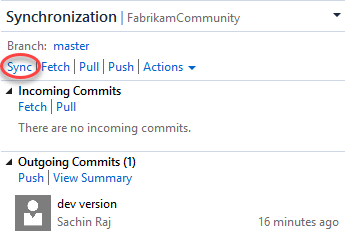

````
Note: If you see a popup notifying that an open file has been changed externally, click **Yes** as this is expected.
````

8.  Visual Studio reports that we can’t push our commit yet due to
    a conflict. Click **Resolve the Conflicts**.

    

9.  In the **Team Explorer – Resolve Conflicts** view, select the
    ***HomeController.cs*** file listed under the **Conflicts** section
    and then click **Merge**.

    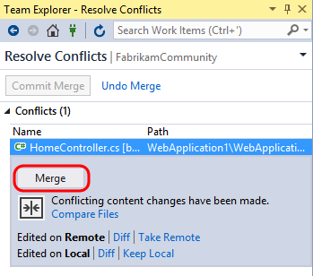


10. The Merge window used for Git conflict resolution is very similar to
    the one used with Team Foundation Version Control. We will go ahead
    and assume that Sachin’s change is correct, so check the box shown
    in the top-right pane.

    


11. Click **Accept Merge**.

    


12. Click **Commit Merge**.

    

13. In the Team Explorer – Changes view, note that conflicts have been
    resolved but the merge still needs to be committed. Enter a message
    and then click the **Commit Staged** dropdown and select **Commit
    Staged and Sync**.

    


14. Click **Web Portal** from **Team Explorer – Home**.

    

15. Select the **Code | History** from the navigation.

    

16. Here we can see a full list of our commits so far.

    

17. Select the **Branches** tab to view all branches published to
    the repository.

    
 

### Task 3: Managing Security and Permissions

1.  Now let’s take a quick peek at managing security and permissions for
    Git repositories hosted in Team Foundation Server. Select the
    **FabrikamCommunity** dropdown and then **Manage Repositories**.

    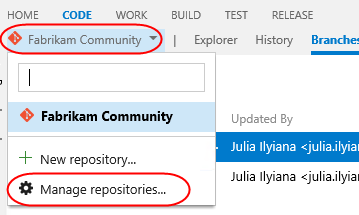

2.  The first thing to note is that you can create additional Git
    repositories within the same team project.

    

3.  Select the **FabrikamCommunity** repository node. You can manage
    repository level security here for your users and security groups.

    


4.  Select the **Master** branch node. Security level settings that
    affect only the currently selected branch can be made here,
    providing fine-grained control for your repository if needed.

    


### Task 4: Branch Policies

  When you want people on your team to review code in a Git team
    project, you can use a pull request to review and merge the code.
    Pull requests enable developers working in topic branches to get
    feedback on their changes from other developers prior to submitting
    the code into the master branch. Any developer participating in the
    review can see the code changes, leave comments in the code, and
    give a "thumbs up" approval if they're satisfied with those changes.


1.  Although it is possible to utilize pull requests without any further
    configuration, let’s take a quick look at how to setup
    branch policies. Select the **Branch Policies** tab.

    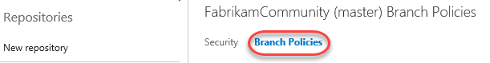

2.  You can make use of branch policies that effectively put in a gate
    that helps prevent inadvertent or low quality commits by
    automatically initiating a build, or by requiring code reviews by
    certain individuals. Select the option to **Require…reviewers per
    pull request** and set the minimum number of reviewers to “1”.

    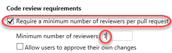

````
    Note:** It is also possible to configure branch policy such that a build is triggered whenever updates are made to the master branch.
    You can even have the merge fail when the build fails. This is
    useful for teams looking to adopt continuous integration.
````


3.  It is also possible to require specific reviewers for specific
    portions of your code base. For example, let’s say that Sachin needs
    to sign off on all changes made to the ASP.NET MVC controllers.
    Click **Add a new path**.

    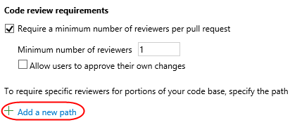

4.  Leave the default options of **Enabled** and **Required** selected,
    set the **Path** to be everything in the **Controllers** folder, and
    then click **Add User**.

    

5.  Select **Sachin Raj** from the Add Required Reviewers window and
    then click **Save Changes**.

    

6.  Click **Save Changes** to update the master branch policies. Close
    the administration browser tab.

    


### Task 5: Code Review and Merge using Pull Requests

1.  Switch back to the **Deniz** RDP session.

2.  In the **Team Explorer - Branches** view, double-click **master** to
    change to that branch.

3.  In the **Team Explorer - Synchronization** view, note that there are
    two incoming commits listed (if there are not, try a
    **Fetch** operation).

4.  Click **Sync** to ensure that the local copy of master matches
    what’s on the server. If you have **HomeController.cs** open in the
    editor, you may be prompted to reload it.

    


5.  Now let’s say that Deniz is working on the project and needs to
    update some of the controller code. To do this, she will first
    create a topic branch based on master. In **Team Explorer -
    Branches**, right-click the **master** branch and select **New Local
    Branch From**…

    

6.  For the branch name, use something like
    “**users/deniz/controllerupdate**”. Use the default option to
    “**Checkout branch**”. Click **Create Branch**.

    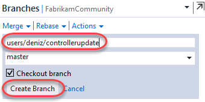


7.  Update the **About** method from **HomeController.cs** with a new
    message, something like “**Deniz’s enhanced description page.**”

    


8.  In **Team Explorer - Changes**, provide a commit message and then
    **Commit All**. Save the changes when prompted.

    

9.  In **Team Explorer - Branches**, right-click the topic branch and
    select **Publish Branch**.

    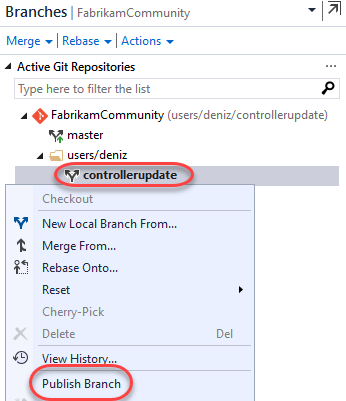

10. After successfully publishing the branch, click **Create a pull
    request**. This will open the pull request on the portal via
    your browser.

    

11. Click **New pull request** to create a pull request with the
    default options.

    

12. After the pull request is created, note that the pull request view
    shows what merge is proposed, Deniz’s description is provided, and
    there are tabs listing affected files and commits. It also indicates
    that there are no merge conflicts detected, and that due to branch
    policy, Sachin must approve the changes in order to proceed

    

13. To demonstrate the branch policy in action, let’s say Deniz attempts
    to complete the pull request by herself. Click **Complete** and then
    **Complete Merge**.

    


14. Note that Deniz is notified that the request first needs to be
    approved by all required reviewers first.

    

15. At this point in the workflow, Sachin needs to be notified of this
    pull request through some communication channel, whether that is in
    person, through Skype, through team room notification, or via TFS
    pull request alert. For the purposes of this short exercise,
    however, we will just skip to Sachin checking pull requests for
    this project.

16. Switch users back to **Sachin**.

17. In the web portal, navigate to the **FabrikamCommunity** project and
    select **Code | Pull Requests** view.

    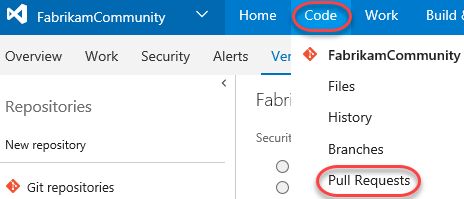

18. Select the link provided on the pull request from Deniz.

    

19. At this point, Sachin can review all of the files and commits
    associated with the pull request and make a decision. It is also
    possible for Sachin to have a conversation with Deniz (and perhaps
    other reviewers) in order to help make the decision, or perhaps even
    request additional work be performed before the pull request will
    be approved.

20. Let’s assume that Sachin is ready to approve the request as-is, so
    select **Approve | Approve**.

    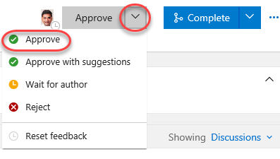

21. Now that all policies have been fulfilled, click **Complete** and
    **Complete merge** to finish the process.

    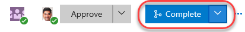

22. Switch users back to **Deniz**.

23. Refresh the pull request view and note that it has been updated as
    expected with the actions made by Sachin.

    