# Collaboration Experiences for Development Teams using Team Foundation Server 2017

<p align="center">
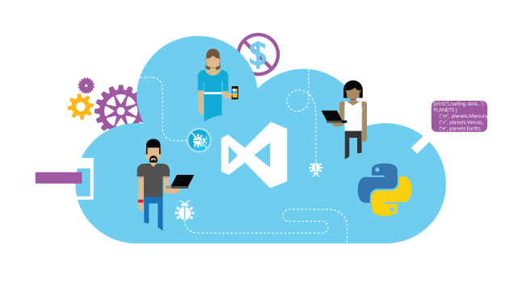
</p>

## Overview

In this lab, you’ll learn about some of the features in Visual
    Studio 2017 and Team Foundation Server 2017 that enable
    collaboration experiences for development teams including Team
    Rooms, Lightweight Code Comments, and CodeLens.

### Pre-requisites

In order to complete this lab you will need the Visual Studio 2017
    virtual machine provided by Microsoft. For more information on
    acquiring and using this virtual machine, please see [this blog
    post](http://aka.ms/ALMVM).

### About the Fabrikam Fiber Scenario

This set of hands-on-labs uses a fictional company, Fabrikam Fiber,
    as a backdrop to the scenarios you are learning about. Fabrikam
    Fiber provides cable television and related services to the
    United States. They are growing rapidly and have embraced Windows
    Azure to scale their customer-facing web site directly to end-users
    to allow them to self-service tickets and track technicians. They
    also use an on-premises ASP.NET MVC application for their customer
    service representatives to administer customer orders.
    
In this set of hands-on labs, you will take part in a number of
    scenarios that involve the development and testing team at
    Fabrikam Fiber. The team, which consists of 8-10 people, has decided
    to use Visual Studio application lifecycle management tools to
    manage their source code, run their builds, test their web sites,
    and plan and track the project.


### Exercises

This hands-on lab includes the following exercises:

* Team Room Collaboration

* Lightweight Code Comments

* CodeLens

Estimated time to complete this lab: **60 minutes**.


## Exercise 1: Team Room Collaboration

In this exercise, you will learn about the Team Room feature in Team
    Foundation Server 2017 (and at visualstudio.com). Team Rooms provide
    a durable collaboration space where members can chat and view
    pertinent events, thereby allowing them to remain in loose contact
    throughout the workday.

#### Task 1: Team Rooms Introduction

1.  Log in as **Sachin Raj** (VSALM\\Sachin). All user passwords are
    **P2ssw0rd**.

2.  Launch **Internet Explorer** from the taskbar and click the **TFS
    Portal** button from the favorites bar at the top.

    

    **Note:** There is also a **Web Portal** link in the Team Explorer
    window within Visual Studio.

    

3.  Click the **Rooms** link to navigate to the first team room.

    

    **Note:** There is also a team room tile on the home page of
    each project.

    

4.  Each team under a project has a room created for them, which you can
    browse from the **Rooms Explorer** on the left side of the screen.
    Select the **Fabrikam Fiber Team Room** to visit that room.

    

5.  On the right side you can participate in team discussions. By
    default, the room shows the recorded messages and activity for the
    current day.

    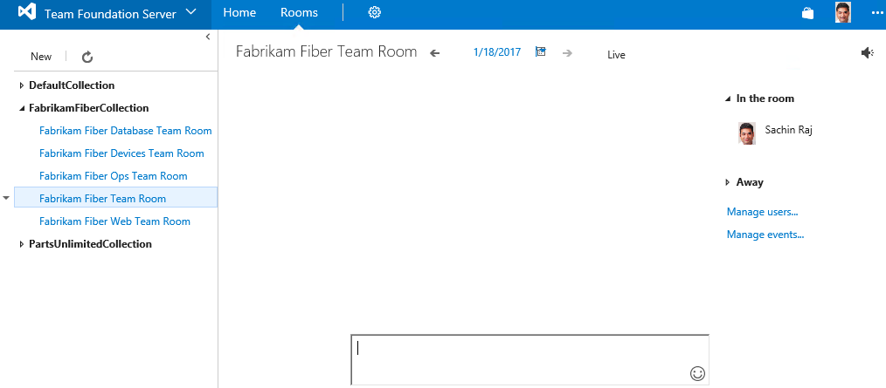

6.  Since the team room content is persistent, team members can go back
    in time to see what happened while they were gone from work. Click
    the back arrow to the left of the current date.

    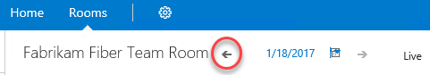

7.  It appears that we didn’t miss anything important in the team room,
    so we can return to the current date by clicking the **Live** link.

    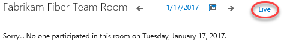


#### Task 2: Team Room Mentions and Links

1.  Now let’s take a look at some of the types of mentions and links
    that can be inserted via team room chat. The first type is the team
    member mention, which can be inserted anywhere by typing the ‘**@**’
    symbol followed by the name. As Sachin, try this out by typing
    “**good morning @**” into the textbox at the bottom of the window.
    Note that a list of room members is presented as soon as you type
    the ‘@’ symbol.

    

2.  Continue typing **‘Brian Keller**’ or select his name from the list
    and then press **Enter**.

    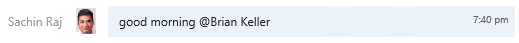

3.  Before we move on, go ahead and get another team member connected to
    the room using remote desktop. In the new remote desktop window,
    login with user name “**VSALM\\Brian**” and password “**P2ssw0rd**”.
    Once connected and logged in, navigate to the **Default Team Room**
    as you previously did.

    **Note:** You can also RDP to ‘localhost’ from within the VM itself.

4.  Note that **Brian’s** view of the message from Sachin renders
    differently than it would for others since he was the
    person addressed.

    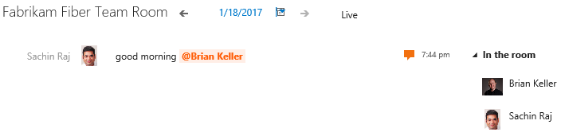

5.  Another type of mention can be used for referencing project
    work items. As **Sachin**, add a message to the team that mentions
    work item \#236.

    

6.  Click the work item link from the team room chat to see that it does
    link to the specified work item.

    

    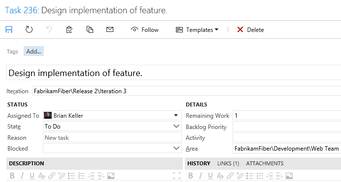

7.  Close the tab showing the work item to return to the team room chat.

8.  Some other patterns render as links include URLs, UNC network paths,
    and email addresses.

    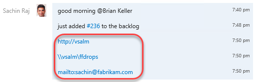

#### Task 3: Team Room Events

1.  Another key feature of team rooms is that various events can be
    selected and configured to automatically feed in additional
    information, thereby providing additional context to active and
    historical team discussions. Click **Manage events…**.

    

2.  The **Configure Events for Fabrikam Fiber Team Room** window that
    appears shows four different options, **Build Completion**, Code
    Changes, Work Item Updates, and Code Reviews. Build completion
    events can be setup to appear whenever selected builds complete.

    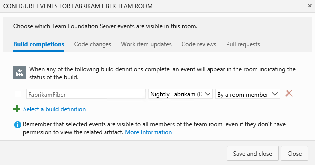

3.  Select the **Code Changes** tab. These events can be setup to appear
    whenever code is checked into selected team projects.

    

4.  Click the **Work Item Updates** tab. These events can be setup to
    appear whenever a work item is created or an existing work item has
    the state or assignment changed. Let’s set this event up by checking
    the box next to the area path and then clicking **Save and Close**
    to use the default options.

    

5.  Navigate to work item **\#236** in TFS web access by clicking the
    link in the room chat window.

    

6.  Change the work item from state to **In Progress** and then click
    **Save**.

    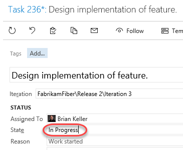

7.  Return to the room and note that an event is raised in the chat
    window describing the state transition. It should only take a moment
    for it to show up, but you can also refresh the page after a few
    minutes if needed.

    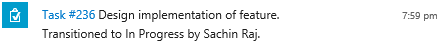

8.  The Team Room feature has been designed with extensibility in mind,
    so that will allow development teams to add in custom events and
    clients in the future. If you are interested in learning more about
    this extensibility, look at the [Team Rooms REST
    API](https://www.visualstudio.com/en-us/integrate/api/chat/overview)
    for more information.

## Exercise 2: Lightweight Code Comments
-----------------------------------------------------------------------------------------------------------------------------------

In this exercise, you will learn about the Lightweight Code Comment
    feature (first introduced with Team Foundation Server 2013), that
    allows team members to comment on code. This enables interactive or
    time shifted conversations about code, all from a very nice inline
    experience in the browser.

1.  Log in as **Sachin Raj** (VSALM\\Sachin) if not already logged in.
    All user passwords are **P2ssw0rd**.

2.  Launch **Internet Explorer** from the taskbar and click the **TFS FF
    Portal** button from the favorites bar at the top.

    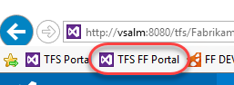

3.  Select **Code | Changesets**.

    

4.  Load changeset 75 by entering “**75**” into the changeset search box
    and pressing **Enter**.

    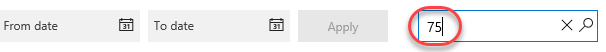

5.  This changeset contains two file edits, with the changes highlighted
    in the diff viewer.

    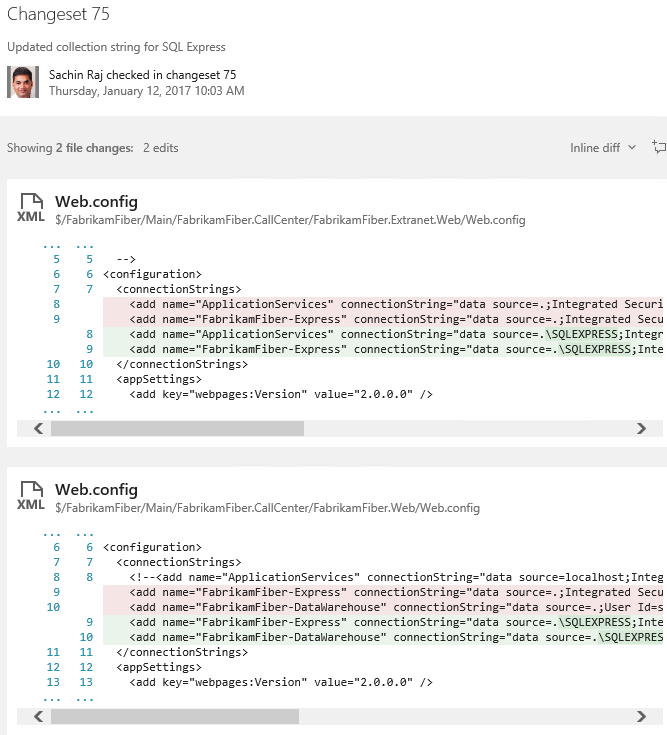

6.  Click the **Add Comment** button to add a comment to the changeset.

    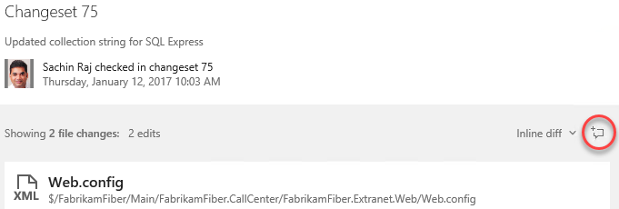

7.  Enter a comment such as “**What was the reason for changing the
    connection strings?**” Press **Enter** when done.

    

8.  To comment on a specific file, click the first **Web.config** link
    to load that specific edit.

    

9.  Click the **Add Comment** button.

    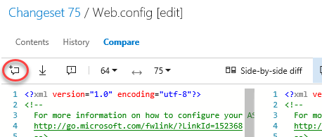

10. Add a short comment of your choosing.

     Figure 29

11. Move the mouse cursor over the lines of the file and note that the
    same **Add Comment** button appears in the margin. Click that button
    while holding the mouse cursor over one of the lines to add a line
    comment of your choice.

    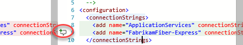

    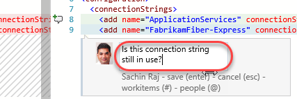

    **Note:** You can even highlight parts of a sentence and comment on
    them if desired.


12. Connect to the VM as **Brian** using the same method that you chose
    in exercise 1, and then navigate to **changeset 75** in the Fabrikam
    Fiber web portal. Note that you can see the comments left by Sachin.

    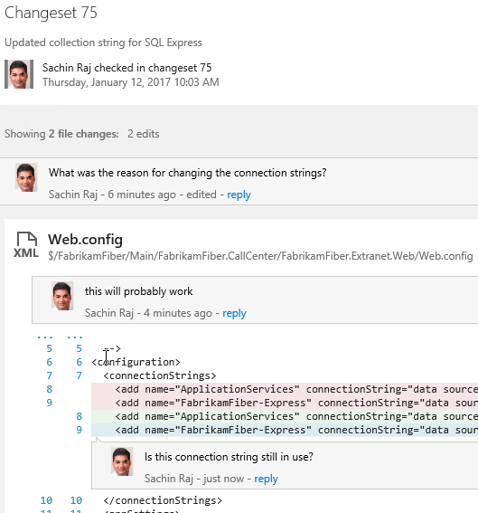


13. Click **reply** within Sachin’s first comment and leave a response
    to his question.

    

    
 

## Exercise 3: CodeLens

In this exercise, you will learn about the CodeLens feature first
    introduced with Visual Studio 2013 and Team Foundation Server 2013
    that provides code insights about classes, methods, and properties
    directly within the code editor.

1.  Log in as **Sachin Raj** (VSALM\\Sachin) if not already. All user
    passwords are **P2ssw0rd**.

2.  Launch **Visual Studio 2017** from the taskbar.

3.  In **Team Explorer – Home**, click **Source Control Explorer**.

    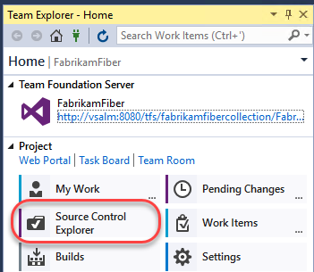

4.  Locate the **Dev** branch and open **FabrikamFiber.CallCenter.sln**.

    

5.  In **Solution Explorer**, expand the **FabrikamFiber.Web |
    Controllers** folder and double-click **CustomersController.cs** to
    open it.

    

6.  After loading **CustomersController.cs** in the code editor, note
    that both the class and its methods show a single line
    of indicators. These indicators are meant to provide developers a
    heads-up-display of sorts - with information about how the code is
    being used, tested, and changed.

    **Note:** CodeLens is available for managed code only.

    

7.  Scroll down to locate the **Create** method that takes a Customer
    object as a parameter, and then click the **references indicator**.
    This shows other code references to this method.

    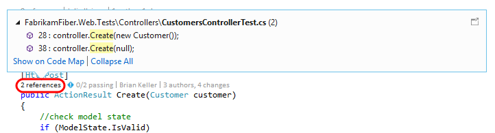

    **Note:** You can also hold down the **Alt** key and press the
    number key shown above each indicator as a shortcut.

    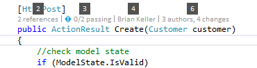

8.  If you were to double-click on one of the references, you would be
    taken to the specified location in code. Press the **Escape**
    key instead.

9.  Click the **Timeline** indicator above the same Create method
    as before. Note that before clicking it, you can see who made the
    most recent change.

    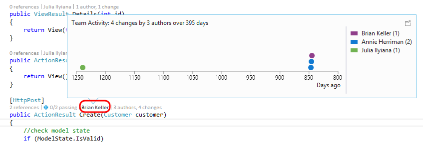

10. Click the **Authors & Changes** indicator to view all authors,
    changeset descriptions, and dates.

    

11. **Right-click** one of the rows shown for the expanded
    **Changes** indicator. Note that you can choose to view the diff,
    view the changeset details, track the changset, get this version, or
    even send email to the author.

    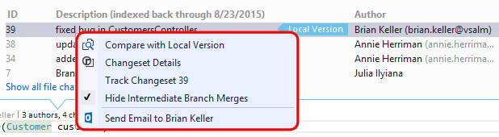

12. Press the **Escape** key.

13. Press **Ctrl+Shift+B** to build the solution.

14. Click the **Tested By** indicator shown above the Create method.
    This lens currently shows that associated tests have not
    been executed.

    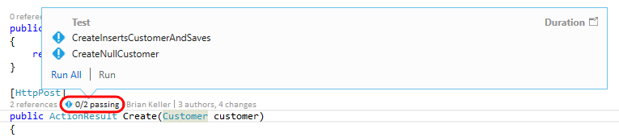

15. Click **Run All** to execute the tests.

    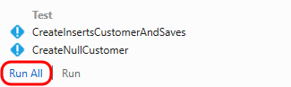

16. It appears that one of the tests failed, so click the **Tested By**
    indicator once again to see which test is causing a problem.

    

17. Let’s take a look at the test itself to determine if the fix needs
    to happen there or in the Create method being tested.
    **Double-click** the **CreateNullCustomer** test to navigate to
    its definition.

    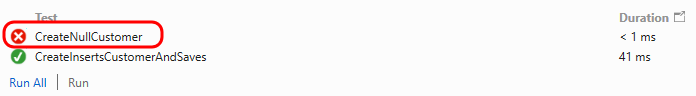

18. After looking at the **CreateNullCustomer** test, we can see that it
    is expecting an **ArgumentNullException** to be thrown when the
    Create method is called with a null parameter. Note that there is
    also a **Test Status** indicator shown next to the test
    method itself.

    

19. Select the indicator showing the failed **CreateNullCustomer** test
    to see additional summary information.

    

20. Throwing this exception seems like a reasonable expectation, so
    let’s go ahead and make the fix in the Create method. Return to
    **CustomersController.cs** and add the following code to the
    beginning of the Create method that takes a Customer parameter.
    
````

if (customer == null)
{ 
    throw new System.ArgumentNullException("customer");
}

````


21. With the fix in place, click the **Tested By** indicator,
    single-click on the **CreateNullCustomer** test, and then click
    **Run** to re-run just the failed test.

 


22. All tests that reference the Create method now pass.

  

  **Note:** With all tests passing, nothing stands out visually in the
    CodeLens indicator line. This demonstrates one of the goals of
    CodeLens - to provide useful information without getting in the way
    or being distracting. Nevertheless the feature can be customized or
    even turned off in **Tools | Options** if desired.


**As a final note, CodeLens also supports a number of indicators for
    Git repositories also. This provides author, change and work item
    indicators that work very similarly to their Team Foundation Version
    Control counterparts. Unlike the CodeLens support for TFVC, CodeLens
    for Git is computed solely on the client side. This means that you
    can use the feature for any Git repository whether it is local,
    cloned from TFS Git, cloned from GitHub or another Git source.**


